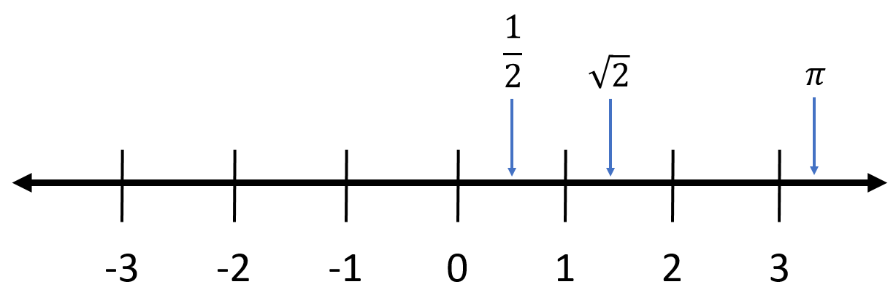
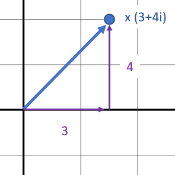
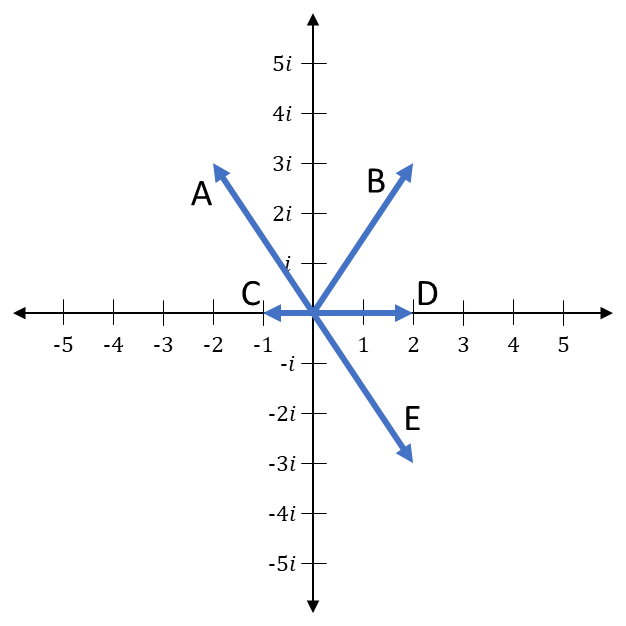
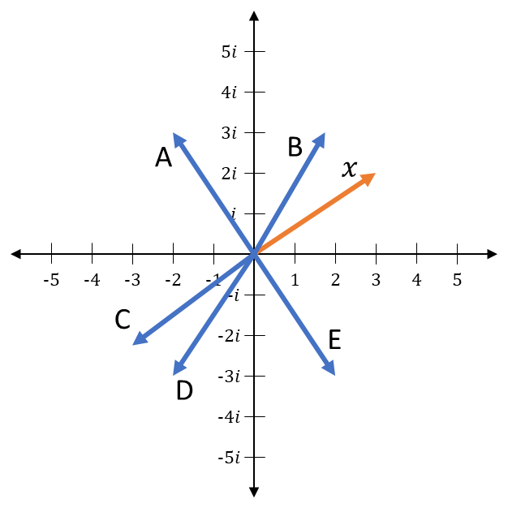

# Complex Numbers

## Objective

Get comfortable with complex numbers and complex arithmetic. Understand how complex numbers can be visualized and interpreted geometrically.

## Real Numbers

"**Real numbers**" is the formal math name for the set of numbers that we, as software engineers, usually call "floating point" numbers.
Some languages call these **floats**, some call them **doubles**, some have both terms.
Anything that can be written out as a single sequence of digits (even if it has an infinite number of digits) is a real number.
They can be positive, negative, or zero.
Integers, fractions, irrational numbers like $\sqrt{2}$ and even transcendental numbers like $\pi$ are all included in the real numbers.
Essentially, they are all of the numbers that can be found on a one-dimensional **number line** like this:

{: .center loading=lazy }

Real numbers can be used to represent the solution to any algebraic equation, with one exception.
Equations of this form cannot be solved with them:

$$
x^2 + y = 0, \qquad y > 0
$$

To solve this, $x^2$ would need to be a negative number.
However, since a positive number times a positive number is positive, and a negative number times a negative number is positive, there isn't a real number that produces a negative number when multiplied by itself.
Thus, we say that this equation has *no real solutions*.

## The Imaginary Unit

Equations like this come up a lot in physics and quantum mechanics, so we can't just ignore it - we need to solve it *somehow*.
The way we do this is by defining a special number that specifically satisfies this equation:

$$
x^2 = -1
$$

We call it the **imaginary unit**, which is kind of an unfortunate derogatory name given to it a long time ago, when mathematicians didn't like dealing with the square roots of negative numbers.
The traditional symbol for the imaginary unit is the letter $i$:

$$
i^2 = -1, \qquad i = \sqrt{-1}
$$

The imaginary unit is a completely separate entity from the real numbers.
It isn't anywhere on the number line.
However, we can still do arithmetic with it.
For example, consider this equation:

$$
(x-3)^2 = -16
$$

As shown before, it doesn't have any real solutions, but we can solve it by using the imaginary unit:

$$
\displaylines{
(x-3)^2 = -16
\\~\\
x-3 = \sqrt{-16}
\\~\\
x = \sqrt{-16} + 3
\\~\\
x = \sqrt{-1 \cdot 16} + 3
\\~\\
x = \sqrt{-1} \cdot \sqrt{16} + 3
\\~\\
x = i \cdot 4 + 3
\\~\\
\boldsymbol{x = 3 + 4i}
}
$$

Because the imaginary unit is a totally separate thing from the real numbers, this solution can't be reduced any further.
We have to write it in two parts: **a real part** (the 3) and **an imaginary part** (the 4$i$).
This is an example of what's called a **complex number**.
Complex numbers take this form:

$$
x = a + bi
$$

The value $a$ is a real number that corresponds to the real part.
The value $b$ is a real number that corresponds to the imaginary part, and the $i$ is used to denote which part is the imaginary one.
$a$ and $b$ can be any real numbers you want, but as a whole, complex numbers have to be written in two parts like this.

Here are some more examples of complex numbers:

$$
x = 3 + 4i, \qquad y = -2 + 6.3i, \qquad z = \frac{1}{2} - 7i, \qquad w = -4, \qquad v = 7.5i
$$

Note that if $b = 0$, as is the case with the $w$ example, then the imaginary part isn't included.
It's just a regular old real number.
If $a = 0$, as in the $v$ example, then the real part isn't included.
It's just a pure imaginary number.

## The Complex Plane

Because complex numbers are represented by two independent real numbers, you can think of a complex number as an array of two floats.
Many software libraries will treat them like this, or like an object with two separate fields (a floating-point number for the real component, and a floating-point number for the imaginary component).
In other words, complex numbers are **two-dimensional** entities, where the real component represents one dimension and the imaginary component represents the other.

Naturally, an easy way to visualize a two-dimensional thing is to plot it on a graph.
When we do this for complex numbers, we can represent the real component with the X axis and the imaginary component with the Y axis.
This specific plot is called the **complex plane**.
To demonstrate, let's graph the five example numbers from above on the complex plane:

{: .center loading=lazy }

In this picture, each complex number is drawn in two ways: the first is a point on the plane, and the second is a vector from the origin to that point.

## Math Properties

### Addition

When adding two complex numbers, you just add the real part to the real part, and the imaginary part to the imaginary part.
For example:

$$
(3 + 4i) + (7 - i) = 10 + 3i
$$

### Multiplication

When multiplying two complex numbers, it's easiest just to follow this formula:

$$
(a_0 + b_{0}i) \cdot (a_1 + b_{1}i) = (a_{0}a_{1} - b_{0}b_{1}) + i(a_{0}b_{1} + b_{0}a_{1})
$$

### Absolute Value / Magnitude

The magnitude of a complex number is represented in-between straight vertical bars, like this:

$$
\lvert a + bi \rvert
$$

It is equal to the length of the vector when the number is plotted on the complex plane.
This vector will produce a right triangle where one side is the length of the real component, one side is the length of the imaginary component, and the hypotenuse is the complex number itself.
For example, using the point $x = 3 + 4i$, the two sides would have lengths 3 and 4:

{: .center loading=lazy }

Following Pythagoras's theorem, $A^2 + B^2 = C^2$, the length of the vector is equal to the square root of the sum on both other sides squared:

$$
C = \sqrt{A^2 + B^2}
$$

Thus, the magnitude of a complex number is just the real component squared plus the imaginary component squared:

$$
\lvert a + bi \rvert = \sqrt{a^2 + b^2}
$$

### Complex Conjugate

The complex conjugate is used sometimes when converting a column vector into a row vector (discussed in the next page).
It's the same number, but with the sign of the imaginary part flipped.
It is represented with an asterisk, like this:

$$
x = a + bi, \qquad x^* = a - bi
$$

## Additional Materials

- [Khan Academy unit on complex numbers](https://www.khanacademy.org/math/precalculus/x9e81a4f98389efdf:complex)

    - What are the complex numbers?
    - The complex plane
    - Adding and subtracting complex numbers
    - Multiplying complex numbers
    - Complex conjugates and dividing complex numbers
    - Absolute value and angle of complex numbers

- [3Blue1Brown video on complex numbers](https://youtu.be/5PcpBw5Hbwo)

    - This is a long video, but if offers a clear and deep understanding of complex numbers.

## Knowledge Check

### Q1

Which arrow represents $2-3i$ on the complex plane?

{: .center loading=lazy style="background-color:white;" }

??? check "Answer"
    E

### Q2

$$
(2-3i) + (3+3i) = \; ?
$$

??? check "Answer"
    $5$

### Q3

$$
(-5+2i) - (-8+i) = \; ?
$$

??? check "Answer"
    $3+i$

### Q4

$$
4 \cdot (1+5i) = \; ?
$$

??? check "Answer"
    $4+20i$

### Q5

$$
-2i \cdot (3-3i) = \; ?
$$

??? check "Answer"
    $-6-6i$

### Q6

Let $x$ be a complex number as shown on the complex plane. Which arrow represents $-i \cdot x$?

{: .center loading=lazy style="background-color:white;" }

??? check "Answer"
    E

### Q7

$$
(-1-4i) \cdot (4+2i) = \; ?
$$

??? check "Answer"
    $4-18i$

### Q8

$$
(3+2i) \cdot (3-2i) = \; ?
$$

??? check "Answer"
    $13$

### Q9

$$
|4-3i| = \; ?
$$

??? check "Answer"
    $5$

### Q10

What is the complex conjugate of $2+5i$?

??? check "Answer"
    $2-5i$
