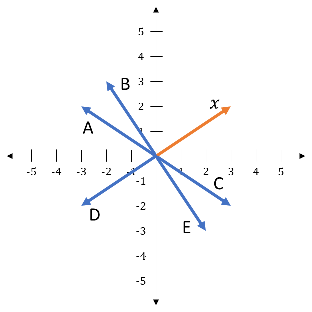
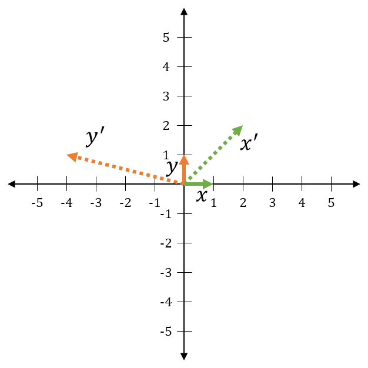

# Matrices

## Objective

Get exposed to matrices, basic matrix operations, and what it means to multiply a vector and a matrix.

## Matrix Notation

Sometimes in software, we need to use an array of arrays (or a two-dimensional array, where the inner arrays are all the same length).
In C-like languages, we might create one with something like this:

```csharp
int[][] matrix = new int[3][];
for(int i = 0; i < matrix.Length; i++)
{
    matrix[i] = new int[2];
}
```

Or, if the language supports explicit multi-dimensional syntax, something like this:

```csharp
int[,] matrix = new int[3,2];
```

Both of these would create two-dimensional arrays with 3 elements in the first dimension, and 2 in the second.
Similar to how vectors are the general math version of arrays, the math version of a two-dimensional array is called a **matrix**.
Matrices have the same syntax as vectors (number wrapped in square brackets).
The first dimension is represented by the **rows** of the matrix, and the second is represented by the **columns**.
Here is an example of a 3x2 matrix:

$$
\begin{bmatrix} 1 & 2 \\ 3 & 4 \\ 5 & 6 \end{bmatrix}
$$

When referring to a matrix in your code comments, one common convention is to write each row out with commas, then separate the rows with semicolons.
The matrix above would be written like this:

```csharp
// This matrix will be [1, 2; 3, 4; 5, 6]
```

As you might expect, matrices essentially act the same way as vectors during arithmetic operations.
In fact, a vector is really just a matrix where one of the dimensions is 1.

Matrices are represented by regular old algebraic variables, though they're usually capitalized to distinguish them from constant values or vectors.
Elements of a matrix $A$ are usually referenced with two subscript indices, where the 1st is the row and the 2nd is the column, like this:

$$
A = \begin{bmatrix} A_{00} & A_{01} \\ A_{10} & A_{11} \\ A_{20} & A_{21} \end{bmatrix}
$$


## Math Properties

### Addition

Adding two matrices together is the same as adding two vectors.
The matrices must be of the same size.
Just add each element to its partner:

$$
\displaylines{
A + B = \begin{bmatrix} A_{00} & A_{01} \\ A_{10} & A_{11} \\ A_{20} & A_{21} \end{bmatrix} + \begin{bmatrix} B_{00} & B_{01} \\ B_{10} & B_{11} \\ B_{20} & B_{21} \end{bmatrix} = \begin{bmatrix} A_{00} + B_{00} & A_{01} + B_{01}  \\ A_{10} + B_{10} & A_{11} + B_{11} \\ A_{20} +B_{20} & A_{21} + B_{21} \end{bmatrix}
\\~\\
\begin{bmatrix} 1 & 2 \\ 3 & 4 \\ 5 & 6 \end{bmatrix} + \begin{bmatrix} 7 & 8 \\ 9 & 10 \\ 11 & 12 \end{bmatrix} = \begin{bmatrix} 8 & 10 \\ 12 & 14 \\ 16 & 18 \end{bmatrix}
}
$$


### Scalar Multiplication

To multiply a matrix by a constant factor, just multiply each element by it.

$$
c \cdot \begin{bmatrix} A_{00} & A_{01} \\ A_{10} & A_{11} \\ A_{20} & A_{21} \end{bmatrix} = \begin{bmatrix} c \cdot A_{00} & c \cdot A_{01} \\ c \cdot A_{10} & c \cdot A_{11} \\ c \cdot A_{20} & c \cdot A_{21} \end{bmatrix}, \qquad 3 \cdot \begin{bmatrix} 1 & 2 \\ 3 & 4 \\ 5 & 6 \end{bmatrix} = \begin{bmatrix} 3 & 6 \\ 9 & 12 \\ 15 & 18 \end{bmatrix}
$$


### Matrix-Vector Multiplication

One of the most common operations in quantum computing is multiplying a matrix with a vector.
To multiply a matrix and a vector, there is one precondition: the length of the vector must be the same as the **width** of the matrix (the number of columns it has).

To do the multiplication, flip the vector sideways (so it becomes a row vector) and calculate the dot product of each row of the matrix and the vector.
The result will be put into a new column vector, which has the same **height** (number of rows) as the matrix:

$$
\displaylines{
\begin{bmatrix} A_{00} & A_{01} \\ A_{10} & A_{11} \\ A_{20} & A_{21} \end{bmatrix} \cdot \begin{bmatrix} x_0 \\ x_1 \end{bmatrix} = \begin{bmatrix} A_{00} \cdot x_0 + A_{01} \cdot x_1 \\ A_{10} \cdot x_0 + A_{11} \cdot x_1 \\ A_{20} \cdot x_0 + A_{21} \cdot x_1 \end{bmatrix}
\\~\\
\begin{bmatrix} 1 & 2 \\ 3 & 4 \\ 5 & 6 \end{bmatrix} \cdot \begin{bmatrix} 7 \\ 8 \end{bmatrix} = \begin{bmatrix} 7 + 16 \\ 21 + 32 \\ 35 + 48 \end{bmatrix} = \begin{bmatrix} 23 \\ 53 \\ 83 \end{bmatrix}
}
$$


## Additional Materials

- [Khan Academy unit on matrices](https://www.khanacademy.org/math/precalculus/x9e81a4f98389efdf:matrices)

    - Introduction to matrices
    - Adding and subtracting matrices
    - Multiplying matrices by scalars
    - Multiplying matrices by matrices
    - Matrices as transformations

- [3Blue1Brown video on linear transformations and matrices](https://youtu.be/kYB8IZa5AuE)

## Knowledge Check

### Q1

$$
\begin{bmatrix} 1 & 2 \\ 3 & 4 \end{bmatrix} + \begin{bmatrix} 5 & 6 \\ 7 & 8 \end{bmatrix} = \; ?
$$

??? check "Answer"
    $\begin{bmatrix} 6 & 8 \\ 10 & 12 \end{bmatrix}$

### Q2

$$
-3 \cdot \begin{bmatrix} 3 & -1 \\ 0 & 2i \\ a & e \end{bmatrix} = \; ?
$$

??? check "Answer"
    $\begin{bmatrix} -9 & 3 \\ 0 & -6i \\ -3a & -3e \end{bmatrix}$

### Q3

$$
\begin{bmatrix} 1 & 0 \\ 0 & 1 \end{bmatrix} \cdot \begin{bmatrix} 2 & -2 \\ 5 & 0 \end{bmatrix} = \; ?
$$

??? check "Answer"
    $\begin{bmatrix} 2 & -2 \\ 5 & 0 \end{bmatrix}$

### Q4

$$
\begin{bmatrix} 0 & 6 \\ -1 & 5 \end{bmatrix} \cdot \begin{bmatrix} -2 \\ 4 \end{bmatrix} = \; ?
$$

??? check "Answer"
    $\begin{bmatrix} 24 \\ 22 \end{bmatrix}$

### Q5

Which of the following is a valid expression (i.e., matrix multiplication is defined)? (Select all that apply.)

A: $\begin{bmatrix} a_{00} & a_{01} \\ a_{10} & a_{11} \end{bmatrix} \cdot \begin{bmatrix} b_{00} & b_{01} \\ b_{10} & b_{11} \\ b_{20} & b_{21} \end{bmatrix}$

B: $\begin{bmatrix} a_{00} & a_{01} & a_{10} \\ a_{10} & a_{11} & a_{12} \end{bmatrix} \cdot \begin{bmatrix} b_{00} & b_{01} b_{02} \\ b_{10} & b_{11} b_{12} \end{bmatrix}$

C: $\begin{bmatrix} a_{00} & a_{01} \\ a_{10} & a_{11} \\ a_{20} & a_{21} \end{bmatrix} \cdot \begin{bmatrix} b_{00} & b_{01} b_{02} \\ b_{10} & b_{11} b_{12} \end{bmatrix}$

D: $\begin{bmatrix} a_{00} \\ a_{01} \end{bmatrix} \cdot \begin{bmatrix} b_{00} & b_{01} \\ b_{10} & b_{11} \end{bmatrix}$

E: $\begin{bmatrix} a_{00} & a_{01} & a_{02} \end{bmatrix} \cdot \begin{bmatrix} b_{00} \\ b_{10} \\ b_{20} \end{bmatrix}$

??? check "Answer"
    C, E

### Q6

Let $M = \begin{bmatrix} 1 & 0 \\ 0 & -1 \end{bmatrix}$, and let $x$ be a 2-element vector as shown. Which vector represents $M \cdot x$?

{: .center loading=lazy style="background-color:white;" }

??? check "Answer"
    C

### Q7

Let $x = \begin{bmatrix} 1 \\ 0 \end{bmatrix}, \: y = \begin{bmatrix} 0 \\ 1 \end{bmatrix}, \: x' = \begin{bmatrix} 2 \\ 2 \end{bmatrix}, \: y' = \begin{bmatrix} -4 \\ 1 \end{bmatrix}$. Let $A$ be the matrix that satisfies $Ax = x'$ and $Ay = y'$. What is $A$?

{: .center loading=lazy style="background-color:white;" }

??? check "Answer"
    $\begin{bmatrix} 2 & -4 \\ 2 & 1 \end{bmatrix}$
