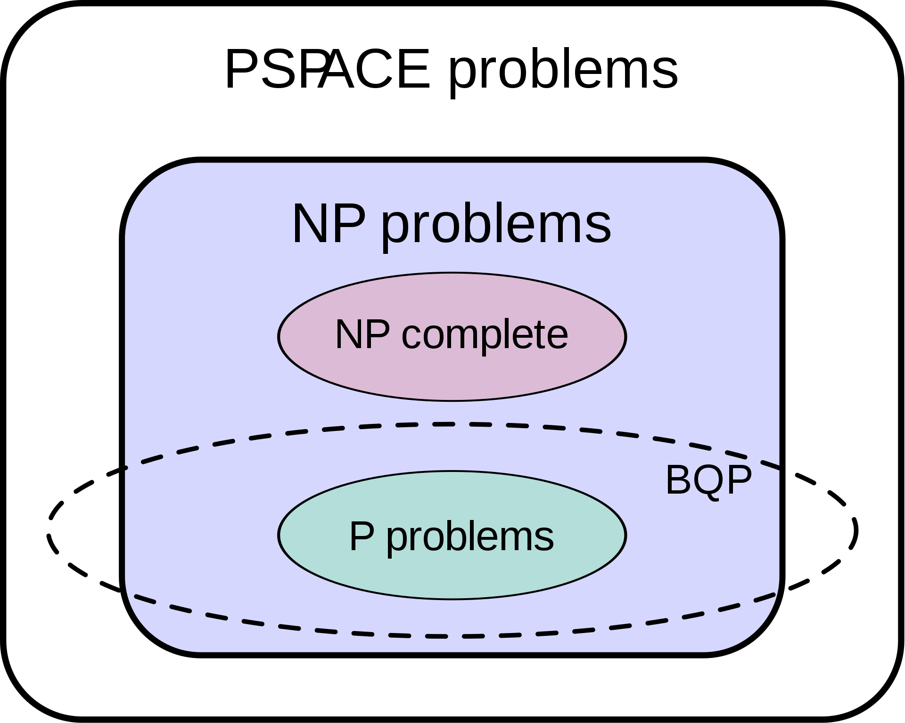
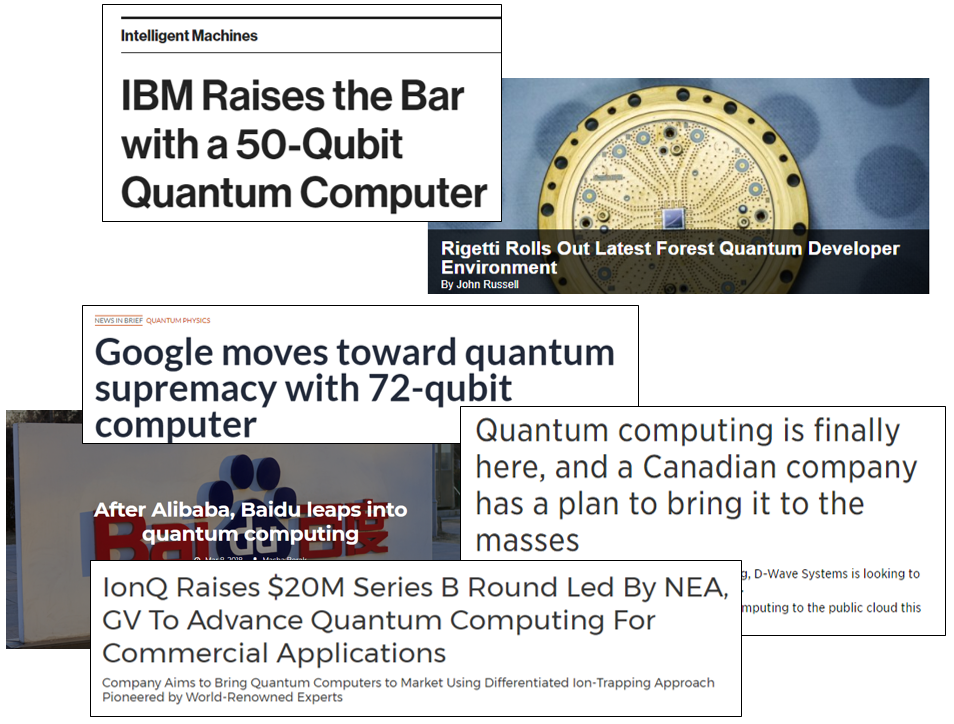

# Background

In recent years, there has been an enormous surge of interest in quantum computing. Government, academic, and commercial organizations have spent billions of dollars attempting to create reliable, general-purpose quantum computers. These systems leverage the unusual properties of quantum mechanics to perform computations that could never be performed on conventional computers in our lifetime. Such calculations have a wide range of applications, including:

- Breaking encryption algorithms (and designing new ones)
- Engineering new materials
- Simulating how systems behave in extreme environments
- Finding new medicines to cure disease
- Building secure transmission channels that cannot be eavesdropped

How do quantum computers accomplish these bold claims? How could we use this technology to tackle our most difficult challenges? And how do programmers like you access it? In this course, we will explore the answers to these questions and help you unlock the ability to write quantum software and simulate quantum algorithms.

## Quantum Computing Theory

The concept of leveraging systems governed by quantum mechanics to perform computation isn't a new one; the domain of quantum computing has been around since the 1980's.
For most of its life, it was almost exclusively explored by a small audience of physicists, mathematicians, computer scientists, and other academics.
The field itself was quite promising: every so often, someone would discover a new algorithm that used quantum computers to crush the performance of classical computers.
Some of them took classical algorithms that took exponential time to run, and reduced them down to even linear quantum time.

The typical example used to advertise the power of a quantum computer is called [Shor's algorithm](https://en.wikipedia.org/wiki/Shor%27s_algorithm) - it provides a way to factor an arbitrarily large integer in linear time, whereas the best classical algorithm still takes around exponential time to do it.
This has the convenient side-effect of destroying modern asymmetric-key cryptography such as the RSA algorithm used in HTTPS.

Besides trivializing modern cryptographic theory, quantum computers have shown promise in artificial intelligence, machine learning, materials science, optimization problems, medicine, and search applications to name a few.
In general, quantum computers offer substantial speedups in a number of algorithms that require exponential computation time on classical computers:

{: .center loading=lazy }

*Image taken from Wikipedia:
[https://en.wikipedia.org/wiki/BQP](https://en.wikipedia.org/wiki/BQP)*
{: .center }

This power has been very promising, but for the last thirty or so years, it's largely been confined to theory and papers.
Building an actual physical quantum computer is an extremely hard thing to do because of how sensitive quantum systems are, and how prone they are to spontaneously collapsing in the middle of a calculation.
For a long time, it was thought that practical quantum computers couldn't ever be realized.
In recent years, however, that sentiment has really been put to the test.

## The Hardware Revolution

At some point in the early-to-mid 2010s, researchers began to find successful, cost-effective ways to control and maintain quantum systems long enough for them to perform useful calculations.
Fueled by their success and the allure of these powerful quantum algorithms, commercial companies began to invest billions of dollars into research and development of quantum computers:

{: .center loading=lazy }

Their successes have demonstrated that the challenges behind quantum processors can be overcome, given enough research and investment.
Quantum computing is here to stay, and it's just getting started.
I'd say that if we were to draw a parallel between quantum computers and classical computers, our quantum systems are about as good as classical computers were in the 1940's or 50's.

Recognizing this, it became obvious to the researchers that there needed to be some kind of software framework that would allow developers to actually program and execute quantum algorithms on these machines.
After all, what good is a computer if it doesn't have any programs to run? Seventy-plus years of classical software development has taught us that software is not an easy thing to create.
We have best practices now, standards and conventions, high-level paradigms like automatic memory management and object-oriented programming, unit tests and peer reviews… software engineering has become a very complex and well-studied domain in its own right.

This class serves as a way to bridge these two domains, by introducing software engineers that are already proficient in the world of software design and implementation to the world of quantum computers.
At the end of the class, you should be ready to apply all of your software engineering knowledge to this brave new world, and help design high-quality quantum algorithms that can be run on real, physical quantum computers.
By the time they become commercially available, you will already know exactly how they work, and how to write programs that can run on them.

## Types of Quantum Computers

Quantum computers typically fall into three categories:

- **Quantum annealers** are designed to solve specially-crafted optimization problems.
  They use quantum mechanics to find "good enough" solutions to these problems, but not necessarily the best possible solution.
  A good example of a quantum annealer is the D-Wave 2000Q.
  We aren't going to discuss these machines in this class because they are limited specifically to optimization problems, as opposed to general purpose computation.
- **Universal quantum computers** (also called Universal gate machines) are quantum computers that essentially mimic the general purpose logic-gate style of classical processors.
  These computers are what we most often hear about when we see news articles that discuss things like "quantum supremacy" or quantum computers with some double-digit number of qubits.
  They are the systems that run the quantum algorithms that are often claimed to revolutionize everything - such as [Shor's algorithm](https://en.wikipedia.org/wiki/Shor%27s_algorithm) - which threatens to break conventional public-key cryptography.
  Companies like IBM, Microsoft, Google, Rigetti, and Alibaba are all heavily invested in researching universal quantum computers.
  We will be looking at these in this class, since they offer the most practical platform for software engineering applications.
- **Continuous Variable Machines** are a variant of universal quantum computers that are designed specifically for photonic systems.
  They are a relatively recent development in the field so we won't discuss them in this class, but they are something we're keeping our eyes on.
  Xanadu AI is working on this type of machine, along with an entire framework dedicated to quantum artificial intelligence using photonic systems.
