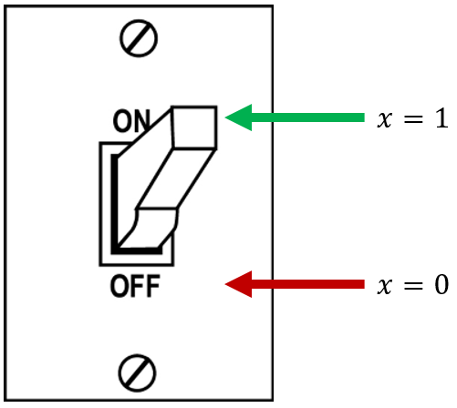

# Digital Logic

## Objective

Get comfortable with basic Boolean operations and understand fundamentally how classical computers process information.

## Binary Arithmetic Operations and Logic Gates

Classical computers revolve entirely around computing functions that are represented as sequences of binary arithmetic operations.
Binary arithmetic works exactly the same way as conventional base-10 arithmetic.
For example, consider this simple addition problem:

$$
10_d + 6_d = 1010_b + 0110_b
$$

$$
\begin{aligned}
&01010 \\
+ \: &00110 \\
\hline
= \: &10000_b
\end{aligned}
$$

$$
= 16_d
$$

Notice that "carrying the one" works the same way in binary as it does in decimal.
The same is true for subtraction, multiplication, division, or any of the other arithmetic operations.
However, classical computers don't actually function by performing these calculations directly.
Instead, they utilize a set of primitives called **logical operations**.
Logic operations are functions that act on one or two bits, and perform some particular operation on the input bit(s) to produce a single output bit.
Each one can be defined by a table that describes the inputs and corresponding output, called a **truth table**.

The physical manifestations of these operations are called **logic gates** - they represent what's actually happening to electrons inside a classical processor.
Billions upon billions of these gates are chained together to very quickly and efficiently compute the output values of binary arithmetic operations.
Our job as software engineers is to translate the function we want to solve into a sequence of these gates so the computer can calculate it, but we'll talk more about that in the next page.
For now, let's look at the main logic gates used by classical computers and the truth tables for each one.

### Unary Gates

Unary gates take in one single bit, and produce one single bit of output.
Though we're only ever concerned with one of them (the negation or NOT gate) on a daily basis, there are four of them in total.
Each gate can be applied to an entire array of bits (often called a **register**) by applying it to each individual bit separately.

#### Clear (Set to 0)

This gate discards the input, and always sets the output to 0, no matter what.

| Input | Output |
| - | - |
| 0 | 0 |
| 1 | 0 |

Bitwise Example:

$$
\text{Clear}(01101010) = 00000000
$$

#### Mark (Set to 1)

This is the opposite of Clear.
It just discards the input and sets the output to 1.

| Input | Output |
| - | - |
| 0 | 1 |
| 1 | 1 |

Bitwise Example:

$$
\text{Mark}(01101010) = 11111111
$$

#### Identity (I)

The identity gate doesn't actually do anything at all.
It simply outputs whatever the input bit was.
This is essentially an empty gate and may seem completely trivial, but it's actually quite important to note; we're going to refer back to this gate several times when discussing quantum computers.

| Input | Output |
| - | - |
| 0 | 0 |
| 1 | 1 |

Bitwise Example:

$$
\text{I}(01101010) = 01101010
$$

#### Negation (NOT)

The final unary gate is the logical negation, also called NOT.
This gate will output the opposite value of the input, and is used very often in computations.

| Input | Output |
| - | - |
| 0 | 1 |
| 1 | 0 |

Bitwise Example:

$$
\text{NOT}(01101010) = 10010101
$$

Because bits can only have the value 0 or 1, you can think of them like a light switch.
We could say that the 0 state represents the OFF position, and the 1 state represents the ON position (in caps because light switches always print the values in caps for some reason):

{: .center loading=lazy }

Changing the state of a light switch from ON to OFF or vice-versa is referred to as "flipping" the switch.
Keeping with this analogy, negating a bit is often called **flipping the bit**.
When we talk about bit flips in this course, that's all we mean - changing a bit into the opposite value of whatever it currently is.

### Binary Gates

Binary gates take in two input bits and produce one output bit.
There are technically six that are regularly used, but the last three are just the negations of the first three.
Like the unary gates, these gates can be applied in a bitwise fashion to two registers by operating on each pair of bits from the registers independently.

#### AND

The AND gate will produce a value of 1 if both the first and the second inputs are 1, hence the name.
If either one (or both) is 0, the output will be 0.

| Input A | Input B | Output |
| - | - | - |
| 0 | 0 | 0 |
| 0 | 1 | 0 |
| 1 | 0 | 0 |
| 1 | 1 | 1 |

Bitwise Example:

$$
0110 \: \text{AND} \: 1010 = 0010
$$

#### OR

The OR gate will produce a value of 1 if either the first or the second input is 1.
It only produces a 0 if both inputs are 0.

| Input A | Input B | Output |
| - | - | - |
| 0 | 0 | 0 |
| 0 | 1 | 1 |
| 1 | 0 | 1 |
| 1 | 1 | 1 |

Bitwise Example:

$$
0110 \: \text{OR} \: 1010 = 1110
$$

#### Exclusive OR (XOR)

XOR is an interesting and very useful gate.
It will produce 1 if the input bits are different, and 0 if they're the same.
XOR has a special symbol, which we encounter in quantum computing sometimes: a circled plus sign ($\oplus$).

| Input A | Input B | Output |
| - | - | - |
| 0 | 0 | 0 |
| 0 | 1 | 1 |
| 1 | 0 | 1 |
| 1 | 1 | 0 |

Bitwise Example:

$$
0110 \: \oplus \: 1010 = 1100
$$

#### NAND, NOR, and XNOR

These three gates are just the negations of the first three, and produce the opposite values of them.

## Additional Materials

- [Khan Academy lesson on logic gates and circuits](https://www.khanacademy.org/computing/computers-and-internet/xcae6f4a7ff015e7d:computers/xcae6f4a7ff015e7d:logic-gates-and-circuits/a/logic-gates)

- [CrashCourse video on Boolean logic & logic gates](https://youtu.be/gI-qXk7XojA)

- [MumboJumbo video demonstrating basic logic gates using Minecraft Redstone](https://youtu.be/9EY_XoEImjM)

- [Wikipedia article on Boolean algebra](https://en.wikipedia.org/wiki/Boolean_algebra)

    - Focus on the "Basic operations" section.

## Knowledge Check

### Q1

$$
\left( (\text{NOT} \ 0) \ \text{AND} \ 1 \right) \ \text{OR} \ 0 = \; ?
$$

??? check "Answer"
    $1$

### Q2

What logical expression is described by the following truth table?

| $X$ | $Y$ | $X \quad ? \quad Y$ |
| --- | --- | ------------------- |
| $0$ | $0$ | $0$                 |
| $0$ | $1$ | $1$                 |
| $1$ | $0$ | $1$                 |
| $1$ | $1$ | $0$                 |

??? check "Answer"
    $\text{XOR}$

### Q3

What is the logical negation of `10011110` (a.k.a. $\text{NOT} \ 10011110_2$)?

??? check "Answer"
    `01100001`

### Q4

Let $x$ be a byte of binary data. If $x$ $\text{AND}$ `0x81` equals `0x01`, then which of the following can be said about the decimal value of $x$? (Select all that apply.)

A: $x$ is even

B: $x$ is odd

C: $x$ is less than 128

D: $x$ is greater than 128

E: $x$ is less than or equal to 128

??? check "Answer"
    B, C

### Q5

What is the value of the “Sum” and “Carry” bits in the circuit shown below if both inputs are a `1`?

{: .center loading=lazy style="background-color:white;" }

??? check "Answer"
    Sum: `0`, Carry: `1`

## Exercises

### E1

Draw the schematic for an 8-bit binary adder

### E2

Implement the circuit you designed in E1 using Minecraft Redstone.
