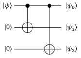
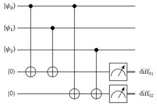

# Bit-Flip Error Correction

## The Bit-Flip Code

One of the biggest problems plaguing physical implementations of quantum computers is the fact that qubits currently have a very short "shelf-life".
Unlike classical bits on hard drives or CDs, which last for years, qubits in superpositions typically have lifespans on the order of microseconds before they "break" and their state changes unintentionally, ruining your computation.
They need to be very heavily isolated from everything else in the environment, because a single interaction with a stray particle or photon can put them into a completely different state.
When this environment-driven error inevitably happens, the circuit will produce nonsensical results; it's essentially the same as having a classical bit on a hard drive sector that no longer reads or writes reliably, so the data it produces is corrupted and useless.

Of course, nothing can be completely isolated from its environment.
Today's quantum computers essentially operate as a race against time, trying to finish meaningful calculations before the qubits break.
There are several techniques that scientists employ to extend this time as much as possible.
Many of them are hardware techniques, but one particular approach actually leverages software instead.
This approach uses what we call Error Correction Codes by entangling one qubit with multiple spare qubits so that they're all in the same state together.
If one of the qubits suffers from an environmentally-induced error, the error correction code can use the other qubits to "fix" it back into the proper state.

This particular technique is employed in many classical systems all over the place today, from RAID arrays with parity bits to communications channels that have low signal-to-noise ratios.
Quantum error correction borrows many ideas from classical error correction codes to help keep qubits "alive" as long as possible.
In this lab, we're going to study the simplest one: the **Bit-Flip Code**.

## Part 1: Encoding

The bit-flip code uses two spare qubits to protect an original qubit.
It can successfully identify and correct a single bit-flip error (meaning one of the three qubits was flipped, like with an X gate).
It can't protect against two bit-flips and it can't correct phase-flip errors; there are more complicated algorithms that provide that level of protection, but we're going to keep it simple since this is an introduction class.

There are three parts to the bit-flip code: first is the **encoding** step, which converts the one original qubit into a "logical" qubit composed of the three qubits, all of which are in the same state.
This logical qubit can then be passed around and used like a regular qubit, even though it's actually three qubits.
The original qubit can be in any arbitrary state, but the two spares must both start in the $`\ket{0}`$  state.
Here's a circuit diagram for the encoding step:

{: .center loading=lazy }

The original qubit is the first qubit in the diagram, and the two spares are the second and third ones.

## Part 2: Syndrome Measurement

The second part is called the **syndrome measurement** step.
This step is used to check the "parity" of the qubits.
Parity, in this case, refers to whether or not they are the same state or opposite states.
For example, consider this simple superposition:

$$
\ket{\psi} = \frac{1}{\sqrt{2}} \ket{001} + \frac{1}{\sqrt{2}} \ket{110}
$$

The first and second qubits are said to have the same parity, because when measured, they will always be in the same state.
The third qubit has opposite parity with the first and second, because when measured, it will always be different from both of them.
The syndrome measurement step is used to check the parity of the first and second qubits, and the first and third qubits.
To do this, it uses two ancilla qubits. Here's the circuit for it:

{: .center loading=lazy }

The syndrome measurement can be performed at any time during an operation, even in the middle of some complex calculation.
If you're feeling particularly paranoid that one of your quantum gates has caused an error, you can run this check immediately after that gate is used.

The two ancilla qubits won't end up being entangled with the logical qubit thanks to having two CNOT gates each, so we can measure them after the CNOT gates without destroying the logical qubit's superposition.
To explain what this measurement does, let's just consider the first parity qubit for simplicity:

1. This ancilla is entangled with the first and second qubits in the register.
1. The ancilla is measured.
    1. If it gives $\ket{0}$, then the first and second qubit have the same parity.
    1. If it gives $\ket{1}$, then the first and second qubit have opposite parity.
1. The measurement could potentially partially collapse the logical qubit's superposition, but it does this in a good way.
    1. If the logical qubit hasn't suffered from any bit flips, the measurement doesn't do anything.
    1. If the logical qubit has suffered from one clean bit flip that exactly flips one qubit (for example, turning $\ket{000}$ into $\ket{001}$), the measurement doesn't do anything.
    1. If the logical qubit has one of its physical qubits partially flipped, to produce a superposition of being flipped and not flipped (for example, turning $\ket{000}$ into $\frac{\sqrt{19}}{\sqrt{20}} \ket{000} + \frac{1}{\sqrt{20}} \ket{001}$), the measurement will partially collapse the register's superposition into a state where either the qubit is 100% broken or it isn't. It will remove any "sort-of-broken" state.

This process is identical for the second ancilla, except it measures the parity of the first and third qubits.

## Part 3: Correction

Once you have the parity measurements, you can perform the third part of the bit-flip code: the **correction** step.
This is where you interpret the syndrome measurement results, determine if one of the qubits is broken, and fix it.

To explain how the syndrome measurement results reveal the broken qubit, let's try a few examples.
Let's say the correct, unbroken state of the register is $\ket{000}$.
Here's what the syndrome measurements will report for a few different broken states:

| **Register State** | **0-1 Syndrome Measurement** | **0-2 Syndrome Measurement** |
| - | - | - |
| $\ket{000}$ | $\ket{0}$ (Same Parity) | $\ket{0}$ (Same Parity) |
| $\ket{001}$ | $\ket{0}$ (Same Parity) | $\ket{1}$ (Different Parity) |
| $\ket{010}$ | $\ket{1}$ (Different Parity) | $\ket{0}$ (Same Parity) |
| $\ket{100}$ | $\ket{1}$ (Different Parity) | $\ket{1}$ (Different Parity) |

In this example, conveniently enough, there are four possible outcomes of the syndrome measurement, and each one corresponds to a different broken qubit.
Take the second example where the register is in the state $\ket{001}$: in this case, the first and second qubits have the same parity, so the first syndrome measurement is $\ket{0}$. However, the first and third qubits have different parity, so the second syndrome measurement is $\ket{1}$.
Logically, if the first and second are the same but the first and third are different, then the third must be different from the first and second; thus, we have found the broken qubit.
As another example, if both syndrome measurements result in $\ket{1}$, then it means that the first and second qubits and the first and third qubits are different - logically, the first must be different from the second and from the third, and thus it must be broken.

Note that we don't actually get to measure the register's state during the syndrome measurement, but it turns out that it doesn't matter; since all we're interested in is the parity of the two qubit pairs, we can use the syndrome measurement to find and fix a broken qubit regardless of the register's "correct" state.

Once you've identified the broken qubit using classical logic, you simply need to fix it by applying the X gate to it. If none of the qubits are broken, the logical qubit doesn't need to be corrected, so you don't have to do anything.

## Lab 10

At this point you should be ready to tackle Lab 10, where you'll implement the bit-flip code on a qubit to protect it from stray bit-flip errors.
Have fun!
