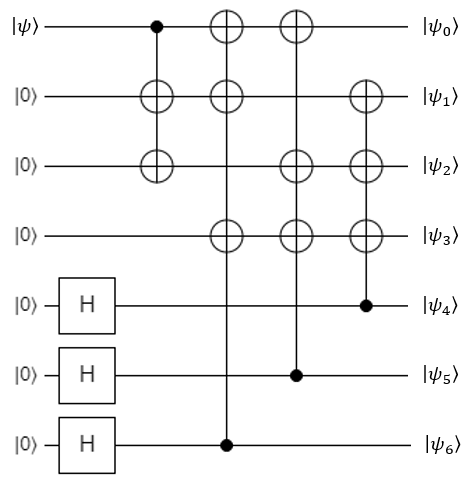
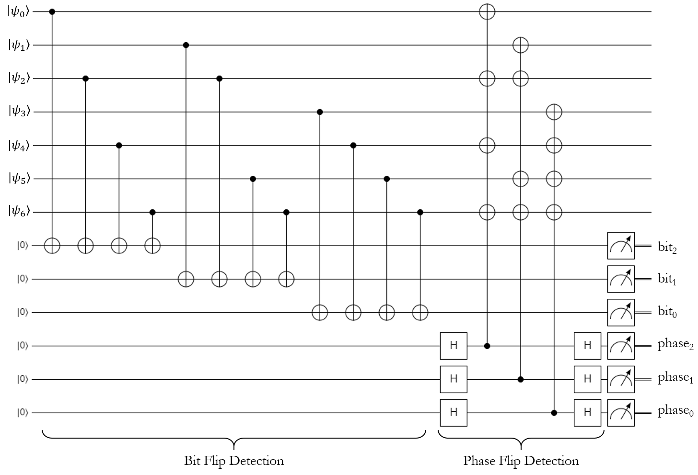

# Steane's Error Correction Code

## A Real Error Correction Code

In Lab 10, we introduced a simple error correction code that used 2 extra qubits to protect an original qubit from an errant bit-flip error.
This works fine for what it is, but it has a major drawback: it doesn’t protect against phase-flip errors.
Because of this, the bit-flip code is considered a kind of "toy" code - it's useful for teaching the concept, but it isn't really used in production systems.

In this section, we're going to introduce a *real* error correction code called the **Steane Code** (also called the **[[7,1,3]]** Code).
Steane is quite popular in actual quantum computing work.
There are a few different varieties of full ECCs, but this one is our personal favorite.
It's fairly efficient: it can protect a qubit against a bit-flip *and* a phase-flip using 6 spare qubits, and it has a really elegant syndrome measurement that we suspect you might appreciate.
Steane's code is actually based on a classical error correction code called a [Hamming code](https://en.wikipedia.org/wiki/Hamming_code); essentially it's the quantum equivalent of it.
If you've played with Hamming codes in the past, this is going to look very familiar.

### Encoding Circuit

The encoding circuit for the Steane code is going to look quite unusual compared to the algorithms you've seen before:

{: .center .small loading=lazy }

This will protect an original qubit with 6 spares, creating a logical qubit out of 7 physical ones.
Once protected, the register can suffer a bit-flip on any qubit and a phase-flip on any qubit, and the code can correct them.
The bit-flip and phase-flip don't have to be on the same qubit - they can both occur on different qubits, and the code can still fix it.

### Syndrome Measurement Circuit

Like the 3-qubit bit-flip code, Steane's error detection and correction operations can be invoked anywhere in the middle of a quantum program.
The canonical version of the syndrome measurement circuit uses 6 ancilla qubits (3 for the bit-flip detection, and 3 for the phase-flip detection), and it looks like this:

{: .center .xlarge loading=lazy }

However, this can really be broken into two parts: the bit-flip detection can be done first with 3 ancilla qubits, then the phase-flip detection can be done with the same 3 ancilla qubits (after they've been reset, of course).
The latter way is usually how the code is implemented in practice, and that's what the exercises will have you do.

Notice that the bit-flip measurements seem to be backwards: the first measurement is labelled $bit_2$, and the last measurement is labeled as $bit_0$.
The same is true of the phase-flip measurements.
This is because both syndrome measurements will provide the answer in little-endian notation, so we reversed their indices in the diagram to make them big-endian instead.

### Interpreting the Syndrome Measurement

Both syndrome measurements have the same general structure.
Let's look at the bit-flip measurement first.

The first syndrome qubit ($bit_2$) will be triggered if register qubit 0, 2, 4, or 6 has been flipped.
Similarly, the second syndrome qubit ($bit_1$) will be triggered if register qubit 1, 2, 5, or 6 has been flipped.
Finally, the third syndrome qubit ($bit_0$) will be triggered if register qubit 3, 4, 5, or 6 has been flipped.
To make this a little more clear, let's put these results into a table:

| Broken Qubit Index | $bit_0$ Value | $bit_1$ Value | $bit_2$ Value |
| - | - | - | - |
| None | 0 | 0 | 0 |
| 0 | 0 | 0 | 1 |
| 1 | 0 | 1 | 0 |
| 2 | 0 | 1 | 1 |
| 3 | 1 | 0 | 0 |
| 4 | 1 | 0 | 1 |
| 5 | 1 | 1 | 0 |
| 6 | 1 | 1 | 1 |

Notice a pattern?
The syndrome qubits basically represent the binary encoding of the broken qubit's index.
Unlike the bit-flip code, this doesn't really need any logical deduction to figure out what qubit is broken - Steane's code tells us exactly which one it is… well, assuming it was one-indexed.
Since it's zero-indexed in our register, we can just convert the syndrome measurements directly into an integer using a series of bit-shifts, subtract 1 from it, and that's our broken qubit (a value of -1 means none of them are broken).

Tip: the bit-shift operator in Q# is <<<.
For example, if you wanted to create the number 4 (which is 100 in binary), you could just do this:

```text
let four = 1 <<< 2;
```

This will shift the value 1 over by two places, giving 100 in binary.

Anyway, the syndrome measurement is exactly the same for the phase-flip detection step.
It will produce the same index after you do the math on the three syndrome qubits.
Personally, we think this is a lot nicer than the bit-flip parity measurement process.


## Lab 11

Alright, that's all you need to know about this code to implement it in Lab 11.
Good luck!
