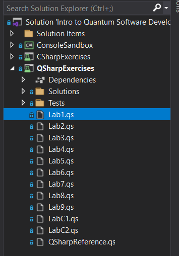
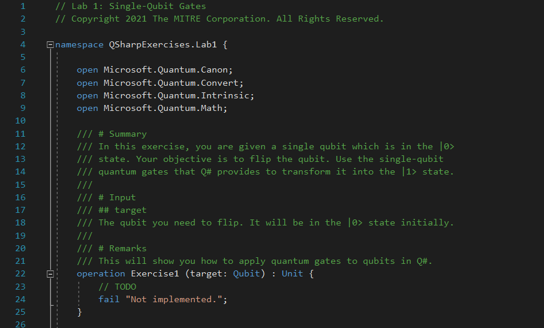
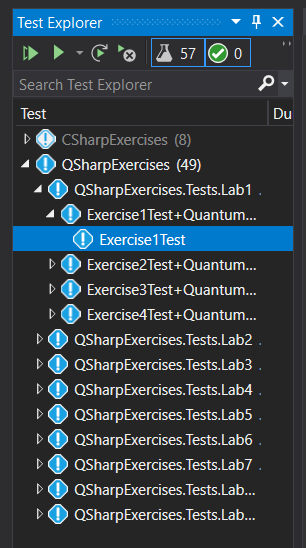
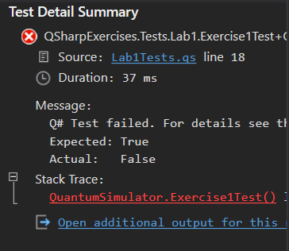

# Lab Tutorial: Single-Qubit Gates

At this point, you should work through the problems in the first lab: **Single-Qubit Gates**. 

Open the first file in the Visual Studio solution under the **QSharpExercises** project, called **Lab1.qs**:

{: .center loading=lazy }

It has some copyright stuff in the header, then this snippet:

{: .center loading=lazy }

As you can see, each exercise in the lab is constructed as a Q# operation.
The operation describes exactly what you need to do, and details the input parameters and the output (if one is required).
Essentially, you must fill in the body of the operation to achieve whatever the stated goal is.

Each exercise is actually the body of a unit test.
In order to test your solution to see if you got it right, find the corresponding test case in the Test Explorer:

{: .center loading=lazy }

Right-click on the test and select "Run Selected Tests" to try it out.
This will automatically compile the Q# code for you (if you didn't already build it manually after you added your changes) and run the test.
If your solution is correct, you'll see a green checkmark appear next to it when it's done.
If your solution is incorrect, you'll see a red X with an error message shown in the Test Explorer's output section:

{: .center loading=lazy }

In this case, try to find the problem in your solution and run it again once you've fixed it.

Once you've finished all of the exercises, continue to the next section.