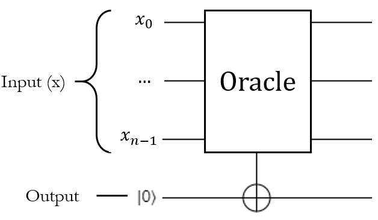
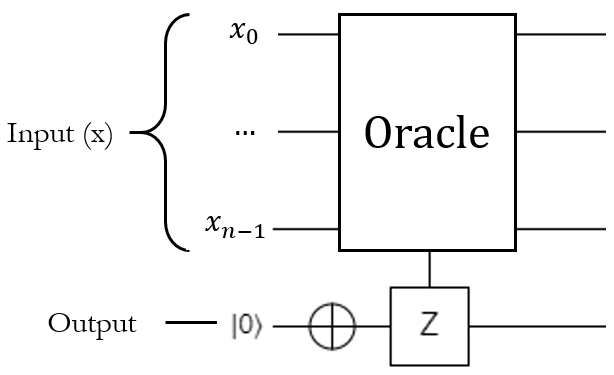
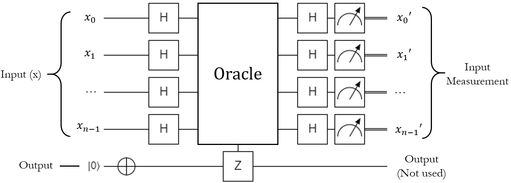
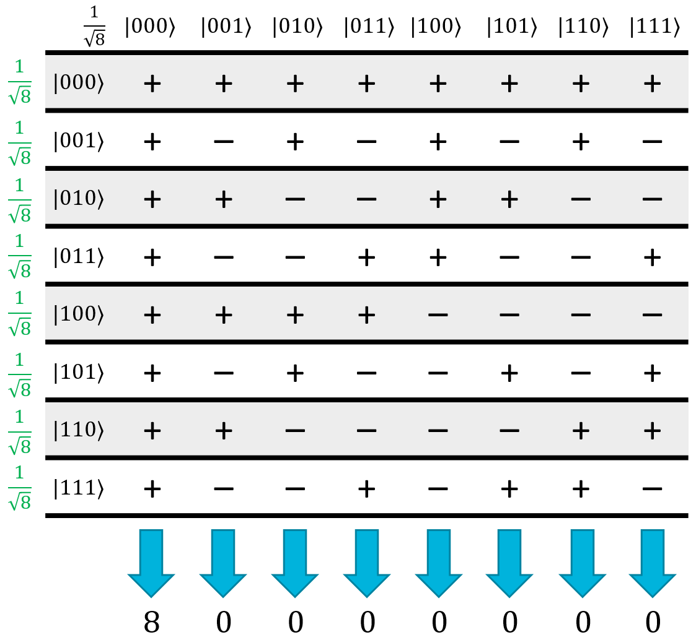
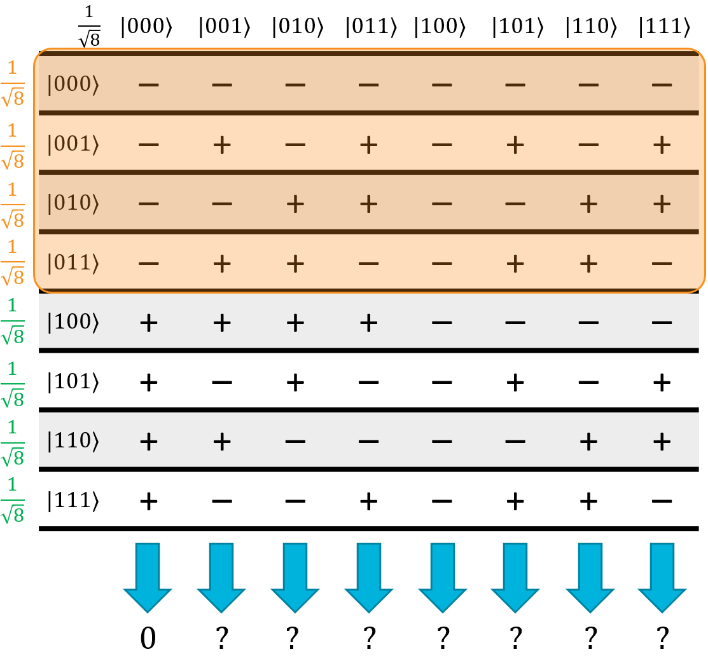

# Deutsch-Jozsa Algorithm

## A Simple Problem

The **Deutsch-Jozsa algorithm** is the first algorithm we're going to look at that provides an exponential speedup over a classical computer.
It's what we call a "toy" problem, because it's extremely contrived and doesn't really have any practical value, but it's a good, simple example of the power that a quantum computer can hold over a classical one.
This is typically the first "hello world" style algorithm taught to people that are new to quantum computing.
It's extremely easy to implement, but it's hard to understand why it works unless you've gone through all of the background that we’ve done so far (especially interference).
Before we get to that, though, we should explain the problem that it solves.

Forget quantum computers for a minute.
Let's go back to the world of classical computers.
Let's say you're given a **black box function**.
You don't know how the function works, but you know it has this signature (in some generic pseudocode):

```c#
public bool BlackBox(bit[] Input)
```

This function is what's called an **oracle**.
It takes in some kind of input, and it outputs a single bit: 0 or 1.
Yes or no.
Correct or incorrect.
You don't know how this oracle function works or what it does; all you know is that it takes in some input and will return true or false based on it.

Any function that implements this behavior can be considered an oracle.
For example, say we have a password checking function to see if the user entered the "correct" password for a given account.
It might take in a string and return true if the password is a match, or false if the password is incorrect:

```c#
public bool CheckPassword(string Input)
```

In this case, there is an enormous number of possible inputs, but only one of them will return true.

For this particular problem, we are promised the following fact about this function: it is either **constant**, or **balanced**.

- A **constant** function will always have the same behavior, no matter what the input is. That is, it always return true or always return false.
- A **balanced** function will return true for exactly one-half of the possible inputs, and return false for the other half. We don't know which inputs belong to which half, we just know that half will trigger it, and half won't.

For example, this is a constant function:

```c#
public bool BlackBox(bit[] Input)
{
    return false;
}
```

In fact, there are only 2 possible constant functions (the other of which always returns true).

Here's an example of a balanced function:

```c#
public bool BlackBox(bit[] Input)
{
    return Input[0] == 1;
}
```

For half of all of the possible inputs to the function, the first bit will be 0 so it will return false.
For the other half, the first bit will be 1 so it will return true.

The problem is this: given one of these black box functions, how many iterations do you need to run before knowing with 100% certainty whether it's constant or balanced?

On a classical computer, the oracle would typically be implemented as a function that takes an input register, and returns a single bit - either 0 or 1.
We wouldn't really have any other choice than to just try various inputs to see what the output is.
In the best case, we'd get super lucky and find two different outputs on our first two tries.
Since a constant function always has the same value for every input, we know that the function can't be constant, and thus it must be balanced.
In the worst case, we'd get super unlucky; we'd try exactly half of the inputs and get the same result for them, but then try one more and get a different result.
In that case the function is balanced, but we had to exhaust an entire half of the inputs to figure it out.
If we try that last extra value and it gives the same result as the first half, we know it's constant and don't have to check anymore.

As you know, with $n$ bits of input, there are $2^n$ possible input values for the function.
If we get unlucky, we're going to have to try $2^{n-1}+1$ iterations, which could be totally impractical for large inputs.
That's the answer to the problem: $2^{n-1}+1$ tries for complete certainty.
To put that into perspective, if we had a 128-bit input (like some encryption algorithms use) and could perform a billion checks per second, it would still take $1.7 \times 10^{29}$ seconds, or about $5 \times 10^{21}$ *years* to figure it out.

A quantum computer, on the other hand, can figure it out in **one iteration**.

## Implementing the Oracle as a Quantum Operation

Now, let's translate this from a classical function to a quantum operation.
The main hurdle to doing this is that quantum operations need to be reversible - they need to have the same number of inputs as outputs.
This means we can't just take in an input register and return a qubit; we actually have to provide the input register AND the "output" qubit as separate inputs to the function.
Think of this like an "out" parameter, if you've ever used those.

The Q# signature of the black box function would look like this:

```q#
operation BlackBox(Input : Qubit[], Output : Qubit) : Unit
```

The behavior of this operation will be identical to the classical implementation, except instead of returning true or false, this particular oracle will have to modify the output qubit.
If we pass in $\ket{0}$ as the output qubit, the oracle could simply apply the X gate to it if the input meets its conditions; that way the output would still be $\ket{0}$ if the input "failed", or it would be $\ket{1}$ if the input "succeeded":

{: .center loading=lazy }

That is a completely valid interpretation of how you might translate the classical oracle into a quantum function, and it makes a lot of sense.

It's also not what we're going to do here.

Instead, we're going to do this:

1. Put the output qubit into the $\ket{1}$ state before running the oracle.
1. If the input is "correct", apply the Z gate to the output qubit. Otherwise, leave it alone.

As you might expect, knowing whether the input is "correct" in a quantum operation is going to involve conditional logic, which means controlled gates.
Basically the oracle will need to run a controlled Z on the output qubit - the exact nature of the control qubits depends on the implementation of the oracle, but we know that in order to satisfy this behavior, it will have to do a controlled Z:

{: .center loading=lazy}

So what's the point of doing it this way?
Well, essentially, we're going to force the oracle to do **phase kickback** for us.
Instead of returning true or false for any given input, it will set the input's quantum state to be positive or negative.
If the state turns negative, then the input was "correct".
Since the "target" qubit (which will be the output qubit here) is in the $\ket{1}$ state, applying a controlled Z to it won't entangle it with the control qubits, but it will make the phase of the controlling term negative.

To explain exactly why we've decided to implement the oracle as a phase kickback function instead of a qubit flipping function, it's time to talk about Deutsch-Jozsa.

## The Deutsch-Jozsa Algorithm

Deutsch-Jozsa is a quantum algorithm that solves this whole constant-or-balanced problem by leveraging superpositions and interference.
At a high level, it puts the input into a uniform superposition so all of the possible inputs are checked by the oracle at once.
This is often called **quantum parallelism**, since it's effectively running the function on all $2^n$ inputs simultaneously.
If the function is constant, none of the results will interfere with one another, and the input register will be left in the same state as it originally was.
If the function is balanced, half of the inputs will interfere with the other half, and the input will end up in some other state.
Checking to see if the input is in the original state or not after the function runs is easy enough, and tells you whether the oracle is constant or balanced.

Here's a circuit diagram for the algorithm:

{: .center .large loading=lazy }

This circuit demonstrates one of the weird things about most quantum algorithms: we usually end up measuring the input to the function after it runs, rather than the output like we're used to doing with classical computers.
In this case, we don't actually care about what happens to the target bit (in fact, it will still be in the $\ket{1}$ state after the function runs).
What we really want to know is what happened to the input, based on the phase kickback and the interference caused by the second round of $H_{ALL}$ that runs after the oracle.

### How it Works

The key to this algorithm is the fact that the oracle is *guaranteed* to be constant or balanced.
This algorithm doesn't work for any old oracle; it only works if we know for a fact that the oracle is one or the other.
To demonstrate why it works, let's bring up the 3-qubit Hadamatrix:

{: .center loading=lazy }

If we start with the state $\ket{000}$ as our input, then after the first $H_{ALL}$ operation, we know it will be in a uniform superposition of all possible states.
A constant function will either leave the whole matrix alone (because it never flipped the target qubit), or will negate all of the rows in the matrix (because it flipped every single input state).
Now, consider what happens during the second $H_{ALL}$ operation:

{: .center loading=lazy }

Every column in the table will have an equal number of + and - terms, so they will all interfere and cancel each other out… except for the $\ket{000}$ state.
The $\ket{000}$ state is all positive (or all negative, if the oracle flips all of the input states) so it will be the only state left that has a non-zero amplitude.
If it's negative, it just means it has a negative global phase, so it's effectively the same thing.

To put it simply, if we start with the $\ket{000}$ state, then for a constant function, we will always end with the $\ket{000}$ state.
It won't ever be in a superposition; if we measure $\ket{000}$ after the algorithm finishes, we 100% know that the function was constant.

Now, consider what happens for a balanced function.
Exactly half of the inputs will flip the target qubit.
Thanks to phase kickback, this means exactly half of the input superposition's terms will get negated, which means we can flip half of the rows in the Hadamatrix.
As an example, let's just flip the first four rows:

{: .center loading=lazy }

Take a look at what happened to the $\ket{000}$ column: instead of being all positive, now exactly half of the terms are positive and half are negative.
In other words, all of the $\ket{000}$ terms will destructively interfere, so it will have an amplitude of 0.
Here's the kicker: because the original $\ket{000}$ column was all positive, it doesn't matter which rows end up being flipped.
As long as exactly half of them are, the $\ket{000}$ state will always have 0 amplitude thanks to quantum interference.

To put this simply, if we start with the $\ket{000}$ state, then for a balanced function, we will never end up measuring the $\ket{000}$ state.
It can be literally anything else, including some bizarre superposition, but the superposition will never include the $\ket{000}$ state as one of its terms.
At least one of the qubits will be $\ket{1}$ when you measure it.

To summarize, once we run the algorithm and measure the qubits in the input register, if any of them are $\ket{1}$, then the function is balanced.
If all of them are $\ket{0}$, then the function is constant.
That's it.
Thanks to superpositions and interference, a quantum computer can answer this problem in a single iteration.

### Implementation

Here are the steps to implement the Deutsch-Jozsa algorithm:

1. Apply H to all of the input qubits, resulting in a uniform superposition of all $\ket{2^n}$ possible states.
1. Apply X to the output qubit, so it is in the $\ket{1}$ state.
1. Run the oracle on the input register and output qubit.
1. Apply H to all of the input qubits.
1. Measure all of the input qubits.
   If all of them are $\ket{0}$, then the function is **constant**.
   If any of the input qubits is $\ket{1}$, then the function is **balanced**.

## Lab 5

Unsurprisingly, in Lab 5, you're going to implement Deutsch-Jozsa along with a few oracle functions for practice.
Have fun!
