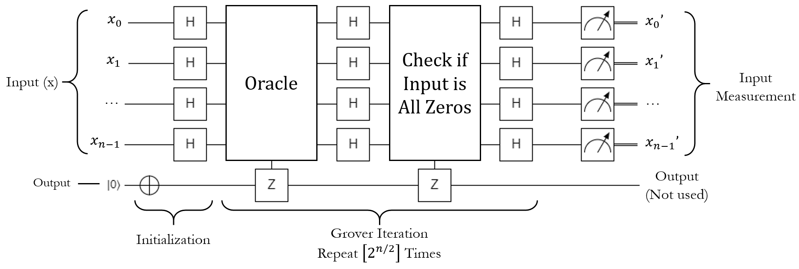
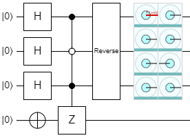
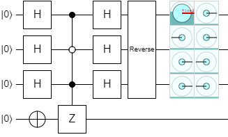
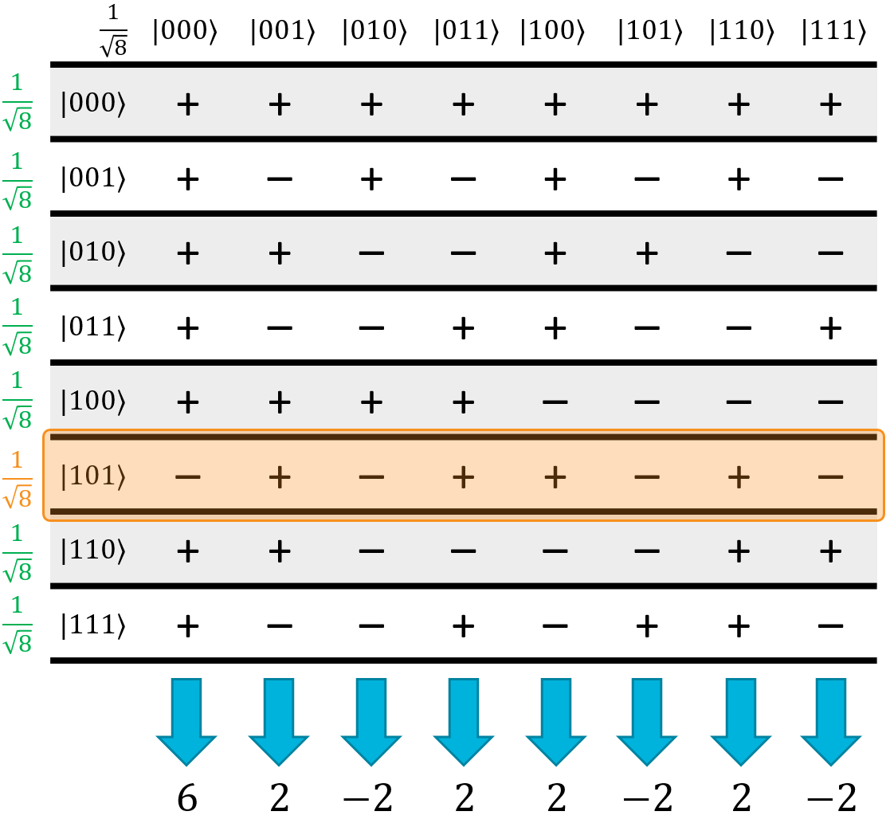
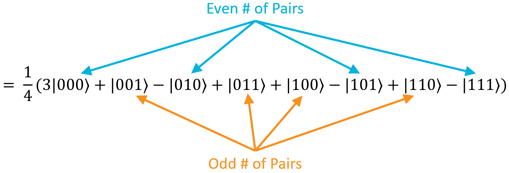
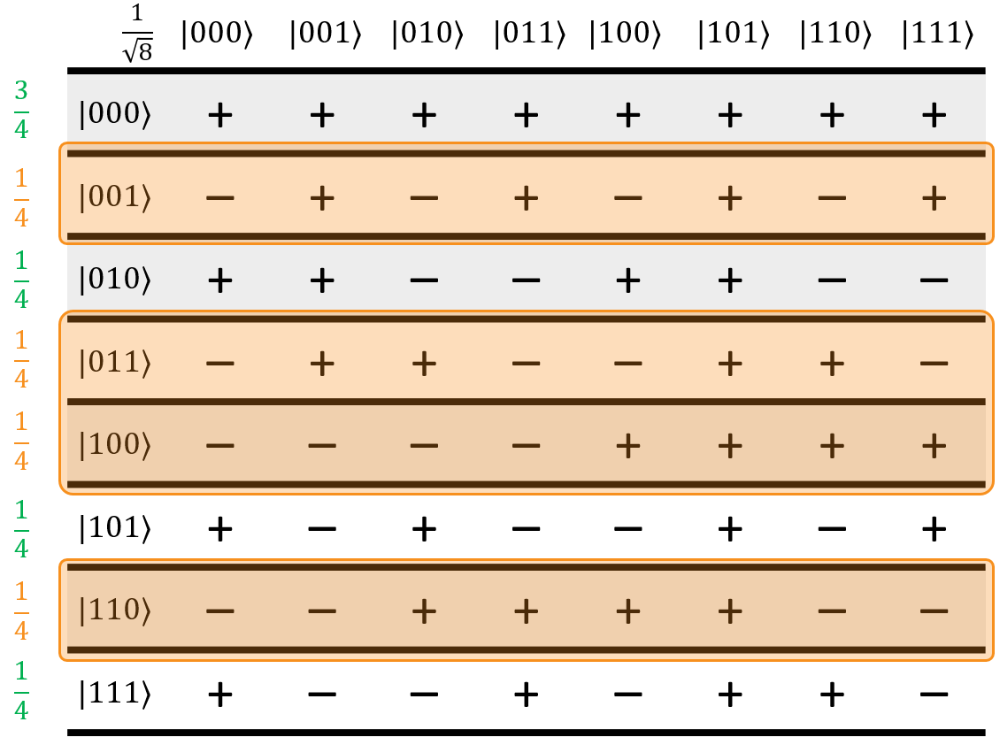
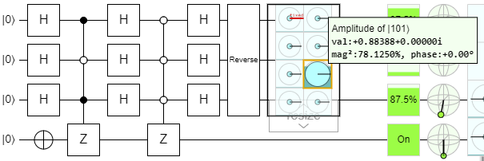
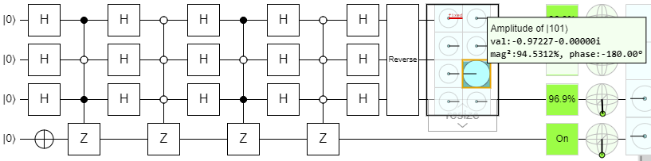

# Grover's Algorithm

## The Needle in the Haystack: Brute Force Search

Imagine the following scenario: you're cleaning out some old stuff that you've had in your closet since you were a kid, and you come across a notebook.
Inside this notebook, you find a phone number with no name attached.
You don't know if it belongs to a friend, or to someone you've never met before, or what - but your curiosity has been piqued, and you want to figure it out.
What's your strategy?

First, you type the first few digits into your cellphone and see if it filters your contacts enough that you can find a match.
You try it, but no such luck.
Next, you try doing a web search for it.
The results tell you roughly where the number is in the world, but doesn't give you any information on who owns it.
As a last-ditch effort, you grab an old-school paper phone book from when you were a kid to try and look it up.

But there's a problem! Phone books aren't sorted by number, they're sorted by name. In order to figure out who the number belongs to, you'd basically have to go through the entire book, line by line, until you found a match.
There are millions of listings in the phone book. It would take you forever to look through all of them, and you don't have that kind of time.
You sigh, and throw the notebook into a box for recycling.
You'll never know who that mysterious number belonged to, or why you wrote it down all those years ago.

Now, as you're going through your closet, you find an old laptop you completely forgot about.
You bet it has a bunch of nostalgic stuff - old conversations with friends, old pictures, a few games you used to play… you plug it in, boot it up, and are greeted with a login prompt.
You have no idea what the password is. You haphazardly try a bunch of different things you think you remember from way back when, but none of them seem to work.
You'd have better luck just trying every possible password until you finally got to the right one.
Even if you knew exactly how long it was, if it was any sensible size, it would take way too long to just try all of the key combinations.
You shake your head and pray you didn't encrypt the hard drive, so you can at least plug it into another computer to see what's on there.

Whoops!
Turns out you were paranoid as a teen, and you did encrypt the hard drive so nobody would steal all of your precious data.
You know what the algorithm is, and you know it has an 80-bit key.
That means there are $2^{80}$ possible keys, which is on the order of $10^{24}$.
If you could check a million keys per second, it would take you approximately **40 billion years** to crack the code.

Sigh.

The three scenarios above are examples of problems that require **brute force search** to solve: given some function, for all of the possible inputs, exactly one of them is the "correct" one and all of the others are wrong.
If you have nothing else to go on, your only strategy is to try them all and hope you get lucky. More specifically, for an n bit input space, you'll have to try up to $2^n$ inputs before you find the correct one.
This exponential growth problem is important; a lot of our modern cryptography, including symmetric key algorithms like AES or cryptographic hash functions like SHA-256, depend on this property.

Luckily for us, quantum computers don't play by the same rules.
In 1996, a computer scientist named Lov Grover found a quantum algorithm that could find this "correct" state, no matter what the actual function was, in $\sqrt{2^n} = 2^{n∕2}$ iterations almost every time.
To put that into perspective, your laptop's 80-bit encryption algorithm would only require $2^{40}$ iterations - at a million checks per second, you could knock that out in **just under 13 days**.
That's a big deal.

## Grover's Search Algorithm

Grover's algorithm is somewhat similar to Deutsch-Jozsa: it uses superpositions and interference to "highlight" a special state that we care about.
Unlike Deutsch-Jozsa, however, Grover's algorithm requires multiple iterations to work.
It's not a simple one-and-done algorithm. Also, Grover's algorithm is a **probabilistic** algorithm: it doesn't have a 100% chance of returning the correct answer.
It has a very high chance, which actually increases with the size of the input space, but it's not 100%.
In most cases, however, if the first run doesn't give you the right answer, you can just try it again.
In our example above, even if it took you 4 tries to crack the code, that's still only 52 days.
That's a lot better than 40 billion years.
In our experience, it pretty much always finds the right answer in 1 to 3 tries.

At a high level, Grover's algorithm puts the input into a uniform superposition of all possible inputs, so that every single state has a small (but non-zero) amplitude.
It uses several rounds of interference to gradually amplify the amplitude of the correct state while reducing the amplitudes of the incorrect states, until the correct state's amplitude is so high that it is extremely likely to be measured.
This technique is called **amplitude amplification**, and unlike Deutsch-Jozsa, it's not a toy problem.
It's a serious quantum technique that scientists and engineers are very excited about, because it has major implications for… well, pretty much any problem that involves searching for something.
Grover's algorithm is a major real-world use case for quantum computers, and today you're going to build it.

Here's a circuit diagram for the algorithm. It's going to require some explanation, but I'll walk you through it:

{: .center .xlarge loading=lazy }

On the surface, this looks fairly similar to Deutsch-Jozsa.
There's an input register and a target qubit, the input starts as all possible states and the output starts as $\ket{1}$, some stuff happens, then the input is measured.
All of that should feel fairly familiar.
What needs explaining is the "some stuff happens" part of the algorithm, which is labeled as "Grover Iteration" in the picture.
Here's what this subroutine does, step by step.

### The Grover Iteration, Step 1: The Oracle

The first thing the iteration does is run the oracle.
Like before, this oracle is a black box function that takes in some input, and if the input meets some criteria, it flips the phase of the target qubit to cause phase kickback on the input state.
In this case, however, we aren't looking at a constant or balanced oracle; the only thing we know is that there is one "correct" state out of all of the possible states, and this oracle will flag it with a phase-flip.
That's all we get.

To put it more simply, when run on a superposition of all possible inputs, the oracle will phase-flip the correct state and leave all of the incorrect states alone.
It doesn't touch the amplitude, it doesn't magically reveal the state, all it does is make it negative and leave the other states positive.

Let's demonstrate this with an example.
Say we have an oracle that takes a 3-qubit register as the input, and the "correct" state is $\ket{101}$.
Here's what the output of Quirk looks like if we built this circuit:

{: .center .small loading=lazy }

The controlled Z in this circuit is the oracle.
Notice how all of the amplitudes are positive, except for $\ket{101}$ which is negative.

### The Grover Iteration, Step 2: H on All

Once the correct state has been flagged with a phase flip, the next thing the iteration does is apply H to all of the input qubits.
This causes quantum interference and produces kind of a weird state:

{: .center .small loading=lazy }

Without the oracle, this would just put the input back into the $\ket{000}$ state.
With the oracle, however, the $\ket{000}$ state still has a large amplitude, but now all of the other states have some non-zero amplitude as well.
Furthermore, some of them are positive and some of them are negative.

To explain what happened here, let's go back to the Hadamatrix.
When the oracle phase-flipped the correct state, it ended up flipping one row in the matrix:

{: .center .large loading=lazy }

This one row-flip will produce this state:

$$
\begin{aligned}
H_{ALL}(\psi), \qquad \ket{\psi} = \frac{1}{8} ( &\, 6\ket{000} + 2\ket{001} - 2\ket{010} + 2\ket{011} + \\
&\, 2\ket{100} - 2\ket{101} + 2\ket{110} - 2\ket{111} )
\end{aligned}
$$

$$
\begin{aligned}
= \frac{1}{4} \left( 3\ket{000} + \ket{001} - \ket{010} + \ket{011} + \ket{100} - \ket{101} + \ket{110} - \ket{111} \right)
\end{aligned}
$$

What this step has done is essentially calculated the mod-2 dot product of every state against the correct one (in this example, $\ket{101}$).
The mod-2 dot product is this operation:

$$
\ket{a} \cdot \ket{b} \mod 2 = (a_0 \cdot b_0) \oplus (a_1 \cdot b_1) \oplus ... \oplus (a_{n-1} \cdot b_{n-1})
$$

Basically, it multiplies each pair of bits together, and XORs all of the results together.
If there were an even number of pairs where both bits were 1, the total result will be zero.
If there were an odd number of $(1⋅1)$ pairs, the total result will be one.
With respect to this $H_{ALL}$ operation, all of the states with an even number of pairs went negative, and all of the states with an odd number of pairs stayed positive:

{: .center .large loading=lazy }

However, there's one glaring exception: the state $\ket{000}$ has an even number of pairs (zero), so it should be negative.
It's not. It's positive.
This bring us to step number 3.

### The Grover Iteration, Step 3 - Flipping the Zero State

The third step runs a function labeled "Check if Input is All Zeros".
This function is actually an oracle, and it does exactly what you would expect: it checks to see if the input is all zeros (in the $\ket{0..0}$ state), and if it is, it flips its phase.
In other words, it fixes the fact that $\ket{0..0}$ has the wrong phase after step 2.
In our example, it would result in this state:

$$
\begin{aligned}
Check \; if \; all \; Zeros(\psi), \qquad \ket{\psi} = \frac{1}{4} ( -3 &\, \ket{000} + \ket{001} - \ket{010} + \ket{011} + \\
&\, \ket{100} - \ket{101} + \ket{110} - \ket{111} )
\end{aligned}
$$

That being said, remember that the standard convention is to assume the $\ket{0..0}$ state doesn't have a phase.
So, rather than negate this phase, we say that this step negates the phase of *every other state in the superposition:*

$$
= \frac{1}{4} \left( 3\ket{000} - \ket{001} + \ket{010} - \ket{011} - \ket{100} + \ket{101} - \ket{110} + \ket{111} \right)
$$

This is the same as the first example, multiplied by a global phase of -1, so they're effectively the same state.
Now, all of the positive states are the ones where the mod-2 dot product with $\ket{101}$ is 0 (the states that have an even number of $\ket{1}$ qubit pairs), and all of the negative states are the ones where the product is 1 (an odd number of $\ket{1}$ qubit pairs).
The mod-2 dot product phases are back to normal! Here's the quirk output at this point:

{: .center loading=lazy }

And now, we're ready to look at the last step of the iteration.

### The Grover Iteration, Step 4: H on All Again

The final step of the iteration applies $H_{ALL}$ to the input once more.
In its current state, exactly half of the inputs will be negated.
Here's the Hadamatrix for our example:

{: .center .large loading=lazy }

What's immediately obvious is that all of the terms in the column of the correct state, $\ket{101}$, are all positive, while every other column has an equal number of positives and negatives.
All of those wrong states will destructively interfere, and the correct state will constructively interfere, boosting its own amplitude at the expense of all of the others.

Doing the math, the final state becomes this:

$$
\begin{aligned}
H_{ALL}(\psi), \qquad \ket{\psi} = \frac{1}{4\sqrt{8}} ( &\, 2\ket{000} + 2\ket{001} + 2\ket{010} + 2\ket{011} + \\
&\, 2\ket{100} + 10\ket{101} + 2\ket{110} + 2\ket{111} )
\end{aligned}
$$

$$
\begin{aligned}
= \frac{1}{2\sqrt{8}} \left( \ket{000} + \ket{001} + \ket{010} + \ket{011} + \ket{100} + 5\ket{101} + \ket{110} + \ket{111} \right)
\end{aligned}
$$

Here it is in Quirk:

{: .center .large loading=lazy }

The amplitude of the $\ket{101}$ state is 5x larger than the others, making it 25x more likely to be measured than any of the others.
Still, since there are 7 other states, it only has a $25/32 \approx 78\%$ chance of being measured.
However, if we just run the iteration again…

{: .center .xlarge loading=lazy }

Now it has a 94.5% chance of being measured - and this is actually as high as it gets for 3 qubits.
If we tried running the iteration again, we'd actually overshoot and it would decrease in amplitude.
Notice that we already overshot it a bit here, because the amplitude of the correct state has gone negative - the second iteration actually took it past 100% and back down to 94.5%.

And that, in conclusion, is how Grover's search algorithm works.
Lots of carefully-crafted interference brings the correct state to light much faster than brute forcing it with a classical computer.
No wonder everyone is excited about quantum computers!

### Implementation

Here are the steps to implement Grover's algorithm in code:

1. Apply H to all of the input qubits, resulting in a uniform superposition of all $2^n$ possible states.
1. Apply X to the output qubit, so it is in the $\ket{1}$ state.
1. Run the Grover iteration $[2^{n∕2}]$ times (rounded to the nearest integer).
    1. Run the oracle on the input register and target qubit.
    1. Apply H to all of the input qubits.
    1. Negate the $\ket{0..0}$ state with a zero-controlled Z on the output qubit, using the entire input register as the controls.
    1. Apply H to all of the input qubits.
1. Measure the input register. The resulting bit string is (probably) the correct state.
1. Run the result on the classical implementation of the function, and check if it's the correct answer.
   If it is, you're done. If not, start over and run the whole algorithm again.

## Lab 7

Alright, you're ready to put your Q# skills to the test and build Grover's algorithm in Lab 7!
