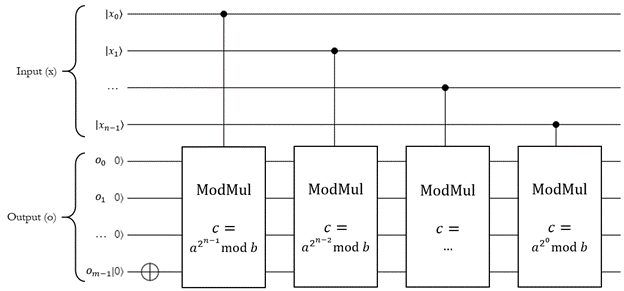
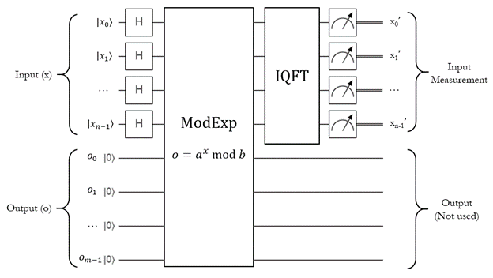
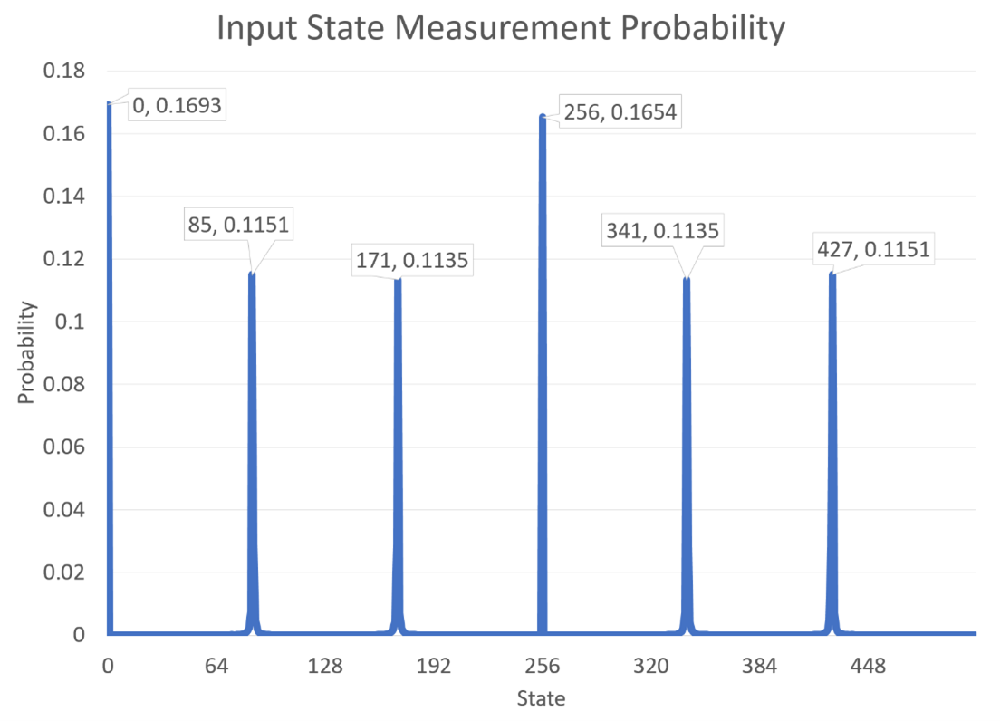

# Shor's Algorithm

## Introduction

Shor's algorithm is perhaps the most famous of all quantum algorithms.
First published in 1994, it is often credited with propelling the surge of interest in quantum computing development that we've been enjoying lately.
Like [Simon's algorithm](./simons-algorithm.md), Shor's is actually a **hybrid** algorithm: it involves some classical pre-processing, then a quantum subroutine, then some classical post-processing.
It is also **iterative**: it can take several rounds of the algorithm to find the right answer.

The problem that it solves is simple:

> Given some non-prime integer $N$, find an integer greater than 1 and less than $N$ that divides it evenly.

More formally, the problem it solves is to find an integer $a$ such that $N/a = b$, where $1 < a < N$ and $b$ is also an integer.

This problem is called the **integer factorization** problem, and computationally, it is extremely difficult to solve for classical computers.
For every bit you add to the size of $N$, it takes twice as long to find a solution.
Integer factorization is an **exponentially difficult** problem; it falls into the **NP** algorithms.

This property of the problem makes it very useful in cryptography and security.
Many asymmetric key encryption algorithms that we use today, such as [RSA](https://en.wikipedia.org/wiki/RSA_(cryptosystem)), rely on this very property in order to provide security: if you have $a$, it's easy to check if it divides $N$ quickly but if you have $N$, it's impractical to find $a$ without just guessing and trying random numbers until you find it.

This kind of encryption is used everywhere today!
For example, the HTTPS protocol uses it to secure all of your Internet traffic so that people can't capture it in transit, read it, and spy on what you're up to.
Really: go to any HTTPS site, click on the little lock icon in your browser next to the URL, and look at the connection details.
You'll see something like this:

{: .center loading=lazy }

You'll see something like that `TLS_ECDHE_RSA_WITH_AES_12_GCM_SHA256` thing - if it involves phrases like `RSA` or `ECDH` or `ECDSA`, then it's using asymmetric encryption.

The reason Shor's algorithm is so important is because it uses a quantum computer to **solve integer factorization in polynomial time**.
In other words, it can do it quickly and efficiently compared to a classical computer - what once took several quadrillion years now takes 10 seconds.
It turns it from an **NP** problem into a **P** problem.

Put plainly, this means a sufficiently powerful quantum computer can use this algorithm to break asymmetric encryption, so someone with one of these machines can read all of your internet traffic.
That means they can steal your passwords, get access to your bank info, upload cat videos to Youtube under your account... and pretty much anything else that involves your identity's security.
As you can imagine, this has pretty profound implications for the security posture of just about every communications technology we use today.

Exactly *how* it does this is a very complicated question to answer, but we're going to go through the entire thing, step by step.
At the end of this section, you will have everything you need in order to implement Shor's algorithm in code.

Make no mistake: this is the final boss of quantum algorithms.
Once you learn how to do this, you will be able to understand and implement any quantum algorithm out there.

To start, let's talk about **modular exponentiation**.

## The Modular Exponentiation Function

Modular exponentiation refers to functions that have this form:

$$
y = a^x \mod b
$$

where $a$, $b$, $x$, and $y$ are all integers, and where $\mod{}$ refers to the **modulo operator**.
$x \mod y$ simply means "divide $x$ by $y$, and return the *remainder* as the output".
As a simple example, let $a=11$ and $b=21$; the output of the function would look like this:

$$
\displaylines{
\begin{aligned}
11^0 \mod 21 &= 1
\\~\\
11^1 \mod 21 &= 11
\\~\\
11^2 \mod 21 &= 16
\\~\\
...
\end{aligned}}
$$

As is the nature of modular functions like this, the remainder can't be bigger than the modulus (the value you're dividing by) so every output will be constrained by the rule that $0 \le y < b$.
The actual term $a^x$ could be absolutely *gigantic* and take billions of bytes to store, but the $\mod b$ at the end means the result will always be less than $b$.
Because of this property, we actually have a lot of [very efficient classical algorithms](https://en.wikipedia.org/wiki/Modular_exponentiation#Right-to-left_binary_method) to calculate it quickly for arbitrary values, even for ridiculously large values of $x$.

### The Binary Substitution Technique

The first step on our journey through Shor's algorithm is to represent this function as a quantum circuit.
Specifically, we want to achieve this setup:

$$
\ket{x,y} = \text{modexp}(\ket{x}, \ket{0}, a, b)
$$

So `modexp` is going to take four arguments: 

- An input register with the value of $x$ (which can be in superposition)
- An output register that will hold $y$
- The value $a$ which is just a classical integer, not a qubit register
- The value $b$ which is just a classical integer, not a qubit register

Note that this is not an *in-place* operation like QFT; this uses the *other* method, where you have two distinct input and output registers and the calculation will entangle them together.

To describe how to implement it, we're going to go over a neat little trick that draws from a fun fact we presented all the way at the beginning of class, when we went over the prerequisites.
Let's talk about **binary numbers** again.

Recall that in big-endian notation, any arbitrary binary number can be broken down like this:

$$
x = x_0 \cdot 2^{n-1} + x_1 \cdot 2^{n-2} + ... + x_{n-1} \cdot 2^0
$$

For example, the number 13 in decimal can be written like this in binary:

$$
\displaylines{
\begin{aligned}
13 &= 8 + 4 + 1
\\~\\
&= 1 \cdot 8 + 1 \cdot 4 + 0 \cdot 2 + 1 \cdot 1
\\~\\
&= 1 \cdot 2^3 + 1 \cdot 2^2 + 0 \cdot 2^1 + 1 \cdot 2^0
\end{aligned}}
$$

Therefore, the binary version of 13 is 1101.

Now, let's rewrite the modular exponentiation function by substituting $x$ with this binary expansion:

$$
\displaylines{
\begin{aligned}
y &= a^x \mod b
\\~\\
&= a^{x_0 \cdot 2^{n-1} + x_1 \cdot 2^{n-2} + ... + x_{n-1} \cdot 2^0} \mod b
\end{aligned}}
$$

Using the [product rule of exponents](https://brilliant.org/wiki/simplify-exponents/), we can rewrite it as a series of multiplications like this:

$$
= a^{x_0 \cdot 2^{n-1}} \cdot a^{x_1 \cdot 2^{n-2}} \cdot ... \cdot a^{x_{n-1} \cdot 2^0} \mod b
$$

Now, because [the modulo operator is distributive](https://en.wikipedia.org/wiki/Modulo_operation#Properties_(identities)), we can rewrite it like this:

$$
= \left( a^{x_0 \cdot 2^{n-1}} \mod b \right) \cdot \left( a^{x_1 \cdot 2^{n-2}} \mod b \right) \cdot \left( ... \right) \cdot \left( a^{x_{n-1} \cdot 2^0} \mod b \right) \mod b
$$

As you can see, we've converted the overall exponentiation into a series of multiplications.
To save space so there's only one register (that is, the input is the same as the output so this is an **in-place** multiplication), we can just set the input to 1 initially like this:

$$
= \left( \left( 1 \cdot \left( a^{x_0 \cdot 2^{n-1}} \mod b \right) \mod b \right) \cdot \left( a^{x_1 \cdot 2^{n-2}} \mod b \right) \mod b \right) ...
$$

Great!
Now we just need to do **modular multiplication**.
If we have a way to do *that*, we can calculate the modular exponentiation function.
We'll get to that in a minute, but for now, let's show off another neat trick.

### Quantum Modular Exponentiation

Take a look at what happens to one of these terms when $x_i$ is 0:

$$
\displaylines{
\begin{aligned}
\ket{r^\prime} &= \left( \ket{r} \cdot a^{0 \cdot 2^{n-i-1}} \mod b \right) \mod b
\\~\\
&= \left( \ket{r} \cdot a^0 \mod b \right) \mod b
\\~\\
&= \left( \ket{r} \cdot 1 \mod b \right) \mod b
\\~\\
&= \left( \ket{r} \mod b \right) \mod b
\\~\\
&= \ket{r}
\end{aligned}}
$$

We know that $\ket{r} = \ket{r} \mod b$ to start, since the initial value is 1 and every multiplication after that is modular.
Therefore, for bits where $x_i=0$, the modular multiplication term won't actually do anything.

To turn this into an algorithm, what we need is a mechanism that says something like:

> If this qubit is 0, don't do anything; if this qubit is 1, do an in-place modular multiplication

We do have a mechanism like this - **controlled operations**!

What we're looking for is a **controlled modular multiplication** operation.
If we have a quantum version of it that satisfies this form:

$$
\ket{r^\prime} = \left( \ket{r} \cdot c \right) \mod b
$$

Then we can use it in this circuit:

{: .center loading=lazy }

This is the circuit for **quantum modular exponentiation**.

A few things to note here:

- The input register $\ket{x}$ holds the value $x$, which is the exponent of $y = a^x \mod b$.
- The output register $\ket{o}$ starts with the value 1, as required, then chains a bunch of controlled modular multiplications (controlled on each qubit of the input $x$).
- Each modular multiplication is parameterized by $c$ - this is actually precomputed on the classical computer and passed into the function. The actual circuit of each modular multiplication will be different because it depends on this $c$ value.
- Because this uses one iteration of `ModMul` for each bit of the input, it scales linearly with the size of the input $x$ in bits - in other words, this is **exponentially faster** than calculating the modular exponent for lots of inputs classically because if you put $x$ into a uniform superposition, the quantum one can calculate it for all possible values at once.

!!! note
    In order to implement this, we'd have to implement the `ModMul` function.
    This is certainly doable (in fact, Q# [comes with an implementation in its function library](https://github.com/microsoft/QuantumLibraries/blob/5cb1f4323e8e81196fdd2a6e07867597c62a9ef2/Standard/src/Arithmetic/Modular.qs#L228)), but it follows the same concepts as the ones you just saw.
    It ultimately boils down to modular addition, and for the sake of this class, we're just going to skip it for now.
    If you're interested though, we encourage you to [look through the theory behind it](https://arxiv.org/pdf/quant-ph/0205095v3.pdf) on your own.

Alright, so we have a quantum modular exponentiation function.
How does that relate to integer factorization?
We'll get there, but next let's talk about period finding.

## Finding the Period of Modular Exponentiation

The modular exponentiation function has an interesting feature: if $a$ and $b$ are **co-prime** (that is, they don't share any common factors other than 1), the output of the function is **periodic** (cyclical - it has a pattern that repeats forever).

To continue the earlier example, let's say $a=11$ and $b=21$.
11 and 21 are co-prime because they don't have any factors in common.
Here's the table of modular exponentiation values as we go through values of $x$:

| $x$ | $11^x \mod 21$ |
| - | - |
| 0 | 1 |
| 1 | 11 |
| 2 | 16 |
| 3 | 8 |
| 4 | 4 |
| 5 | 2 |
| 6 | 1 |
| 7 | 11 |
| 8 | 16 |
| 9 | 8 |
| ... | ... |

For $a=11$ and $b=21$, the pattern (1, 11, 16, 8, 4, 2) repeats forever.
This pattern contains 6 entries, so we say that the function **$11^x \mod 21$ has period 6** (also called **order 6**).

More generally, the period of the modular exponentiation function is the smallest value of $p$ that satisfies this equation:

$$
a^p \mod b = 1, \qquad p > 0
$$

This is because modular exponentiation always starts at 1 when the exponent is 0; thus, any value of $p$ greater than 0 that results in a 1 signifies the beginning of a new repetition of the sequence.
Once you hit a repetition, you know that the previous values were 0 to $p-1$ (which were $p$ total values), thus $p$ tells you the number of terms in the sequence.

This works for any values of $a$ and $b$, as long as they're co-prime.
As another example, if we leave $b=21$ but vary the value of $a$, here is a table of period values:

| $a$ | Period |
| - | - |
| 0 | --- |
| 1 | --- |
| 2 | 6 |
| 3 | --- |
| 4 | 3 |
| 5 | 6 |
| 6 | --- |
| 7 | --- |
| 8 | 2 |
| 9 | --- |
| ... | ... |

The rows with `---` in the period are places where $a$ is not co-prime with 21.

Now, normally, finding the period of the modular exponentiation function is an **exponentially difficult** problem.
There's no easy way to do it; barring some optimizations, you simply have to go through each value of $x$ and check to see if the modular exponent is 1.
For very large values of $a$ and $b$, this can take a very, *very* long time.
So long, in fact, that it's impractical to solve on a classical computer - finding the period of this function is an NP-hard problem.

At least, it *was*.

### Quantum Phase Estimation

Let's take our example earlier where $a=11$ and $b=21$, and run it through our quantum modular exponentiation function.
As with all things, let's just set $\ket{x}$ into a uniform superposition of all possible values using the $H_{ALL}$ operation.
Assuming $x$ is an $n$-qubit register, then the result is this:

$$
\displaylines{
\begin{aligned}
\ket{x} &= 0
\\~\\
H_{ALL}(\ket{x}), \qquad \ket{x} &= \frac{1}{\sqrt{2^n}} \sum_{i=0}^{2^n-1} \ket{i}
\\~\\
&= \frac{1}{\sqrt{2^n}} \left( \ket{0} + \ket{1} + \ket{2} + ... + \ket{2^n-1} \right)
\end{aligned}}
$$

Now let's run the modular exponentiation:

$$
\displaylines{
\begin{aligned}
\ket{x,y} &= \frac{1}{\sqrt{2^n}} \sum_{i=0}^{2^n-1} \ket{i, 0}
\\~\\
\text{ModExp}(\ket{x}, \ket{0}), \qquad \ket{x,y} &= \frac{1}{\sqrt{2^n}} \sum_{i=0}^{2^n-1} \ket{i, 11^i \mod 21}
\\~\\
&= \frac{1}{\sqrt{2^n}} \left( \ket{0,1} + \ket{1,11} + \ket{2,16} + \ket{3,8} + ... \right)
\end{aligned}}
$$

Excellent!
We now have the modular exponentiation function calculated. 
As you'd expect, the resulting superposition has a **periodic component** to it: the output register contains a repeating pattern with 6 elements.
The output register itself doesn't contain any information about the period; it just has six possible mostly-likely outcomes (1, 11, 16, 8, 4, or 2).
The input register itself doesn't contain any information about the period; it's just an equally-likely superposition of all possible states.
Indeed, the period information is captured in the relationship between the input and output once they're entangled together.

In the [QFT](./qft.md) section, we demonstrated how the inverse QFT could be used to recover the frequency of a wave if the that wave was encoded into the amplitudes of a register in superposition.
Here, we're going to do something similar.
It's a little different because the amplitudes don't contain a wave in the same way; they all have the same value in some states, and 0 value in others (for example, $\ket{0,14}$ is not part of the superposition).

We're going to do this:

{: .center loading=lazy }

That is, we're going to run the modular exponentiation circuit covered above with the input in a complete superposition, and then run the inverse QFT on the **input register only**.
Finally, we do a measurement on the input register to get some kind of result back.

Fundamentally, the inverse QFT is going to transform the overall state from this:

$$
\displaylines{
\begin{aligned}
\ket{x,o} &= \frac{1}{\sqrt{2^n}} \sum_{a=0}^{2^n-1} \ket{a, 11^a \mod 21}
\\~\\
&= \frac{1}{\sqrt{2^n}} \left( \ket{0,1} + \ket{1,11} + \ket{2,16} + \ket{3,8} + ... \right)
\end{aligned}}
$$

to this:

$$
\ket{x,o} = \frac{1}{2^n} \sum_{b=0}^{2^n-1} \sum_{a=0}^{2^n-1} e^{-2 \pi i \cdot a b / 2^n} \cdot \ket{b, 11^a \mod 21}
$$

This is going to cause a lot of quantum interference on the original statevector.
Most of the states are going to **destructively** interfere so that their amplitudes are practically zero.
There are a few key states, however, that will **constructively** interfere so that their amplitudes are extremely high compared to the others.

Let's say that our input register, $\ket{x}$, has 9 qubits in it.
With a uniform superposition, its values will range from 0 to 511 (for a total of 512 values).
If we do this, then here are the resulting probabilities for each state after we run the above circuit:

{: .center loading=lazy }

Right away, you can see something interesting: the period for $11^x \mod 21$ is 6, and there are 6 evenly-spaced values with massive probabilities in $\ket{x}$ after the inverse QFT.
This is not a coincidence.
While we can't immediately count the number of "peaks" in this graph (and thus get the number 6), we *can* do some very clever computation to get that number and thus return the period of the modular exponentiation function.

The general name for this technique is known as [Quantum Phase Estimation](https://en.wikipedia.org/wiki/Quantum_phase_estimation_algorithm).
The theory behind *why* the IQFT causes interference to produce these peaks is fairly complicated to describe without diving heavily into the math; if you are curious, we encourage you to explore the topic further.
For the sake of this introductory class, we're just going to highlight the fact that it will result in this interference pattern, and describe how to take advantage of it.

### Continued Fractions

Let's call these heavily amplified states the **special states**, and denote the $i$-th one as $s_i$.
The special states amplified by this algorithm follow this equation:

$$
s_i = \frac{2^n \cdot i}{p}, \qquad 0 \le i < p
$$

Here $p$ is the period of the modular exponentiation function (which is what we want to find), $i$ is an integer, and $n$ is the number of qubits in the input register.
For our $11^x \mod 21$ example, using $n=9$, here is a table of all of the special states:

| $i$ | $s_i$ | $\ket{x_i}$ |
| - | - | - |
| 0 | 0 | 0 |
| 1 | 85.333... | 85 |
| 2 | 170.666... | 171 |
| 3 | 256 | 256 |
| 4 | 341.333... | 341 |
| 5 | 426.666... | 427 |

Note that because $\ket{x}$ is an integer, it will end up being rounded to the closest value of the corresponding special state.
That's why, in the above picture, the values 85, 171, 341, and 427 have a lower probability than 0 and 256 - they are rounded, so their amplitude is distributed amongst the nearest integers instead of being concentrated at one value.

Because of this, a more precise equation for $\ket{x_i}$ is as follows:

$$
\ket{x_i} \approx \frac{2^n \cdot i}{p}, \qquad 0 \le i < p
$$

If we reformulate it a bit, we can move all of the known quantities over to the left side:

$$
\frac{\ket{x_i}}{2^n} \approx \frac{i}{p}
$$

Thus, when we measure $\ket{x_i}$, we have a good approximation for the value of $\frac{i}{p}$.
This doesn't tell us $p$ exactly, but it can be used to recover it with some clever techniques.
Before that though, let's discuss a way to get the **actual** value of $\frac{i}{p}$ instead of just an approximation.
Luckily for us, there is an efficient way to do this on a classical computer.
It involves **continued fractions**.

A continued fraction is one that takes this form:

$$
x = a_0 + \frac{1}{a_1 + \frac{1}{a_2 + \frac{1}{a_3 + ...}}}
$$

Any number, rational or irrational, can be expressed in this form.
For irrational numbers, this process will keep going on forever.
For rational numbers, this process may go on for a while but will eventually end.
This is good, because our $\frac{i}{p}$ value is definitely a **rational** number.

In continued fractions, the $a_i$ values at each level are called the **coefficients of the continued fraction**.
They are all integers.

If we start with a typical rational number $P/Q$, there is an easy iterative algorithm for getting each of these coefficients:

1. Start by calling $P_0$ the **numerator** used for the first iteration, and $Q_0$ the **denominator** for the first iteration. Set $P_0 = P$ and $Q_0 = Q$.
1. Calculate $P_0 / Q_0$ (in integer arithmetic, so truncating any remainder). This will be the first coefficient, $a_0$. More formally, $a_0 = \lfloor P_0 / Q_0 \rfloor$.
1. Calculate the remainder, $r_0$, as $r_0 = P_0 \mod Q_0$.
1. Run the next iteration. Set $P_1 = Q_0$ and $Q_1 = r_0$.
1. Repeat step 2 with $P_1$ and $Q_1$ to obtain the next coefficient, $a_1$.
1. Repeat steps 3 and 4 using $P_1$ and $Q_1$ to obtain $P_2$ and $Q_2$.
1. Continue this process until $r_i = 0$. At this point, the coefficient found during this iteration will be the final one.

As an example, let's run this algorithm on the fraction $45/16$ to find the continued fraction form:

| Step ($i$) | $P_i$ | $Q_i$ | **$a_i$** | $r_i$ |
| - | - | - | - | - |
| 0 | 45 | 16 | **2** | 13 |
| 1 | 16 | 13 | **1** | 3 |
| 2 | 13 | 3 | **4** | 1 |
| 3 | 3 | 1 | **3** | 0 |

This tells us that the continued fraction representation of $45/16$ is:

$$
\frac{45}{16} = 2 + \frac{1}{1 + \frac{1}{4 + \frac{1}{3}}}
$$

Great!
This is helpful if we already know what $P$ and $Q$ are, but back to our original problem - we don't.
We have an approximation of them, but not the real values.
To find the period of modular exponentiations, we need those real values.
We can do that using a similar technique to the above, known as finding the **convergents of a continued fraction**.

### Continued Fraction Convergents

**Convergents** of continued fractions are approximations of continued fractions that simply stop at a certain coefficient instead of continuing all the way.

Let's label the $i$-th convergent as $v_i$.
As a general rule, the convergents will take this form:

$$
\displaylines{
v_0 = a_0
\\~\\
v_1 = a_0 + \frac{1}{a_1}
\\~\\
v_2 = a_0 + \frac{1}{a_1 + \frac{1}{a_2}}
}
$$

Continuing the $45/16$ example, the first convergent is $2$, the second is $2 + \frac{1}{1} = 3$, the third is $2 + \frac{1}{1 + \frac{1}{4}} = 14/5 = 2.8$, and the fourth is the actual value $45/16 = 2.8125$.
As you can see, the convergents actually *oscillate* around the actual value as they get closer and closer to it.
Sometimes they're smaller, sometimes they're larger, but as you add more terms, they tend to *converge* towards the actual value (assuming it's a rational number).
Hence the name, *convergents*.

Here is a simple algorithm to calculate the numerator $n_i$ and denominator $d_i$ for each of the convergents:

1. Start with the initial values $n_{-2} = 0$, $d_{-2} = 1$, $n_{-1} = 1$, and $d_{-1} = 0$.
1. Calculate the numerator $n_0$ of the first convergent $v_0$: $n_0 = a_0 \cdot n_{-1} + n_{-2}$. Calculate the denominator $d_0$ of the first convergent $v_0$: $d_0 = a_0 \cdot d_{-1} + d_{-2}$.
1. Repeat this process, where $n_i = a_i \cdot n_{i-1} + n_{i-2}$ and $d_i = a_i \cdot d_{i-1} + d_{i-2}$.
1. Keep going until $d_i$ is larger than some arbitrary cutoff (discussed in a minute), or until you hit the final coefficient.

Let's apply this to the $45/16$ example to demonstrate how it works:

| Step ($i$) | Coefficient ($a_i$) | Numerator ($n_i$) | Denominator ($d_i$) | Value |
| - | - | - | - | - |
| -2 | - | 0 | 1 | - |
| -1 | - | 1 | 0 | - |
| 0 | 2 | 2 | 1 | $\frac{2}{1}=2$ |
| 1 | 1 | 3 | 1 | $\frac{3}{1}=3$ |
| 2 | 4 | 14 | 5 | $\frac{14}{5}=2.8$ |
| 3 | 3 | 45 | 16 | $\frac{45}{16}=2.8125$ |

Nice.
Now, to relate it back to our original problem of finding $p$, the period of modular exponentiation!

To do this, we're going to set the cutoff in step 4 to $b$, which is the original modulus value used in the modular exponentiation.
If the denominator ever gets larger than this, we'll stop.
This is because we know that $p$, the denominator, must always be less than $b$ - the period will always be smaller than the value it's being modulo'd by!
So if we ever get a denominator larger than that, we overshot the **real** value of $p$ and can retrieve it by simply getting looking at the last convergent before we overshot.

Going back to our $11^x \mod 21$ example, we had 6 special states: 0, 85, 171, 256, 341, and 427.
Let's do an example where we measured 341 in the input register, which corresponds to $\frac{i}{p} = \frac{4}{6}$ so $i=4$. 
That means we'll use 341 as $P_0$, 512 as $Q_0$, and stop if the convergent denominator is ever larger than 21:

| Step ($i$) | $P_i$ | $Q_i$ | $a_i$ | $r_i$ | Numerator ($n_i$) | Denominator ($d_i$) |
| - | - | - | - | - | - | - |
| -2 | - | - | - | - | 0 | 1 |
| -1 | - | - | - | - | 1 | 0 |
| 0 | 341 | 512 | 0 | 341 | 0 | 1 |
| 1 | 512 | 341 | 1 | 171 | 1 | 1 |
| 2 | 341 | 171 | 1 | 170 | 1 | 2 |
| 3 | 171 | 170 | 1 | 1 | 2 | 3 |
| 4 | 170 | 1 | 170 | 0 | 341 | 512 |

$v_4$ has a demoninator of 512, which is too big.
That means the **true** value of $\frac{i}{p}$ is represented by $v_3$; in other words, we know that if we measure $341$ in the input register, then $i$ is 2 and $p$ is 3!
We've found the period!

...or have we?

It turns out that this gets is closer to the right answer, but unfortunately it only gives the **reduced fraction** form of the actual value.
Since the original in this example was $4/6$, the reduced version is $2/3$ which is what we landed on here.
The value that we get for the denominator *could* be $p$, or it could just be a *factor* of $p$.
Luckily, it's very easy to test if we found the period; we just have to quickly calculate if $a^p \mod b = 1$.
If it is, we found the period by definition!
If not, we have to do some more work.

!!!note
    If you measure 0 in the input register, you have to scrap the entire measurement and do the whole quantum subroutine again to try to get a different value.
    This is because 0 always solves $a^p \mod b = 1$, but it doesn't actually tell you what the period is; it's a **fake answer** and isn't helpful.

### Aggregating Factors of the Period

So far, we've managed to use a quantum subroutine to retrieve one of the special states with the period of modular exponentiation hidden inside of it, and we've used continued fraction convergents to find a factor of the period.
We're so close... we just need to find the period itself.

While this seems daunting, we're actually very close to the finish line.
It turns out all we need to do is find *more factors of $p$*, and we can use an efficient iterative algorithm to progressively get closer and closer to $p$ with each new factor.

Let's demonstrate what to do with an example.
Say we have some values of $a$ and $b$, so that the period of $a^x \mod b$ is 24.
24 has several factors: 2, 3, 4, 6, 8, 12, and 24 itself.
We could measure any of these using the procedure so far.

Let's say we run the algorithm once, and calculate a 2 for the period - call this $d_{old}$.
Then, we run it a second time, and calculate 3 - call this $d_{new}$.
This tells us that 2 and 3 are both factors of the actual period.
We can use this information to calculate a *larger* factor with this equation:

$$
factor = \frac{d_{old} \cdot d_{new}}{\gcd(d_{old}, d_{new})}
$$

where $\gcd$ is the [greatest common divisor](https://en.wikipedia.org/wiki/Greatest_common_divisor) function, which can be efficiently calculated with the [Euclidean algorithm](https://en.wikipedia.org/wiki/Euclidean_algorithm).
Most modern frameworks come with a `gcd()` or a `gcf()` function that can do this for you.

In the example, the new factor would be:

$$
\frac{2 \cdot 3}{gcd(2, 3)} = \frac{6}{1} = 6
$$

So we now know that 2, 3, and 6 are factors of the period.
That's still not enough to get the actual period, so we **run the whole thing again** looking for a new factor.
Let's say we do it and this time we get 8.

$$
factor = \frac{d_{old} \cdot d_{new}}{\gcd(d_{old}, d_{new})} = \frac{6 \cdot 8}{\gcd(6, 8)} = \frac{48}{2} = 24
$$

And with, that we've found it!
In reality, we just keep running this subroutine over and over, progressively collecting more and more factors until we have enough to find the true period.

### Algorithm Summary

It's been a lot of work to get this far.
Before moving on, let's summarize the steps for the period finding portion of Shor's algorithm.

Goal: **find the period of $a^x \mod b$**.

Assumptions:

- $a$ and $b$ are co-prime.

Steps:

1. Run the quantum subroutine.
    1. Prepare an "output" register $\ket{o} = \ket{0}$ of size $m$. $m$ needs to be large enough to hold $b$ (where $b$ is the number being factored), so $m = \lceil \log_2(b+1) \rceil$ qubits.
    1. Prepare an "input" register $\ket{x} = \ket{0}$ of size $n$. A good rule of thumb for its size is twice as large as the output register, so $n = 2m$ qubits.
    1. Put $\ket{x}$ into a complete uniform superposition with $H_{ALL}$.
    1. Run the modular exponentiation function, with $\ket{x}$ as the input, $\ket{o}$ as the output, parameterized on $a$ and $b$.
        1. Apply X to the last qubit in $\ket{o}$, so $\ket{o} = \ket{1}$.
        1. Start with the index of the first qubit in the input, so $i=0$.
            1. Calculate the value of $a^{2-n-i} \mod b$ classically. Call this value $c$.
            1. Apply the controlled `ModMul` function, where the qubit $x_i$ is the control, $\ket{o}$ is the target, $c$ is the multiplier, and $b$ is the modulus.
        1. Repeat step ii for all of the qubits in $\ket{x}$, so $0 \le i < n$.
    1. Run the inverse QFT on $\ket{x}$.
    1. Measure all of the qubits in $\ket{x}$ and convert them into an integer called $x^\prime$.
1. If $x^\prime = 0$, discard it and run step 1 again.
1. Find the closest continued fraction convergent of $x^\prime / 2^n$.
    1. Start with the initial values $n_{-2} = 0$, $d_{-2} = 1$, $n_{-1} = 1$, and $d_{-1} = 0$, $P_0 = x^\prime$, $Q_0 = 2^n$, and $i = 0$.
    1. Calculate $a_i = \lfloor P_i / Q_i \rfloor$ via integer arithmetic (truncating any remainder).
    1. Calculate the remainder, $r_i = P_i \mod Q_i$.
    1. Calculate the convergent denominator $d_i = a_i \cdot d_{i-1} + d_{i-2}$ (we don't actually need the numerator, so we can ignore it).
    1. Prepare the values for the next iteration: increment $i$, set $P_i = Q_{i-1}$, and set $Q_i = r_{i-1}$.
    1. Repeat steps a-e until $r_i = 0$, or $d_i \ge b$. Return the largest value of $d_i$ that is less than $b$. 
1. Check if $a^{d_i} \mod b = 1$. If it is, then $d_i = p$, the period we're looking for. Return it. If not, $d_i$ is a factor of p.
1. Set $d_{old} = d_i$. Run steps 1-4 again to get another factor, and call it $d_{new}$.
1. Calculate a larger factor of $p$ with $factor = d_{old} \cdot d_{new} / \gcd(d_{old}, d_{new})$.
1. Check if $factor = p$ using the test in step 4. If it is, return it. If not, set $d_{old} = factor$ and run steps 1-7 again.

## The Relation to Integer Factorization

At this point, we have found the period $p$ of the expression $a^x \mod b$.
That's great, but we still haven't figured out how that relates to the original problem that Shor's algorithm claims to solve: the integer factorization problem.

Recall that the integer factorization problem goes like this:

> Given some non-prime integer $b$, find an integer $b_0$ that evenly divides it; $b / b_0 = b_1$, where $b_1$ is also an integer.

Let's bring the two together.

The equation that we just solved is:

$$
a^p \mod b = 1
$$

Using the rules of modular arithmetic, we can rewrite it like this:

$$
(a^p - 1) \mod b = 0
$$

What this means is that $a^p - 1$ is divided evenly by $b$; there's no remainder left over.
In other words, $b$ is a **factor** of $a^p - 1$.
More formally, since all of these quantities are integers, we can state:

$$
a^p - 1 = zb
$$

where $z$ is some unknown multiplier, but is also an integer.

Using our $11^x \mod 21$ example, let's work this out (knowing that the period is 6):

$$
\displaylines{
11^6 - 1 = 1771560
\\~\\
1771560 / 21 = 84360
}
$$

Thus $z=84360$.

Let's take advantage of another fun property of integers: every integer can be expressed as a multiple of two smaller integers; more formally, $z = z_0 \cdot z_1$.
Granted, one of those integers could just be 1 if $z$ is prime, but the equation is still valid.

If we leverage this property, we can rewrite $z$ and $b$ this way:

$$
a^p - 1 = z_0 z_1 b_0 b_1
$$

Now, $b$ is the number we're trying to factor.
We can tell if it's prime or not (there are pretty efficient classical tests for that), so if we're interested in it, then we know it's a composite.
We also know it's odd, because if it were even we could just say that $b_0 = 2$ and be done with this whole process.
Thus, what we know is that $2 < b_0 < b$ and $2 < b_1 < b$.

This is the fun part where the magic happens.
Let's rewrite this a bit:

$$
(a^{\frac{p}{2}})^2 - 1 = z_0 z_1 b_0 b_1
$$

This follows the form $x^2 - y^2$, which we can factor using the [difference of squares](https://www.khanacademy.org/math/algebra/x2f8bb11595b61c86:quadratics-multiplying-factoring/x2f8bb11595b61c86:factor-difference-squares/a/factoring-quadratics-difference-of-squares) formula:

$$
(a^{\frac{p}{2}} + 1)(a^{\frac{p}{2}} - 1) = z_0 z_1 b_0 b_1
$$

As this shows, the quantity $a^{\frac{p}{2}} + 1$ could be the product of any combination of $z_0$, $z_1$, $b_0$, and $b_1$.
The same goes for $a^{\frac{p}{2}} - 1$, which just holds whatever is left over.

If we get lucky and $b_0$ appears in one of these quantities, and $b_1$ appears in the other, then we have split $b$'s factors up into separate quantities.
We can retrieve them efficiently using the `gcd` algorithm!

For example, say $a^{\frac{p}{2}} + 1 = z_0 b_0$ and $a^{\frac{p}{2}} - 1 = z_1 b_1$:

$$
\displaylines{
\gcd \left( b, a^{\frac{p}{2}} + 1 \right) = \gcd \left( b_0 \cdot b_1, z_0 \cdot b_0 \right) = b_0
\\~\\
\gcd \left( b, a^{\frac{p}{2}} - 1 \right) = \gcd \left( b_0 \cdot b_1, z_1 \cdot b_1 \right) = b_1
}
$$

Just like that, we now know what $b_0$ and $b_1$ are, and have thus **used the period of modular exponentiation to factor our integer $b$!**

Now, it's important to note that this doesn't always work.
It only works when $b_0$ and $b_1$ are separated, and we don't know if this is the case or not until we try it.

Luckily, there's a very quick test we can run to see if we've hit this problem or not.
We simply need to check if $b$ divides $a^{\frac{p}{2}} + 1$ or $a^{\frac{p}{2}} - 1$ evenly:

$$
\left( a^{\frac{p}{2}} + 1 \right) \mod b = 0,\qquad \left( a^{\frac{p}{2}} - 1 \right) \mod b = 0
$$

If either of those expressions is true, then we know that one of them contains both $b_0$ and $b_1$, and this won't work so we have to try something else.

!!!note
    From an implementation standpoint, it's usually easier to check if $a^{\frac{p}{2}} \mod b$ is equal to 1 or $b - 1$ - this way we can use classical modular exponentiation, which is very fast.

To summarize, this technique will reveal the factors of $b$ under two conditions:

1. $p$ must be an even number, so $p/2$ is an integer.
1. $a^{\frac{p}{2}} \mod b$ must not be 1 or $b - 1$.

Thus, the real task comes down to picking the value of $a$ in the original modular exponentiation function so that both of these conditions are true.
There is no easy way to determine this ahead of time, so we simply have to plug numbers in randomly and try them until we find one that works.
Typical strategies are to pick random numbers where $2 < a < b$, or to start at 3 and just iterate until we get to a good one.

### Example Walkthrough

To demonstrate the entire process, let's walk through a familiar example.
Say we want to factor the number 21.
Let's use the iterative strategy, starting with $a = 4$.

1. Let $a=4$.
1. Using the quantum subroutine, we determine the period of $4^x \mod 21$ is 3. 3 is not even, so we can't use it.
1. Let $a=5$.
1. Using the quantum subroutine, we determine the period if $5^x \mod 21$ is 6. 6 is even, so we can continue.
1. $5^{\frac{6}{2}} \mod 21 = 20$, which is equal to $b-1$, so we can't use it. Doing the math, $5^3 + 1$ = 126 which gives factors of 6 and 21, which is not helpful; this is an example of a case where $b_0$ and $b_1$ aren't separated, so we can't use this to find the factors of 21.
1. 6 and 7 are not coprime with 21, so we can't use them. Note that if we checked $\gcd(21, 6)$ or $\gcd(21,7)$ we would immediately find the factors of 21 and could return. Shor's algorithm considers this, and starts with a `gcd()` check for each new guess of $a$ you do just in case you get lucky. For the sake of the example, let's keep going though.
1. Let $a=8$.
1. Using the quantum subroutine, we determine the period if $8^x \mod 21$ is 2. 2 is even, so we can continue.
1. $8^{\frac{2}{2}} \mod 21 = 8$. This isn't 1 or 20, so we can continue.
1. $\gcd \left( 21, \left(8^{\frac{2}{2}} \mod 21 \right) + 1 \right) = 3$, so one of the factors is 3. The other factor is $21 / 3 = 7$.

Though it took a few tries, the algorithm was able to factor 21 in this very clever fashion.

## The Complete Algorithm

You've made it to the end.
All of the context has been set, and all the steps have been explained.
You're ready to build Shor's algorithm.

Here are the high-level steps for the whole thing:

1. Select an integer $b$ that you want to factor. Run it through a primality test to make sure it's not prime first. If it's composite (non-prime), then continue.
1. If $b$ is even, the factors are 2 and $b/2$. Return those.
1. Choose a random number $a$, where $2 < a < b$, as a guess for a possible factor of $b$. Or, if you prefer the iterative approach, start with $a=3$ and increment from there.
1. Check to see if $a$ and $b$ are coprime: if $\gcd(a,b) \ne 1$, they have a common factor. The factors of $b$ are this GCD result and $b$ divided by that number. Return these factors.
1. If $a$ and $b$ are coprime, then $a^x \mod b$ is periodic. Use the [quantum period finding subroutine](#algorithm-summary) to retrieve the period $p$.
    1. If the period finding subroutine repeatedly measures 0, the period may be a small number like 2 or 3 and you may just be getting unlucky. Consider setting a threshold of, for example, 3 tries before you abandon that guess of $a$ and try a different one with a larger period.
1. Check if $p$ is odd. If it is, then it can't be used for factoring. Start over from step 3 by picking a different value of $a$.
1. Check if $a^{\frac{p}{2}} \mod b$ is 1 or $b - 1$. If it is, it can't be used for factoring because it will just give factors of $b$ and 1, which is not helpful. Start over from step 3 by picking a different value of $a$.
1. Calculate the factors $b_0 = \gcd \left( b, \left(a^{\frac{p}{2}} \mod b \right) + 1 \right)$ and $b_1 = \gcd \left( b, \left(a^{\frac{p}{2}} \mod b \right) - 1 \right)$.
1. Perform a sanity check by verifying that $2 < b_0 < b$, $2 < b_1 < b$, and $b_0 \cdot b_1 = b$.

Now that you know how the algorithm works, it's worth taking a moment to step back and look at the big picture.
Though the steps are straightforward to follow, coming up with the theory behind this algorithm took considerable ingenuity and lateral thinking.
While this is probably the most celebrated of the major quantum algorithms, it certainly won't be the last.
Who knows what clever trick someone will come up with next that brings a classically intractible problem into the realm of reality by leveraging quantum computers?

Whatever it ends up being, rest assured that by now you're well-equipped to write an implementation of it in software.
Once a quantum computer comes along that's powerful enough to run it, you'll be able to do just that.

## Lab 9

You're now ready to tackle the next lab.
In Lab 9, you're going to write the bulk of Shor's algorithm, starting with Step 5 from the writeup above.

