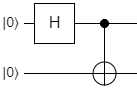
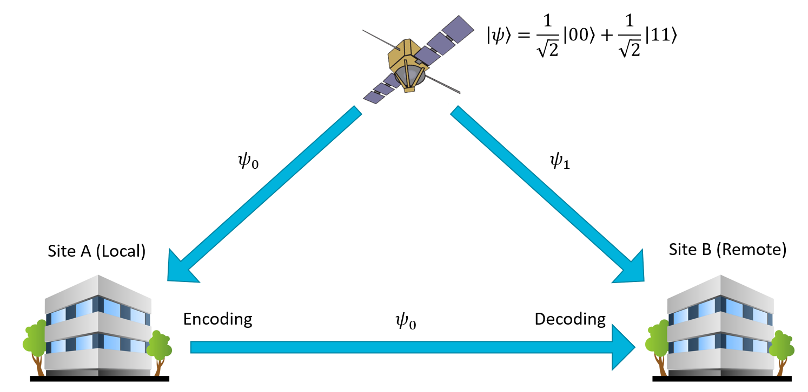
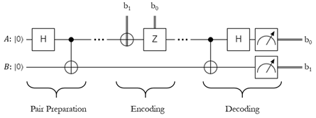

# Superdense Coding

## Undoing the Bell States

Before we get into this algorithm, let's revisit the four Bell States for a minute.
You already explored them in Lab 2, but they're rewritten here as a reminder:

$$
\displaylines{
\ket{\Phi^{+}} = \frac{1}{\sqrt{2}} \ket{00} + \frac{1}{\sqrt{2}} \ket{11}
\\~\\
\ket{\Phi^{-}} = \frac{1}{\sqrt{2}} \ket{00} - \frac{1}{\sqrt{2}} \ket{11}
\\~\\
\ket{\Psi^{+}} = \frac{1}{\sqrt{2}} \ket{01} + \frac{1}{\sqrt{2}} \ket{10}
\\~\\
\ket{\Psi^{-}} = \frac{1}{\sqrt{2}} \ket{01} - \frac{1}{\sqrt{2}} \ket{10}
}
$$

As you know, the $\ket{\Phi^{+}}$ state is prepared by applying H to one qubit, then using it as a control in a CNOT operation, with the other qubit as the target:

{: .center .xsmall loading=lazy }

All of the other states are constructed by applying X, Z, or XZ to $\ket{\Phi^{+}}$.
You've seen this and even implemented it yourself already.
However, we stopped at implementing the states in Lab 2.
In this section, we're going to see what happens when we apply the inverse of the $\ket{\Phi^{+}}$ preparation circuit to each of the four states.
Let's start with $\ket{\Phi^{+}}$ itself:

$$
\displaylines{
\ket{\psi} = \ket{\Phi^{+}} = \frac{1}{\sqrt{2}} \ket{00} + \frac{1}{\sqrt{2}} \ket{11}
\\~\\
CNOT(\psi_0, \psi_1), \qquad \ket{\psi} = \frac{1}{\sqrt{2}} \ket{00} + \frac{1}{\sqrt{2}} \ket{10}
}
$$

Now, using our knowledge of quantum interference, we know what will happen when we apply the H gate again:

$$
\displaylines{
H(\psi_0), \qquad \ket{\psi} = \frac{1}{\sqrt{2}} \textcolor{green}{H_0(\ket{00})} + \frac{1}{\sqrt{2}} \textcolor{red}{H_0(\ket{10})}
\\~\\
= \frac{1}{\sqrt{2}} \textcolor{green}{ \left( \frac{1}{\sqrt{2}} \ket{00} + \frac{1}{\sqrt{2}} \ket{10} \right) } + \frac{1}{\sqrt{2}} \textcolor{red}{ \left( \frac{1}{\sqrt{2}} \ket{00} - \frac{1}{\sqrt{2}} \ket{10} \right) }
\\~\\
= \ket{00}
}
$$

For $\ket{\Phi^{+}}$, it just resets the qubits to the $\ket{00}$ state.
This is no surprise, since quantum operations are reversible.
What about the other three Bell States though?

$$
\displaylines{
\ket{\psi} = \ket{\Phi^{-}} = \frac{1}{\sqrt{2}} \ket{00} - \frac{1}{\sqrt{2}} \ket{11}
\\~\\
CNOT(\psi_0, \psi_1), \qquad \ket{\psi} = \frac{1}{\sqrt{2}} \ket{00} - \frac{1}{\sqrt{2}} \ket{10}
\\~\\
H(\psi_0), \qquad \ket{\psi} = \frac{1}{\sqrt{2}} \textcolor{green}{H_0(\ket{00})} - \frac{1}{\sqrt{2}} \textcolor{red}{H_0(\ket{10})}
\\~\\
= \frac{1}{\sqrt{2}} \textcolor{green}{ \left( \frac{1}{\sqrt{2}} \ket{00} + \frac{1}{\sqrt{2}} \ket{10} \right) } - \frac{1}{\sqrt{2}} \textcolor{red}{ \left( \frac{1}{\sqrt{2}} \ket{00} - \frac{1}{\sqrt{2}} \ket{10} \right) }
\\~\\
= \ket{10}
}
$$

Applying the CNOT / H combination to $\ket{\Phi^{-}}$ results in the $\ket{10}$ state, with no superposition.
In other words, the first qubit will always be $\ket{1}$ and the second qubit will always be $\ket{0}$.
Huh. Let's keep going.

$$
\displaylines{
\ket{\psi} = \ket{\Psi^{+}} = \frac{1}{\sqrt{2}} \ket{01} + \frac{1}{\sqrt{2}} \ket{10}
\\~\\
CNOT(\psi_0, \psi_1), \qquad \ket{\psi} = \frac{1}{\sqrt{2}} \ket{01} + \frac{1}{\sqrt{2}} \ket{11}
\\~\\
H(\psi_0), \qquad \ket{\psi} = \frac{1}{\sqrt{2}} \textcolor{green}{H_0(\ket{01})} + \frac{1}{\sqrt{2}} \textcolor{red}{H_0(\ket{11})}
\\~\\
= \frac{1}{\sqrt{2}} \textcolor{green}{ \left( \frac{1}{\sqrt{2}} \ket{01} + \frac{1}{\sqrt{2}} \ket{11} \right) } + \frac{1}{\sqrt{2}} \textcolor{red}{ \left( \frac{1}{\sqrt{2}} \ket{01} - \frac{1}{\sqrt{2}} \ket{11} \right) }
\\~\\
= \ket{01}
}
$$

Applying the combo to $\ket{\Psi^{+}}$ will result in $\ket{01}$, which is also not in a superposition, so we always know what the qubits will be without even measuring them.
We bet you can guess what the result will be for the $\ket{\Psi^{-}}$ state:

$$
\displaylines{
\ket{\psi} = \ket{\Psi^{-}} = \frac{1}{\sqrt{2}} \ket{01} - \frac{1}{\sqrt{2}} \ket{10}
\\~\\
CNOT(\psi_0, \psi_1), \qquad \ket{\psi} = \frac{1}{\sqrt{2}} \ket{01} - \frac{1}{\sqrt{2}} \ket{11}
\\~\\
H(\psi_0), \qquad \ket{\psi} = \frac{1}{\sqrt{2}} \textcolor{green}{H_0(\ket{01})} - \frac{1}{\sqrt{2}} \textcolor{red}{H_0(\ket{11})}
\\~\\
= \frac{1}{\sqrt{2}} \textcolor{green}{ \left( \frac{1}{\sqrt{2}} \ket{01} + \frac{1}{\sqrt{2}} \ket{11} \right) } - \frac{1}{\sqrt{2}} \textcolor{red}{ \left( \frac{1}{\sqrt{2}} \ket{01} - \frac{1}{\sqrt{2}} \ket{11} \right) }
\\~\\
= \ket{11}
}
$$

And there it is.
It turns out that if we're given one of the four Bell States, but we don't know which one it is, we can figure it out with 100% certainty by applying the CNOT / H combination to the qubits and measuring them.
Let's create a table that shows what operations we performed on a Bell State to produce it, and what the resulting measurement will be after running the CNOT / H operations on it:

| **Starting State** | **Prep Operations** | **Resulting State** | **Measurement Outcome** |
| - | - | - | - |
| $\ket{\Phi^{+}}$ | --- | $\ket{\Phi^{+}}$ | $\ket{00}$ |
| $\ket{\Phi^{+}}$ | X | $\ket{\Psi^{+}}$ | $\ket{01}$ |
| $\ket{\Phi^{+}}$ | Z | $\ket{\Phi^{-}}$ | $\ket{10}$ |
| $\ket{\Phi^{+}}$ | XZ | $\ket{\Psi^{-}}$ | $\ket{11}$ |

As you might have noticed, there is a very convenient correlation between the operations and the measurements.
Every time we use the X gate, the second qubit is a 1.
Every time we use the Z gate, the first qubit is a 1.
We could actually encode two bits of classical information into the two qubits by selectively applying the X and Z gates to one of them after they've been entangled!
This technique is called **superdense coding**.

## Superdense Coding Technique

As shown, superdense coding is a simple technique that leverages the Bell States to encode classical information into a pair of entangled qubits.
It gets its name from the fact that you can construct an entangled pair of qubits and encode two bits of classical information by applying gates to only one of the qubits, so it seems like you're encoding two bits into a single qubit.
This isn't actually true, because you need both qubits in the pair in order to recover the data, so it doesn't actually violate any information density laws.
We think the name "superdense coding" isn't all that helpful, because it doesn't really describe what's so special about the technique.
To explain that, let's imagine the following scenario.

Let's say you want to send a secret, sensitive message to a friend using qubits, but you want it to be secure so nobody can eavesdrop on you.
Maybe it's a question about dinner plans, or a picture of your cat doing something silly, or maybe it's a secret encryption key that you want to share with them so they can decrypt a bunch of important data.
Whatever the reason, you don't trust classical communications channels like the Internet.
They're too easy to hack or eavesdrop on - the last thing you need is some kind of man-in-the-middle attack where an adversary intercepts and reads all of your data.
So how do you do it?

Answer: superdense coding.

If you can construct a way to create a stream of entangled qubit pairs and send one half to your friend while keeping the other half for yourself, you can use superdense coding to encode your classical message into your qubit stream.
You can then send your qubits over to your friend, who can disentangle them and recover your message.
If an attacker intercepts the stream of qubits you sent to your friend and tries to measure them, he's only measuring one half of an entangled pair.
The qubit will have a 50% chance of being 0 and a 50% chance of being 1.
There's no way for him to recover both classical bits you encoded into it, he'll just get a single random measurement.

The only way this fails is if the attacker can somehow intercept both of the qubit streams, disentangle and read them himself, and then pass them onto your friend.
We've come up with some very crafty ways to circumvent that problem - for example, [by putting a satellite in low orbit that generates laser pulses of entangled photons and sends them to two separate facilities.](https://en.wikipedia.org/wiki/Quantum_Experiments_at_Space_Scale)
This can be used to create a triangle of qubit streams (satellite to receiver, satellite to sender, sender to receiver) which is pretty impractical to completely intercept without someone noticing:

{: .center .xlarge loading=lazy }

So, back to the original point, this is why we think superdense coding is an awesome technique.
It lets you create quantum communications channels that are stupendously difficult to eavesdrop.
Even if you could, there are more complex variants of the algorithm that make it pretty much impossible to attack the channel, but those are best saved for a more advanced course on quantum key distribution and quantum encryption.
For now, the simple superdense coding approach is plenty to get us started.

Let's go over the protocol, step by step:

1. Create a pair of entangled qubits (for example, by preparing the $\ket{\Phi^{+}}$ state).
1. Keep one of the qubits for yourself. This will be Qubit A, the local qubit.
1. Send the other qubit to the receiver. This will be Qubit B, the remote qubit.
1. Encode your two classical bits into the pair.
    1. If the first bit in your buffer is 1, apply the Z gate to your qubit.
    1. If the second bit in your buffer is 1, apply the X gate to your qubit.
1. Send Qubit A to the receiver.
1. The receiver then unentangles the two qubits and measures them.
    1. Apply CNOT to Qubit B, with Qubit A as the control.
    1. Apply H to Qubit A.
    1. Measure Qubit A and B. Qubit A will contain the first classical bit, and Qubit B will contain the second classical bit.

To help illustrate the process, here's a circuit diagram:

{: .center .large loading=lazy }

Here $b_1$ refers to the second bit you want to send, and $b_0$ refers to the first bit.If either bit is 1, apply the respective gate.

## Lab 4

Alright, time to start coding!
In Lab 4 you're going to implement the whole superdense coding protocol from start to finish.
Have fun!
