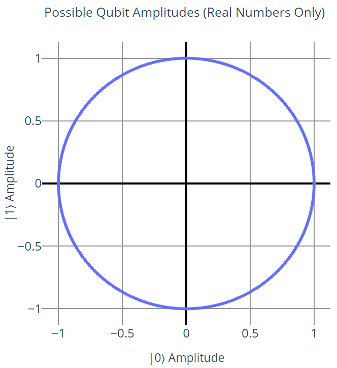
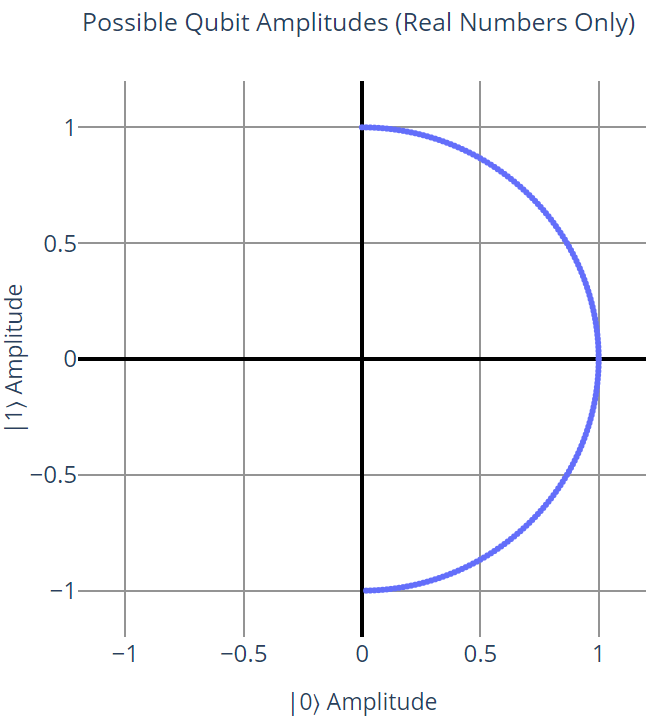
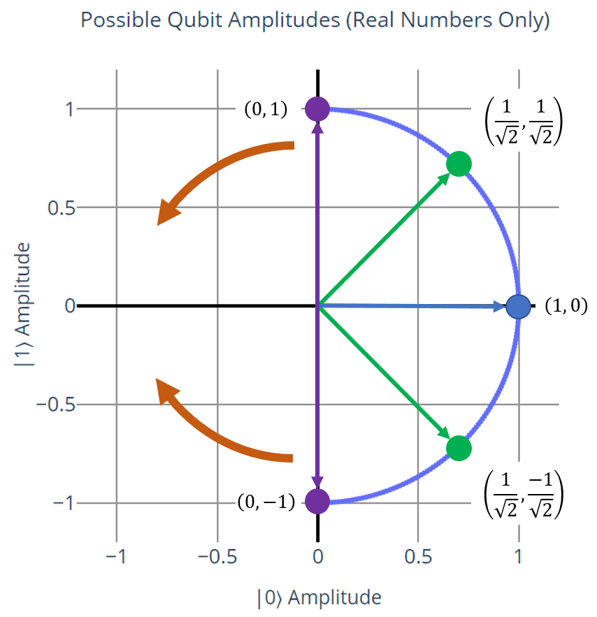
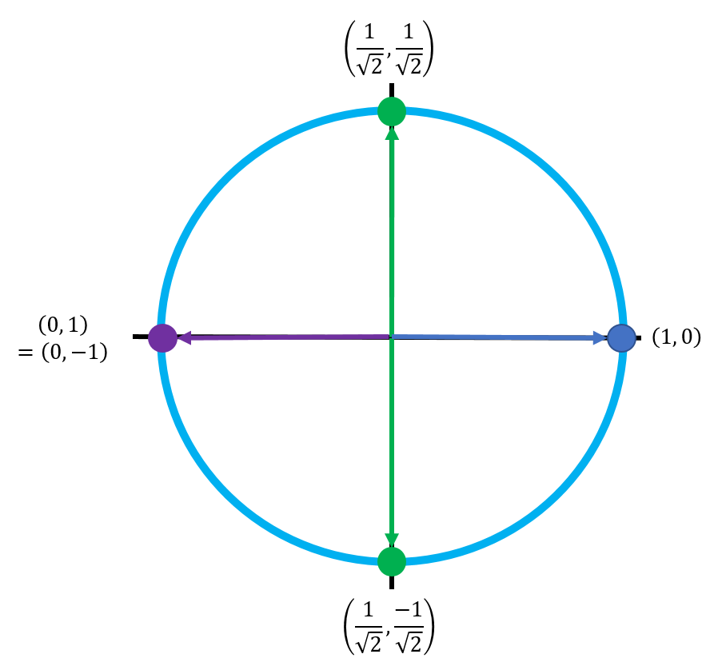
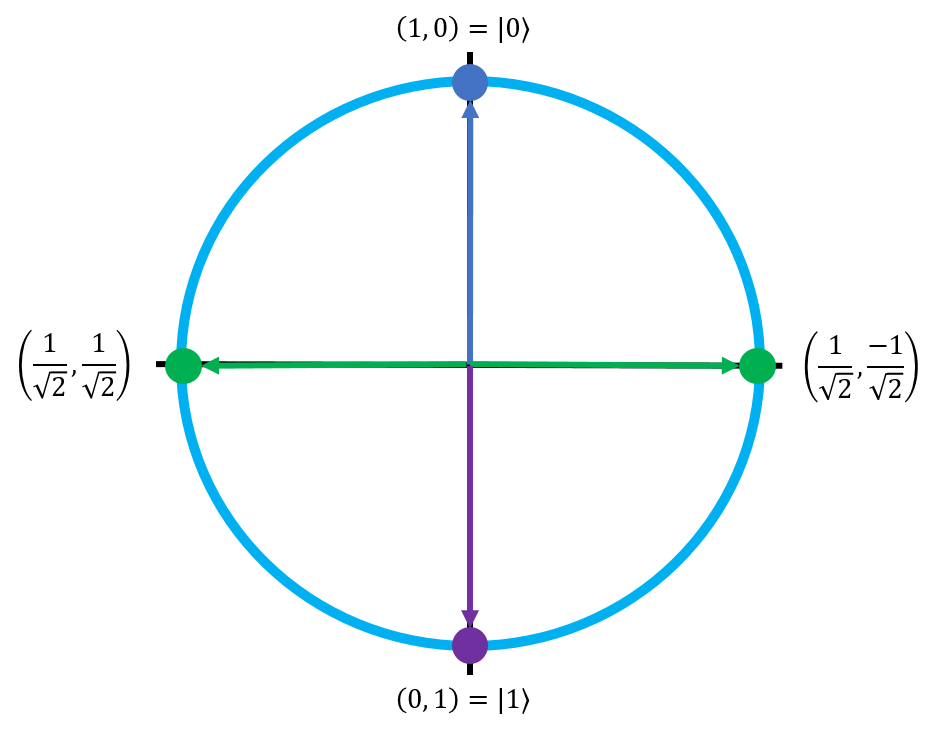
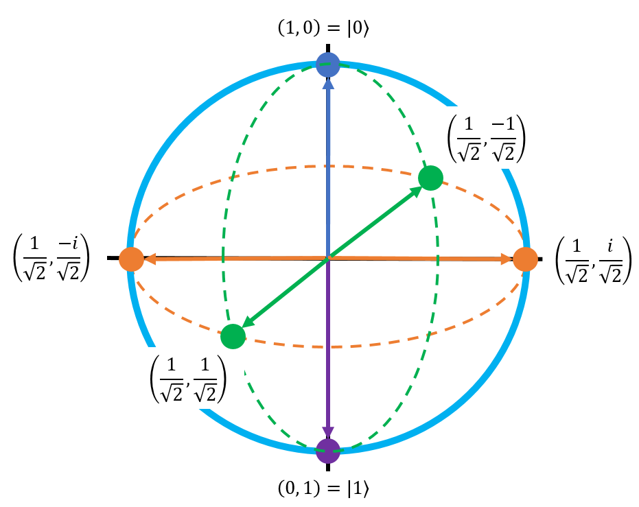
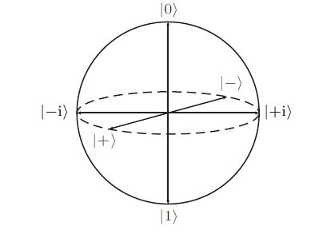
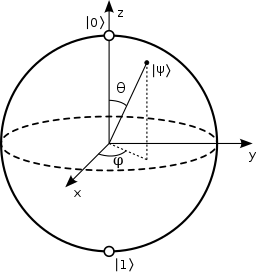

# The Bloch Sphere

## Drawing Qubit States as Graphs

In the Qubits page, we briefly introduced a silly 2D graph called the **palm-plex plane**, which showed the amplitude values that a qubit could have (assuming no imaginary components) when representing a choice of hands.
Let's generalize this picture to a more accurate drawing of actual qubits, without the hand analogy:

{: .center loading=lazy }

This graph does a good job of showing the states that a qubit is allowed to be in when we ignore complex numbers.
However, we also learned from the previous page that global phase doesn't matter; for example, the state $\frac{-1}{2} \ket{0} + \frac{\sqrt{3}}{2} \ket{1}$ is the same as the state $\frac{1}{2} \ket{0} - \frac{\sqrt{3}}{2} \ket{1}$⟩.
We also learned that by convention, the |0⟩  state doesn't have a phase.

Putting those two things together, we can effectively say that the left half of the graph, where $\ket{0}$ is negative, directly maps to the right half of the graph; every point on the left half has a corresponding equal point on the right half.
Because of this, we can get rid of the left half entirely:

{: .center loading=lazy }

So far, so good.
On this graph, there are two "endpoints" of the semicircle: (0, 1) and (0, -1) which correspond to qubit states $0 \ket{0} + 1 \ket{1}$ and $0 \ket{0} - 1 \ket{1}$ respectively.
However, notice the following:

$$
\displaylines{
\begin{aligned}
0 \ket{0} - 1 \ket{1} &= -0 \ket{0} - 1 \ket{1}
\\~\\
&= -1 \cdot (0 \ket{0} + 1 \ket{1})
\\~\\
&= 0 \ket{0} + 1 \ket{1}
\end{aligned}
}
$$

Because -0 = 0, we can say that the latter point has a global phase of -1, which turns it into the first point.
Both points actually represent the same qubit state.
In other words, phase doesn't matter for qubits in the $\ket{0}$ or $\ket{1}$ state.

This next part gets a little bizarre, and we're going to break the conventional rules of Euclidean geometry for a minute.
We can redraw the graph to merge the two endpoints together, by stretching and wrapping the semicircle to the left.
For reference, here's the original graph with a few key points highlighted and the direction of stretching shown as orange arrows:

{: .center loading=lazy }

This is the graph after the stretch:

{: .center loading=lazy }

Essentially, every point gets moved to the left along the path of the original circle, except for (1, 0).
This graph doesn't follow the rules of geometry because the points (1, 0) and (0, 1) are no longer orthogonal - they lie on the same line.
However, this is actually a much closer representation of how qubits work in real life.
Notice that the $\ket{0}$ state is always positive (its amplitude never has any phase), but the $\ket{1}$ state's amplitude can go negative in the lower half of the circle.
 
The conventional way to draw this circle is rotated 90° counterclockwise, so the point corresponding to the $\ket{0}$ state is on top (pointing up), and the point corresponding to the $\ket{1}$ state is on the bottom (pointing down):

{: .center loading=lazy }

Finally, the last step is to bring complex numbers into the equation.
Recall that the definition of an amplitude's phase is its sign *and* its imaginary component.
Also recall that we can only observe the *relative phase difference* between the $\ket{0}$ state and the $\ket{1}$ state.
By convention, the $\ket{0}$ state doesn't have a phase, but the $\ket{1}$ state can have a phase.
This means that the $\ket{1}$ state's amplitude is allowed to have an imaginary component.
Since the imaginary component of a complex number is independent from the real component, we have to draw it in a third orthogonal dimension of this graph.

Even when they're complex numbers, the state amplitudes follow the same rules as before:

$$
\ket{x} = a \ket{0} + (b + ci) \ket{1}, \qquad a^2 + b^2 + c^2 = 1
$$

Similar to how the constraint on the amplitude values (when we only dealt with real numbers) described the unit circle, this constraint is actually the equation for the unit sphere.
Thus, if we draw a 3D graph by including the imaginary axis, the qubit's full set of possible states (including imaginary phase components) can be defined by this sphere:

{: .center loading=lazy }

This lovely graph is known as the **Bloch Sphere**, and it is the standard way to visualize a qubit's state in quantum computing.
A qubit's state can be *any point on this sphere*.
This is a complete and total representation of a qubit; no hand-waving, no ignoring things for the sake of this being an introductory class.
The Bloch Sphere is the real deal.
When you're working with quantum computers, you're can always rely on the Bloch Sphere to visually represent a qubit's state.

The original circle from the previous steps is represented by the green dashed line.
The orange axis represents the new imaginary axis that we added to deal with complex numbers in the $\ket{1}$ state's phase.
Because we aren't really going to deal with imaginary numbers in this class, **we're going to stick to the dashed-green-line circle during the exercises**, but it's important that you at least see the Bloch Sphere in its entirety because it's pretty much the only fundamental tool we have for visualizing qubit states.

## Labeling the Axis Points of the Bloch Sphere

The six points corresponding to the axes of the Bloch sphere are very important in quantum computing.
Writing them out in their explicit form can be tedious, so we have some developed some convenient labels for them.

Note that the point $\left( \frac{1}{\sqrt{2}}, \frac{1}{\sqrt{2}} \right)$ corresponds to the state vector $\begin{bmatrix} \frac{1}{\sqrt{2}} \\ \frac{1}{\sqrt{2}} \end{bmatrix}$, which can be rewritten using the rules of vector arithmetic to this form:  

$$
\begin{bmatrix} \frac{1}{\sqrt{2}} \\ \frac{1}{\sqrt{2}} \end{bmatrix} = \frac{1}{\sqrt{2}} \ket{0} + \frac{1}{\sqrt{2}} \ket{1}
$$

This state is usually shortened to the symbol $\ket{}$.
Similarly, the point $( \frac{1}{\sqrt{2}}, \frac{-1}{\sqrt{2}})$ corresponds to the state $\frac{1}{\sqrt{2}} \ket{0} - \frac{1}{\sqrt{2}} \ket{1}$ which is shortened to the symbol $\ket{-}$.
The two imaginary axis points are called $\ket{i+}$ and $\ket{i-}$, respectively.
Thus, a more clear labelling of the Bloch Sphere (and one of the most common ways to write it) is shown by the canonical image from Wikipedia below:

{: .center loading=lazy }
*Image taken from Wikipedia:* [https://en.wikipedia.org/wiki/Bloch_sphere](https://en.wikipedia.org/wiki/Bloch_sphere)
{: .center }

## The Pauli Axes Labels

When represented in this form, the three axes of the Bloch Sphere are called the **Pauli Axes** because they correspond to some special quantum operations, which I'll describe in the next section on quantum logic gates. 

The axis with $\ket{0}$ and $\ket{1}$ on it is called the **Pauli Z axis**, or just the Z axis for short.
When we measure a qubit in the computational basis to see if it's in the $\ket{0}$ or the $\ket{1}$ state, this is also called performing a **Z measurement**.

The axis with $\ket{+}$ and $\ket{-}$ is called the **Pauli X axis** (or just the X axis).

The axis with $\ket{i+}$ and $\ket{i−}$ is called the **Pauli Y axis** (or just the Y axis).

Another common way to draw the Bloch Sphere is by using these axes labels instead of the intersection points, as demonstrated in this picture (also from Wikipedia):

{: .center loading=lazy }
*Image taken from Wikipedia:* [https://en.wikipedia.org/wiki/Bloch_sphere](https://en.wikipedia.org/wiki/Bloch_sphere)
{: .center }

## Representing Qubits on the Bloch Sphere

That last picture has some interesting extra information in it; Besides showing the three axes of the Bloch Sphere, it also shows a qubit $\ket{\psi}$ pointing somewhere in between the three of them.
It also has the angles $\theta$ and $\phi$ on it, which look like they are tied to $\ket{\psi}$.
Let's quickly go over what these angles mean, and how they relate to qubits on the Bloch Sphere.

In order to represent a point in 3D space, we have two options.
The first way is with **Cartesian Coordinates**, where a point is a set of distinct X, Y, and Z coordinates - this is what we usually do when we think about normal graphs.
For example, the point (3, 1, -4) would represent the point that's 3 units in the X direct, then 1 unit in the Y direction, and finally 4 units in the negative Z direction.
This system is useful when we're talking about shapes like cubes or rectangular prisms, which have a lot of planes that are parallel to one of the axes.

The second way is with **Spherical Coordinates**, where a point is represented by two angles and a length.
This system is used when we're talking about shapes like cylinders or spheres that tend to have constant lengths, and are easily described by rotations around an axis.
It takes the form $(r, \theta, \phi)$ where $r$ is the length of the line stretching from the origin to the point (the radius of the sphere), $\theta$ is an angle of that line from one of the axes, and $\phi$ is an angle from one of the other axes.
These three parameters can be used to describe any point in 3D space.
In the case of a sphere, the radius is always the same, so if you know the radius then you really only need the two angles to define a point.

Since the Bloch Sphere is, well, a sphere, and since qubit states are just points on the surface of the sphere, it's easy to represent qubits in spherical coordinates.
The radius will always be 1 (with an important exception that we'll talk about later when we get to quantum entanglement), so all we need to determine a qubit's state are the two angles.

In the case of the Bloch Sphere:

- The angle $\theta$ represents the angle from the positive Z axis (the $\ket{0}$ state) to the positive X axis on the **X-Z plane**.
- The angle $\phi$ describes the angle from the positive X axis (the $\ket{+}$ state) to the positive Y axis on the **X-Y plane**.

These two angles provide enough information to describe any qubit. The formal equation for using them to declare a qubit's state is this:

$$
\ket{\psi} = \cos \left(\frac{\theta}{2} \right) \cdot \ket{0} + e^{i \phi} \sin \left(\frac{\theta}{2} \right) \cdot \ket{1}, \qquad 0 \le \theta \le \pi, \qquad 0 \le \phi \lt 2\pi
$$

Notice that this looks very similar to the original way we wrote qubits:

$$
\ket{x} = a \ket{0} + (b + ci) \ket{1}, \qquad a^2 + b^2 + c^2 = 1
$$

Indeed, these are just two equivalent ways of writing qubits.
You'll see both forms a lot in quantum computing.

In the next page, we'll talk about how we can actually compute something with qubits, and how the Bloch Sphere can be used to visualize those computations.