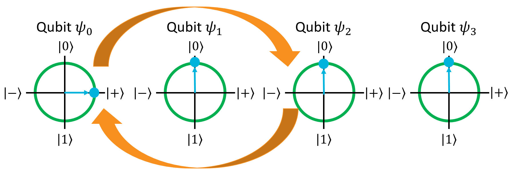
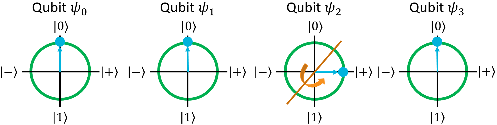
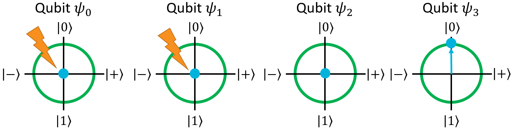
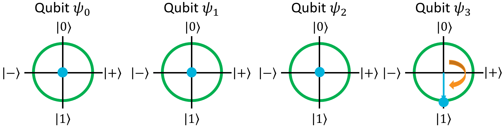
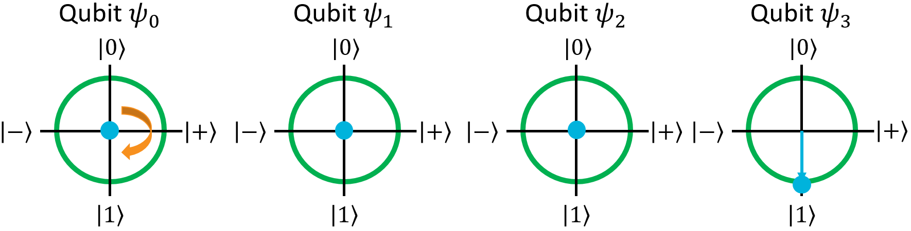
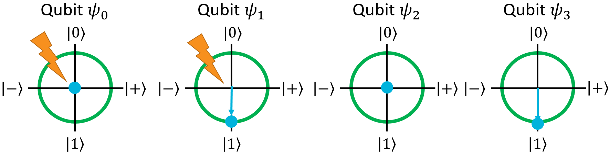

# Multi-Qubit Gates

## A Multi-Qubit Gate: the SWAP Gate

Single-qubit gates, even applied to registers, still only affect one qubit.
These gates can be thought of like functions that only take one qubit in their input parameters.
They may have more than one overall parameter, such as the arbitrary rotation gates, but they only have one parameter that is a qubit.
In this section, we're going to look at gates that take more than one qubit in their input.

The simplest multi-qubit gate is called the **SWAP** gate. It takes in two qubits and switches their states - that is, it puts the first qubit in the state of the second qubit, and vice-versa.
The SWAP gate has this matrix:

$$
SWAP = \begin{bmatrix} 
1 & 0 & 0 & 0 \\ 
0 & 0 & 1 & 0 \\
0 & 1 & 0 & 0 \\
0 & 0 & 0 & 1 \end{bmatrix}
$$

Here's its truth table. Note that the input and output terms are multi-qubit kets:

| Input | Output |
| - | - |
| $\ket{00}$ | $\ket{00}$ |
| $\ket{01}$ | $\ket{10}$ |
| $\ket{10}$ | $\ket{01}$ |
| $\ket{11}$ | $\ket{11}$ |

If both qubits are in the same state, then this gate doesn't do anything.
If both qubits are in different states, the SWAP gate switches their states.
Note that it doesn't switch the physical qubits themselves; SWAP simply puts the first qubit into the second qubit's state, and the second qubit into the first qubit's state.
The actual qubits remain at the same indices in the register that they originally were.

Don't let the ket notation fool you; **SWAP can be applied to any two qubits at any indices in a register**.
They don't have to be adjacent indices. This is true of all multi-qubit gates, as you'll see when we go through more of them later on.

Let's do a quick example to show how SWAP works.
We'll start with a 4-qubit register in the $\ket{0000}$ state:

$$
\ket{\psi} = \ket{0000}
$$

{: .center loading=lazy }

Now, just for fun, let's put it into superposition by applying H to the 3rd qubit:

$$
H(\psi_2), \qquad \ket{\psi} = \frac{1}{\sqrt{2}} \ket{0000} + \frac{1}{\sqrt{2}} \ket{0010}
$$

{: .center loading=lazy }

Now, let's run the SWAP gate on the first and third qubits.
As a reminder, applying a quantum gate (even a multi-qubit one) to a register in superposition is the same as applying it to each individual term in the superposition:

$$
\begin{aligned}
\ket{\psi} &= \frac{1}{\sqrt{2}} \ket{0000} + \frac{1}{\sqrt{2}} \ket{0010}
\\~\\
SWAP(\psi_0, \psi_2), \qquad \ket{\psi} &= \frac{1}{\sqrt{2}} \left( SWAP_{0,2} (\ket{0000}) \right) + \frac{1}{\sqrt{2}} \left( SWAP_{0,2} (\ket{0010}) \right)
\end{aligned}
$$

In the first term, both the first and third qubits are in the $\ket{0}$ state, so swapping them won't do anything.
That term will stay as $\ket{0000}$.
In the second term, however, the two qubits are different. That will go from $\ket{0010}$ to $\ket{1000}$:

$$
\begin{aligned}
\ket{\psi} = SWAP(\psi_0, \psi_2), \qquad \ket{\psi} &= \frac{1}{\sqrt{2}} \left( SWAP_{0,2} (\ket{0000}) \right) + \frac{1}{\sqrt{2}} \left( SWAP_{0,2} (\ket{0010}) \right)
\\~\\
&= \frac{1}{\sqrt{2}} \ket{0000} + \frac{1}{\sqrt{2}} \ket{1000}
\end{aligned}
$$

Here's what the qubits look like on the Bloch Spheres:

{: .center loading=lazy }

The states of the first and third qubits have switched places, even though the physical qubits themselves are still in the same indices.
SWAP is useful in algorithms where the elements of a register need to be reordered without physically moving the qubits around in the machine (such as reversing a register, turning it from big-endian form to little-endian form).


## The CNOT Gate

The second multi-qubit gate we're going to talk about is called the **CNOT** gate.
This is a very special gate, and is probably *the most important gate* in all of quantum computing.
We'll get into what the name means and why it's so important in a moment.
First, let's define the gate's matrix:

$$
CNOT = \begin{bmatrix} 
1 & 0 & 0 & 0 \\ 
0 & 1 & 0 & 0 \\
0 & 0 & 0 & 1 \\
0 & 0 & 1 & 0 \end{bmatrix}
$$

Here's its truth table. Note that the input and output terms are multi-qubit kets:

| Input | Output |
| - | - |
| $\ket{00}$ | $\ket{00}$ |
| $\ket{01}$ | $\ket{01}$ |
| $\ket{10}$ | $\ket{11}$ |
| $\ket{11}$ | $\ket{10}$ |

Now this is interesting.
It looks like it doesn't have any effect on $\ket{00}$ or $\ket{01}$, but it turns $\ket{10}$ into $\ket{11}$ and vice versa.
This looks like a conditional operation: when the first qubit is 1, it will flip the second qubit, and when the first qubit is 0, it doesn't do anything.
In classical programming, we might write this behavior like this (in pseudocode):

```c#
if(q0 == 1)
{
    X(q1);
}
```

Normally, this isn't possible because in order to actually evaluate that if statement's condition, we'd have to measure the first qubit to see what it is.
However, this gate doesn't seem to have anything to do with measurement.
It somehow manages to conditionally flip the second qubit based on the first qubit's state without actually measuring the first qubit.
Essentially, this gate lets us do **quantum conditional logic** where we can change the behavior of a program based on the state of the qubits, without knowing what state the qubits are actually in.
This ability to perform conditional logic, *without collapsing a qubit register's state*, is what makes CNOT such an important gate.

Let's try CNOT out on a register in superposition to see what it does. As usual, let's start with the $\ket{0000}$ state:

$$
\ket{\psi} = \ket{0000}
$$

{: .center loading=lazy }

Once again, let's apply H to the third qubit since we've done it before and know how it works:

$$
H(\psi_2), \qquad \ket{\psi} = \frac{1}{\sqrt{2}} \ket{0000} + \frac{1}{\sqrt{2}} \ket{0010}
$$

{: .center loading=lazy }

Now, we have a superposition where the third qubit is $\ket{0}$ in one term and $\ket{1}$ in another.
Let's try applying CNOT where $\psi_2$ is the first argument and, say, $\psi_0$ is the second argument:

$$
\begin{aligned}
\ket{\psi} &= \frac{1}{\sqrt{2}} \ket{0000} + \frac{1}{\sqrt{2}} \ket{0010}
\\~\\
CNOT(\psi_2, \psi_0), \qquad \ket{\psi} &= \frac{1}{\sqrt{2}} \left( CNOT_{2,0}(\ket{0000}) \right) + \frac{1}{\sqrt{2}} \left( CNOT_{2,0}(\ket{0010}) \right) 
\end{aligned}
$$

In the first ket, the first argument is $\ket{0}$, so CNOT has no effect.
In the second ket, however, the first argument is $\ket{1}$ so the second argument will be flipped.
The result will be this state:

$$
\ket{\psi} = \frac{1}{\sqrt{2}} \ket{0000} + \frac{1}{\sqrt{2}} \ket{1010}
$$

It looks like CNOT has only had an effect on one of the kets in the superposition.
How did this happen?


## Controlled Gates in General

The CNOT gate is what we call a **controlled** gate.
"Controlled" is the name we give to gates that only do something if a particular qubit is in the $\ket{1}$ state.
The first argument is called the "control" qubit, and the second argument is commonly called the "target" qubit.
This is where the name "CNOT" comes from: the "C" in its name refers to this "controlled" behavior, and the "NOT" stems from what the gate does if its control criteria is met: it applies the NOT gate to the target qubit.
As you might guess, this is also commonly referred to as the CX gate, or more generally, the "Controlled X" gate.

CNOT isn't special in this regard; any gate can be run in controlled mode, with an arbitrary number of control qubits.
For example, what if we had a 3-qubit register, and wanted to flip the third one if both the first and the second qubits were in the $\ket{1}$ state?
We can do that with a double-controlled X gate, which is similar to CNOT but takes 2 control qubits.
This is also called the **CCNOT**, **CCX**, or the **Toffoli** gate.

Here's the truth table for CCNOT.
We've added a comma to separate the control qubits from the target qubit for clarity (remember, in ket notation, you're allowed to put commas wherever you want because they don't actually mean anything):

| Input | Output |
| - | - |
| $\ket{00,0}$ | $\ket{00,0}$ |
| $\ket{01,0}$ | $\ket{01,0}$ |
| $\ket{10,0}$ | $\ket{10,0}$ |
| $\ket{11,0}$ | $\ket{11,1}$ |
| $\ket{00,1}$ | $\ket{00,1}$ |
| $\ket{01,1}$ | $\ket{01,1}$ |
| $\ket{10,1}$ | $\ket{10,1}$ |
| $\ket{11,1}$ | $\ket{11,0}$ |

As shown, CCNOT flips the target qubit if both control qubits are $\ket{1}$.

How about a controlled version of the Z gate? No problem, we can make that too:

| Input | Output |
| - | - |
| $\ket{0,0}$ | $\ket{0,0}$ |
| $\ket{0,1}$ | $\ket{0,1}$ |
| $\ket{1,0}$ | $\ket{1,0}$ |
| $\ket{1,1}$ | $-\ket{1,1}$ |

This will negate the second qubit's phase only when the first qubit is $\ket{1}$.
Since Z only affects the $\ket{1}$ state, this has the effect of negating the overall register ket's phase if (and only if) both the control and target qubits are $\ket{1}$.

Essentially, we can make any gate we want run in controlled mode.
Q# actually has a very convenient syntax for this, which is included in the `QSharpReference.qs` file:

```
using(qubits = Qubit[10])    // Allocate 10 qubits
{
	// This is a generic multicontrolled version of the X gate. What this says is
	// if all of the qubits in the first argument are |1>, then it will apply X
	// to the 2nd argument. In this case, if the first 9 qubits in the register
	// are |1>, then it will flip the 10th qubit.
	Controlled X(qubits[0..8], qubits[9]);
	 
	// In Q#, any operation that supports the "controlled" keyword can be run with
	// an arbitrary number of control qubits on it. This is the same as the previous
	// gate, but instead of flipping the last qubit, it will apply the Hadamard gate
	// to it.
	Controlled H(qubits[0..8], qubits[9]);
		
	ResetAll(qubits);
}
```

Attaching the `Controlled` keyword before a gate, and providing an array of control qubits as the first argument (and the target qubit as the second argument), will run the gate in controlled mode.
What makes Q# *really* powerful is that the `Controlled` keyword isn't just confined to quantum gates; you can also prepend entire operations with it, so the whole operation (and all of the gates in it) runs in controlled mode!
This is an extremely convenient property of the language, and it makes our lives as software engineers much easier - otherwise, we'd have to write separate versions of every operation for controlled and non-controlled behavior, and propagate the control qubits to all of the other operations that it calls, and so on.
It would get messy very quickly.


## Entanglement

Okay, with that little diatribe about controlled gates out of the way, let's get back to our original example.
We last left it in this state, which we got by CNOT'ing the register using the 3rd qubit as the control and the 1st qubit as the target:

$$
\ket{\psi} = \frac{1}{\sqrt{2}} \ket{0000} + \frac{1}{\sqrt{2}} \ket{1010}
$$

Let's try and look at this with the Bloch Sphere:

{: .center loading=lazy }

Uh oh.

Something weird has happened here.
The first and third qubits aren't really anywhere on the sphere.
Now they're just… points at the origin.
How is this possible? Qubits are supposed to be unit vectors - they need to have a length of 1.
They're supposed to be points on the unit sphere. How can they suddenly have length… 0? What does this mean?

Simply put, it means that these two qubits *no longer have individual, independent states*.
The two qubits now exist as two components of one composite, irreducible superposition, and one cannot be described without the other.
We call this property **entanglement**.

For this specific state $\frac{1}{\sqrt{2}} \ket{0000} + \frac{1}{\sqrt{2}} \ket{1010}$, measuring the qubits has a 50% chance of giving the $\ket{0000}$ state, and a 50% chance of giving the $\ket{1010}$ state.
We don't know which one we'll get until we measure the qubits, but we do know one thing: no matter what happens, the first and third qubits will always be in the same state once we measure them - either both will be $\ket{0}$ or both will be $\ket{1}$.
Because the qubits are entangled, their "fates" are linked, so to speak.
Essentially, if we measure one of them, we automatically know what state the other one is in before we even measure it.

This is what you often hear referred to as "spooky action at a distance", with respect to Einstein's problem with quantum mechanics.
We can take two qubits, entangle them, separate them millions of lightyears apart, and they're still two parts of the irreducible entangled superposition state.
As soon as we measure one of them, the superposition collapses, and the second qubit - millions of lightyears away - immediately "snaps" into the corresponding, but independent, state, even though nobody directly touched it.

You've probably heard of entanglement before - it's a term that gets thrown around a lot whenever quantum mechanics comes up.
If you've ever wonder what it really means, this is it.
It's what happens when multiple qubits in a register are linked together, and their measurement outcomes depend on each other.
Entanglement is what we would consider the **second key principle of quantum computing**, right behind superpositions.
We'll talk about why entanglement is so important when we get into some of the quantum algorithms later on - first, let's explore a little bit more about how it works.

Let's run CNOT again, this time with the first qubit as the control and the second qubit as the target:

$$
\begin{aligned}
\ket{\psi} &= \frac{1}{\sqrt{2}} \ket{0000} + \frac{1}{\sqrt{2}} \ket{1010}
\\~\\
CNOT(\psi_0, \psi_1), \qquad \ket{\psi} &= \frac{1}{\sqrt{2}} \ket{0000} + \frac{1}{\sqrt{2}} \ket{1110}
\end{aligned}
$$

Naturally the first ket doesn't get affected because the control qubit is $\ket{0}$, but the second ket does.
Now, the first three qubits in the register are all entangled together:

{: .center loading=lazy }

All of them have a 50% chance of being measured as $\ket{0}$, and a 50% chance of being measured as $\ket{1}$, but they will all have the same value once measured.

Note that the fourth qubit isn't entangled with the other ones.
We can apply a single-qubit gate like X to it, and its outcome still won't depend on the others:

$$
\begin{aligned}
\ket{\psi} &= \frac{1}{\sqrt{2}} \ket{0000} + \frac{1}{\sqrt{2}} \ket{1110}
\\~\\
X(\psi_3), \qquad \ket{\psi} &= \frac{1}{\sqrt{2}} \ket{0001} + \frac{1}{\sqrt{2}} \ket{1111}
\end{aligned}
$$

{: .center loading=lazy }

Whatever state we measure, the last qubit will always be $\ket{1}$.

We can also apply single-qubit gates to the entangled qubits, and they'll have their normal effect.
For example, let's apply X to the first qubit:

$$
\begin{aligned}
\ket{\psi} &= \frac{1}{\sqrt{2}} \ket{0001} + \frac{1}{\sqrt{2}} \ket{1111}
\\~\\
X(\psi_0), \qquad \ket{\psi} &= \frac{1}{\sqrt{2}} \ket{1001} + \frac{1}{\sqrt{2}} \ket{0111}
\end{aligned}
$$

{: .center loading=lazy }

The first qubit got flipped in both register kets, as expected.
However, on the Bloch Sphere, it's still just a point at the origin.
This is because the qubit is still entangled: its measurement outcome still depends on the second and third qubits.
In this new state, there's a 50% chance of measuring $\ket{1001}$, and a 50% chance of measuring $\ket{0111}$.
In either case, the first qubit will have the opposite value of the second and third qubits.
Whether it's the same value or the opposite value doesn't matter; if its value depends on another qubit, it's entangled.

So how do we break a qubit out of entanglement?
Simple.
We just need to run some controlled gates that remove the qubit's dependency on other qubits.
Let's say we wanted to disentangle the second qubit here.
We can do that by setting it to $\ket{1}$ in the first ket (so it's $\ket{1}$ in every ket), or by setting it to $\ket{0}$ in the second ket (so it's $\ket{0}$ in every ket).
We could achieve the first way by running CNOT with the first qubit as the control, and the second qubit as the target.
We could achieve the second way by running CNOT with the third qubit as the control, and the second qubit as the target.
Let's go with the first way as an example:

$$
\begin{aligned}
\ket{\psi} &= \frac{1}{\sqrt{2}} \ket{1001} + \frac{1}{\sqrt{2}} \ket{0111}
\\~\\
CNOT(\psi_0, \psi_1), \qquad \ket{\psi} &= \frac{1}{\sqrt{2}} \ket{1101} + \frac{1}{\sqrt{2}} \ket{0111}
\end{aligned}
$$

{: .center loading=lazy }

Now, the second qubit is $\ket{1}$ in all of the possible outcomes, so it no longer depends on the first or third qubits.
It's no longer entangled.


## Lab 2

This was a pretty tough chapter, but you're now familiar with qubit registers, how to apply single-qubit and multi-qubit gates to registers, and quantum entanglement.
The good news is, if you understand this stuff, then you've basically mastered all of the hard parts of quantum computing!
Everything after this is smooth sailing.
To practice what you've learned, open up Lab 2 in Visual Studio and work through the exercises there before moving onto the next section.