# Quantum Circuit Diagrams

## Quantum Circuit Diagrams

In your classical electrical engineering and computer science work, you've probably run across a logic circuit diagram before.
These diagrams represent bits with lines and logic gates with various symbols, and represent a circuit as a sequence of gates that are connected with lines.
Here's an example of one:

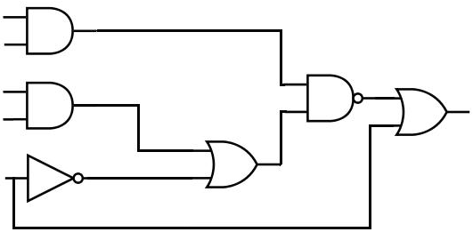{: .center loading=lazy }

The scientists working on quantum computing for the past 30 years have taken a page out of the classical computing book, and have adapted this diagram to the quantum domain.
The result is known as a **quantum circuit diagram**, and it is the standard way to depict quantum algorithms.

Here's an example of a simple quantum circuit diagram that uses some of the single-qubit gates we've studied so far:

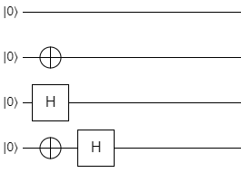{: .center loading=lazy }

Let's break down the elements in this diagram:

- Each horizontal line represents **a single qubit**.
- The ket at the left of each line is either **the qubit's name**, or its **initial state** (or occasionally both).
- The diagram is divided into a set of columns (though the boundaries between columns are invisible).
    - Each column represents **a step in the algorithm's sequence**. You can also think of these as discrete, sequential moments in time.
    - The leftmost column represents the very first step in the algorithm. The column to the right of that represents the next step, the column to that represents the third step, etc.
    - Basically, **the vertical axis represents the qubits**, and **the horizontal axis represents time**.
- Each qubit in each step can have a gate applied to it.

The picture below shows the same qubits, but with all of the elements annotated:

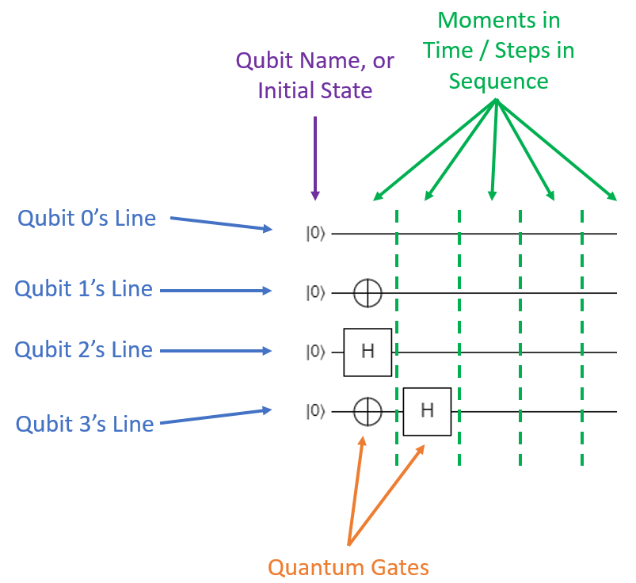{: .center loading=lazy }

Quantum circuit diagrams differ a bit from classical circuit diagrams due to the fact that quantum gates are always reversible; in other words, **quantum gates must always have the same amount of input and output qubits**.
The result is that **quantum circuit diagrams always show the qubits as straight horizontal lines**, unlike classical circuits which can have the bit lines zig-zag around in various directions.

Now let's talk about what we actually see in this specific circuit diagram:

- There are 4 qubits used in this circuit. They don't have explicit names, so we'll just call the first one q0, the next one q1, the third one q2, and the last one q3 for our own bookkeeping.
- Each qubit starts in the $\ket{0}$ state.
- In the first step of the circuit:
    - q0 is idle; nothing happens to it.
    - q1 has a gate with the $\oplus$ symbol applied to it. This is the symbol for the X (NOT) gate.
    - q2 has a gate applied to it that's represented by a box with an H in it. As you might have guessed, this is the H (Hadamard) gate.
    - q3 also has the X gate applied to it.
- In the second step of the algorithm:
    - q0, q1, and q2 don't have anything applied to them. They're left alone.
    - q3 has the H gate applied to it.

If we were to write a program to implement this circuit (in pseudocode), it might look something like this:

```
// Initialize the qubit states to |0>
set_state(q0, |0>);
set_state(q1, |0>);
set_state(q2, |0>);
set_state(q3, |0>);
	
// Step 1
X(q1);
H(q2);
X(q3);
	
// Step 2
H(q3);
```

At the end of the circuit, q0 will be in the $\ket{0}$ state, q1 will be in the $\ket{1}$ state, q2 will be in the $\ket{+}$ state, and q3 will be in the $\ket{-}$ state.

This particular form is the "condensed" or "compacted" version of this circuit, because all of the gates are moved as far left on the diagram as possible without interfering with other gates.
For organizational purposes, sometimes it's more convenient to write the gates out so that each one gets its own column like this:

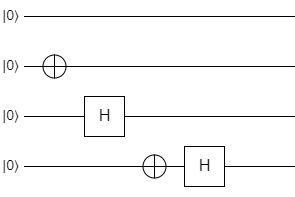{: .center loading=lazy }

This is essentially the same circuit as the previous one (it would have the same instructions in our pseudocode), but the gates are spaced out visually.
Depending on the actual quantum computer you run it on, this may be interpreted as four discrete time steps, or it may compress the gates down into two time steps as the original picture showed.


## Quantum Gate Symbols for Single-Qubit Gates

Most of the single-qubit gates in quantum circuit diagrams are simply represented by boxes with the name of the gate in them.
Here are the symbols for the gates we've covered:

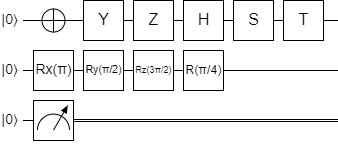{: .center loading=lazy }

The first qubit shows the symbols for the X, Y, Z, H, S, and T gates.
The I gate isn't really used anywhere because it doesn't do anything, but if you want to include it in a diagram, just add a box with the letter I in it.

The second qubit shows one way to represent the arbitrary rotation gates.
There are a few different conventions for these gates, but they always start with R so it's usually pretty easy to figure out which gate you're looking at by the context of the algorithm.
In this case, $R_x(\pi)$ represents the $R_x$ gate where $\theta$ is $\pi$ radians.
$R_y(\pi/2)$  is the $R_y$ gate with $\pi/2$ radians, and $R_z(3 \pi/2)$ is the $R_z$ gate with $3\pi/2$ radians.
$R(\pi/4)$ is a common way to represent $R_\phi$ (the phase-shift gate); the $\phi$ is omitted and it's just written as $R$.

The third qubit shows something pretty weird.
This symbol, which looks like an analog meter, represents the measurement gate.
Once a qubit has been measured, it loses its superposition information; this is shown on the circuit by turning the original qubit line into two lines after the measurement.


## Multi-Qubit Gates

There are a few different ways that multi-qubit gates are represented in quantum circuit diagrams, depending on the gate. 


### SWAP

The SWAP gate is shown with two X marks on the two qubits being swapped, connected by a line like this:

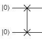{: .center loading=lazy }

### Controlled Gates

Controlled gates are broken into two parts.
First, the control qubits are marked with a small black circle.
Second, the actual operation is shown as it normally is on the target qubit.
The two parts are connected by a vertical line.
For example, here's the CNOT gate (Controlled X with one control qubit):

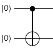{: .center loading=lazy }

In this case, the top qubit is the control, and the bottom is the target.
Here's an example of the CCNOT gate:

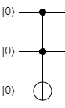{: .center loading=lazy }

Now the first two qubits are controlling the X gate on the third qubit.
For other gates, like H or Z, the structure is exactly the same.
Here's a doubly-controlled H gate:

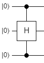{: .center loading=lazy }

Note that the first and third qubits are the controls, and now the second qubit is the target.
Finally, the last bit of controlled notation is a white circle instead of a black one, like this:

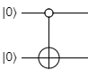{: .center loading=lazy }

This is a **zero-controlled** (or anti-controlled) CNOT gate.
That is, this symbol means the second qubit will be flipped when the first qubit is $\ket{0}$ instead of $\ket{1}$.
Zero-controlled and regular-controlled qubits can be mixed, like this:

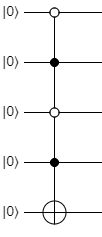{: .center loading=lazy }

This shows a gate where if the first and third qubits are $\ket{0}$, and the second and fourth qubits are $\ket{1}$, then it will flip the fifth qubit.
In other words, it will only flip the last qubit if the first four qubits are $\ket{0101}$.


## State Preparation Circuit Examples

In the previous page on Complex Superpositions, we figured out how to create this state:

$$
\ket{\psi} = \frac{1}{2} \left( \ket{000} + \ket{010} + \ket{100} + \ket{111} \right)
$$

The process was essentially this:

```
H(q0);
H(q1);
CCNOT(q0, q1, q2);
```

If we wanted to build a circuit diagram for this process, it would look like this:

{: .center loading=lazy }

This is a nice, compact, easy-to-read way to describe and visualize quantum algorithms.
In fact, the majority of the time, this format is how new quantum algorithms are described in academic papers.
When someone hands you a paper that defines an algorithm and asks you to implement it, the first thing you should look for is a circuit diagram.

Here's another example from the previous page:

$$
\ket{\psi} = \frac{1}{2} \left( \ket{001} + \ket{010} - \ket{101} - \ket{110} \right)
$$

We derived one process for it with this code:

```
H(q0);
H(q1);
CNOT(q1, q2);
X(q2);
Z(q0);
```

Here's the diagram from this circuit:

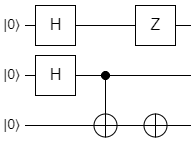{: .center loading=lazy }

Notice that it's compacted, so everything is moved as far left as it can be.
The Z on q0 is in the 3rd column though, because if it was in the 2nd column, then it would be part of the CNOT that's already in that column.
Any time you have a controlled operation, it basically needs to be in its own column to disambiguate which gates are controlled, and which are not.

Here's a third state from the previous page, which used an ancilla qubit:

$$
\ket{\psi} = \frac{1}{2} \left( \ket{00} + \ket{01} + \ket{10} - \ket{11} \right)
$$

The process for this one was essentially this:

```
H(q0);
H(q1);
X(q2);
Controlled Z([q0, q1], q2);
```

Here's the circuit diagram for it:

{: .center loading=lazy }

Pretty simple!
The circuit diagram does a really good job of encapsulating all of the different gates and steps in a quantum operation.
Knowing how to read them (and write them) is essential if you're going to develop quantum software.

In the next section, I'll introduce you to a helpful tool that can be used to create circuit diagrams, simulate the circuits they represent, and inspect the circuits to learn more about how they work.