# Quantum Interference

## Wave Interference

So far in the class, we've touched on two of the key concepts that make quantum computing powerful: **superpositions** and **entanglement**.
In this section, we're going to cover the **third key concept: interference**.
We've actually seen it before, in the way that the Hadamard gate works, but haven't explicitly talked about why it works - especially with large registers.
Before we get into it, let's take a step back and think about water waves.

At some point in your life, you've probably come across a picture of a simple experiment that looks something like this:

{: .center loading=lazy }

*Image courtesy of Dr. Derek Muller, of the Veritasium YouTube channel:
[https://www.youtube.com/watch?v=Iuv6hY6zsd0](https://www.youtube.com/watch?v=Iuv6hY6zsd0)*
{: .center }

Or perhaps you've seen it done with lasers or electron beams in a physics lab, like this:

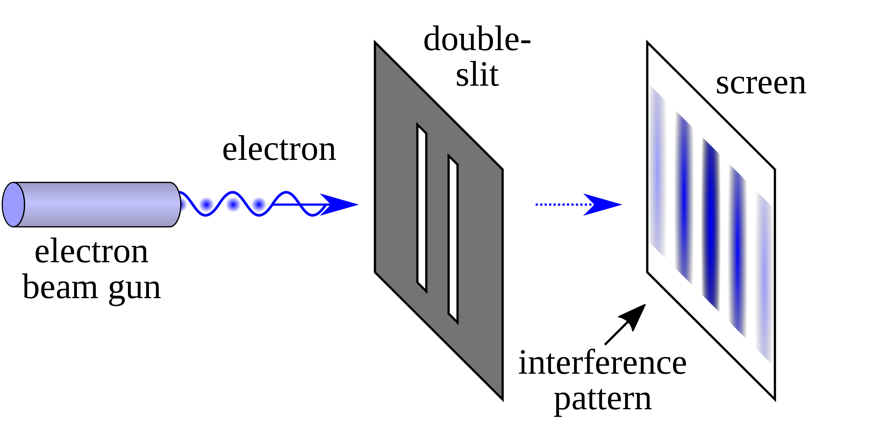{: .center loading=lazy }

*Image taken from Wikipedia: [https://en.wikipedia.org/wiki/Double-slit_experiment](https://en.wikipedia.org/wiki/Double-slit_experiment)*
{: .center }

In either version, the general concept is the same: these are examples of **interference**.
When two waves of some kind interact with one another (whether sound waves, or water waves, or light waves, or even particles), their amplitudes add up to produce a third, composite wave:

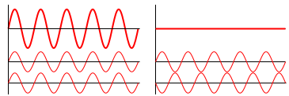{: .center loading=lazy }

*Image taken from Wikipedia: [https://en.wikipedia.org/wiki/Wave_interference](https://en.wikipedia.org/wiki/Wave_interference)*
{: .center }

In places where their amplitudes are both positive, the amplitude of the composite wave will be larger than either of the individual component waves.
If both waves are perfectly in phase (so their highest points align), the result will have the highest possible value.
This is called **constructive interference**.
The pattern on the left shows constructive interference - the two smaller waves at the bottom are the components, and the larger, bold wave at the top is the composite.
Both waves are perfectly in sync, so their sums always produce the largest possible amplitude.

In places where one is positive and the other is negative, the composite wave's amplitude will be somewhere in-between the two.
In the extreme case, where the waves are perfectly out-of-phase so that one's amplitude is always the negative of the other, the waves will cancel each other out.
The composite wave will have zero amplitude.
This is called **destructive interference**, and is show in the picture on the right.

This picture shows the original water wave interference pattern, but with the constructive and destructive interference lines highlighted in green and red, respectively:

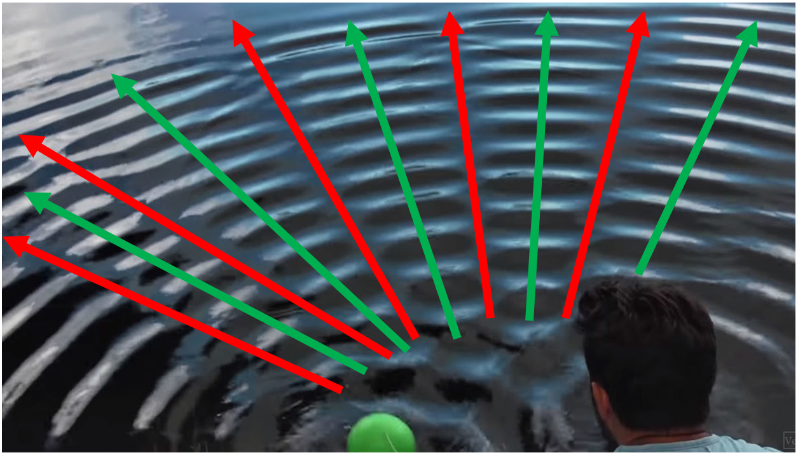{: .center loading=lazy }

Along these lines, the waves produced by the bobbing balls interfere completely to either double the wave's amplitude, or reduce it to zero.

Interference isn't just restricted to ponds and lasers though; it turns out that the same principles apply to qubits in superpositions.

## Qubit Interference and the Hadamard Gate

You've seen the results of applying the H gate to qubits in the $\ket{0}$ or $\ket{1}$ states about a hundred times at this point.
However, what you haven't seen is what happens when we apply H to qubits that are already in a superposition.
Let's do a simple example, by applying H to a qubit in the $\ket{+}$ state.

I'm going to color the two terms in the superposition green and red to help separate them:

$$
\displaylines{
\ket{\psi} = \frac{1}{\sqrt{2}} \left( \textcolor{green}{\ket{0}} + \textcolor{red}{\ket{1}} \right)
\\~\\
H(\psi_0), \qquad \ket{\psi} = \frac{1}{\sqrt{2}} \left( \textcolor{green}{H( \ket{0} )} + \textcolor{red}{H( \ket{1} )} \right)
\\~\\
= \frac{1}{\sqrt{2}} \left( \textcolor{green}{\frac{1}{\sqrt{2}} ( \ket{0} + \ket{1}) )} + \textcolor{red}{\frac{1}{\sqrt{2}} ( \ket{0} - \ket{1} )} \right)
\\~\\
= \frac{1}{2} \left( \textcolor{green}{ \ket{0} + \ket{1} } + \textcolor{red}{ \ket{0} - \ket{1} }  \right)
}
$$

Notice what's going to happen here: the two $\ket{0}$ terms are going to combine, and the two $\ket{1}$ terms are going to cancel each other out.
Essentially the two states will **constructively** and **destructively interfere** to produce a new, composite state that (in this case) ends up being simpler than the originals.
The end result is this:

$$
\displaylines{
= \frac{1}{2} \left( 2 \cdot \ket{0} + 0 \cdot \ket{1} \right)
\\~\\
= \ket{0}
}
$$

Applying H to a qubit in the $\ket{+}$ state will bring it back to $\ket{0}$.
This is pretty easy to see by looking at the Bloch Sphere:

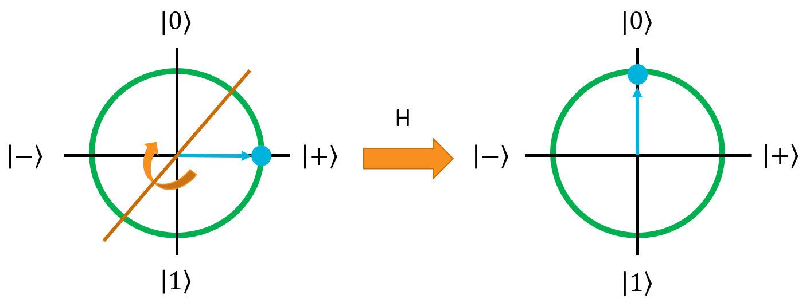{: .center .large loading=lazy }

As you can also see from here, H will turn the $\ket{-}$ state back into $\ket{1}$.
You can work out how interference causes this yourself if you like.

## Interference on Qubit Registers

### Calculating Multi-Qubit Uniform Superpositions

Applying the H gate to a qubit that's in an register can cause interference when the register is in a superposition, just like a single qubit.
Before getting into the interference, let's first define a few superposition states with the H gate.
Let's start with the state $\ket{00}$ and apply the H gate to both qubits:

$$
\displaylines{
H_{ALL}( \ket{00} ) = H_1( H_0( \ket{00} ))
\\~\\
= H_1 \left( \frac{1}{\sqrt{2}} ( \textcolor{green}{\ket{00}} + \textcolor{red}{\ket{10}} ) \right)
\\~\\
= \frac{1}{\sqrt{2}} \left( \textcolor{green}{ H_1(\ket{00}) } + \textcolor{red}{ H_1(\ket{10}) } \right)
\\~\\
= \frac{1}{\sqrt{2}} \left( \textcolor{green}{ \frac{1}{\sqrt{2}}( \ket{00} + \ket{01} )} + \textcolor{red}{ \frac{1}{\sqrt{2}}( \ket{10} + \ket{11} )} \right)
\\~\\
= \frac{1}{2} \left( \ket{00} + \ket{01} + \ket{10} + \ket{11} \right)
}
$$

We've seen this before, so the resulting state is no surprise.
What about if we apply H to both qubits in the $\ket{01}$ state?

$$
\displaylines{
H_{ALL}( \ket{01} ) = H_1( H_0( \ket{01} ))
\\~\\
= H_1 \left( \frac{1}{\sqrt{2}} ( \textcolor{green}{\ket{01}} + \textcolor{red}{\ket{11}} ) \right)
\\~\\
= \frac{1}{\sqrt{2}} \left( \textcolor{green}{ H_1(\ket{01}) } + \textcolor{red}{ H_1(\ket{11}) } \right)
\\~\\
= \frac{1}{\sqrt{2}} \left( \textcolor{green}{ \frac{1}{\sqrt{2}}( \ket{00} - \ket{01} )} + \textcolor{red}{ \frac{1}{\sqrt{2}}( \ket{10} - \ket{11} )} \right)
\\~\\
= \frac{1}{2} \left( \ket{00} - \ket{01} + \ket{10} - \ket{11} \right)
}
$$

Note here that the phases of the $\ket{01}$ and $\ket{11}$ terms are negative, because of what the H gate does when the second qubit is originally in the $\ket{1}$ state.
This is going to be critical for examining what happens when we apply the H gate to all of the qubits in a register in superposition.

For reference, the H gate applied to the other two two-qubit states ($\ket{10}$ and $\ket{11}$) are shown here.
You can derive them if you want, for practice.

$$
\displaylines{
H_{ALL}( \ket{10} ) = \frac{1}{2} \left( \ket{00} + \ket{01} - \ket{10} - \ket{11} \right)
\\~\\
H_{ALL}( \ket{11} ) = \frac{1}{2} \left( \ket{00} - \ket{01} - \ket{10} + \ket{11} \right)
}
$$

The last one is interesting because the negation caused by the H gate happens twice on the $\ket{11}$ (since both qubits started in the $\ket{1}$ state), thus it ends up being positive.

### Multi-Qubit Interference

Now that we have our four Hadamard basis states determined, let's apply the H gate to one of them to see how it causes constructive and destructive interference:

$$
\begin{aligned}
H_{ALL}( \ket{++} ) = \frac{1}{2} ( &\, \textcolor{green}{ H_{ALL}(\ket{00}) } + \textcolor{red}{ H_{ALL}(\ket{01}) } + \\
&\, \textcolor{purple}{ H_{ALL}(\ket{10}) } + \textcolor{blue}{ H_{ALL}(\ket{11}) } )
\end{aligned}
$$

$$
\begin{aligned}
= \frac{1}{2} \biggl( &\, \textcolor{green}{ \frac{1}{2} \left( \ket{00} + \ket{01} + \ket{10} + \ket{11} \right) } + \textcolor{red}{ H_{ALL}(\ket{01}) } + \\
&\, \textcolor{purple}{ H_{ALL}(\ket{10}) } + \textcolor{blue}{ H_{ALL}(\ket{11}) } \biggr)
\end{aligned}
$$

$$
\begin{aligned}
= \frac{1}{2} \biggl( &\, \textcolor{green}{ \frac{1}{2} \left( \ket{00} + \ket{01} + \ket{10} + \ket{11} \right) } + \textcolor{red}{ \frac{1}{2} \left( \ket{00} - \ket{01} + \ket{10} - \ket{11} \right) } + \\
&\, \textcolor{purple}{ H_{ALL}(\ket{10}) } + \textcolor{blue}{ H_{ALL}(\ket{11}) } \biggr)
\end{aligned}
$$

$$
\begin{aligned}
= \frac{1}{2} \biggl( &\, \frac{1}{2} \left( 2 \cdot \ket{00} + 0 \cdot \ket{01} + 2 \cdot \ket{10} + 0 \cdot \ket{11} \right) + \\
&\, \textcolor{purple}{ H_{ALL}(\ket{10}) } + \textcolor{blue}{ H_{ALL}(\ket{11}) } \biggr)
\end{aligned}
$$

At this point, the first two terms have interfered to remove the $\ket{01}$ and $\ket{11}$ states, and doubled the amplitudes of the other two.
Let's keep going:

$$
\begin{aligned}
= \frac{1}{2} \biggl( &\, \frac{1}{2} \left( 2 \cdot \ket{00} + 0 \cdot \ket{01} + 2 \cdot \ket{10} + 0 \cdot \ket{11} \right) + \\
&\, \textcolor{purple}{ \frac{1}{2} \left( \ket{00} + \ket{01} - \ket{10} - \ket{11} \right) } + \textcolor{blue}{ H_{ALL}(\ket{11}) } \biggr)
\end{aligned}
$$

$$
\begin{aligned}
= \frac{1}{2} \left( \frac{1}{2} \left( 3 \cdot \ket{00} + 1 \cdot \ket{01} + 1 \cdot \ket{10} - 1 \cdot \ket{11} \right)  + \textcolor{blue}{ H_{ALL}(\ket{11}) } \right)
\end{aligned}
$$

The terms have interfered again, making $\ket{00}$'s amplitude grow and reducing the amplitude of the other states (even taking $\ket{11}$'s amplitude negative). Now for the final term:

$$
\displaylines{
= \frac{1}{2} \left( \frac{1}{2} \left( 3 \cdot \ket{00} + 1 \cdot \ket{01} + 1 \cdot \ket{10} - 1 \cdot \ket{11} \right)  + \textcolor{blue}{ \frac{1}{2} \left( \ket{00} - \ket{01} - \ket{10} + \ket{11} \right) } \right)
\\~\\
= \frac{1}{2} \left( \frac{1}{2} \left( 4 \cdot \ket{00} + 0 \cdot \ket{01} + 0 \cdot \ket{10} + 0 \cdot \ket{11} \right) \right)
\\~\\
= \frac{1}{4} \left( 4 \cdot \ket{00} \right)
\\~\\
= \ket{00}
}
$$

The last term interferes destructively with all of the terms but $\ket{00}$, bringing it all the way up to maximum amplitude.
This interference isn't just a neat side-effect of the Hadamard matrix; it's actually an incredibly useful tool that we can use in quantum computers to selectively cull states we don't care about, and amplify states we do care about.

## The Hadamatrix

Before we get into the more complicated interference-based algorithms, we want to show you a tool for exploring the Hadamard gate that we came up with when we were learning quantum computing.
It's been very helpful in giving us an understanding of what the next two algorithms are actually doing under the hood, so we hope it will be useful for you as well.
We call it the "Hadamatrix".
Essentially, it's just a table that shows you what the phases of each state in a superposition will be if you apply the H gate to all of the qubits in the register.

Here's the Hadamatrix for a single qubit:

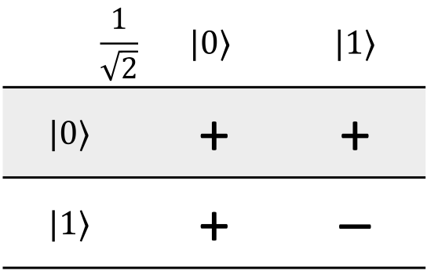{: .center .small loading=lazy }

Each row represents the original state that the register was in, and the columns represent all of the states that will be in the register's superposition after the H gate is applied to all of the qubits.
The term in the top-left corner tells you the amplitude of each resulting state in the superposition.
The body of the matrix tells you what the phase of that particular term in the superposition will be (positive or negative).
Here's an annotated version of the same picture:

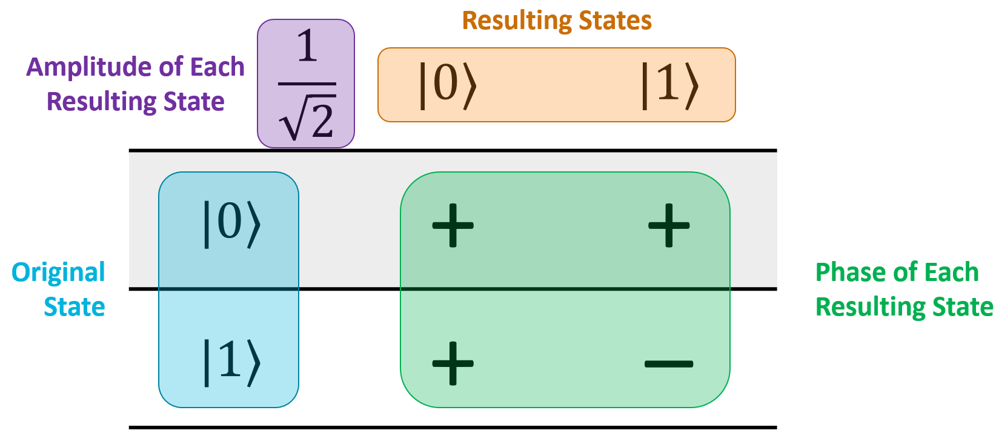{: .center loading=lazy }

What this particular matrix tells you is that if you have a single qubit in the $\ket{0}$ state and apply H to it, the qubit will be put into the superposition $\frac{1}{\sqrt{2}} \ket{0} + \frac{1}{\sqrt{2}} \ket{1}$:

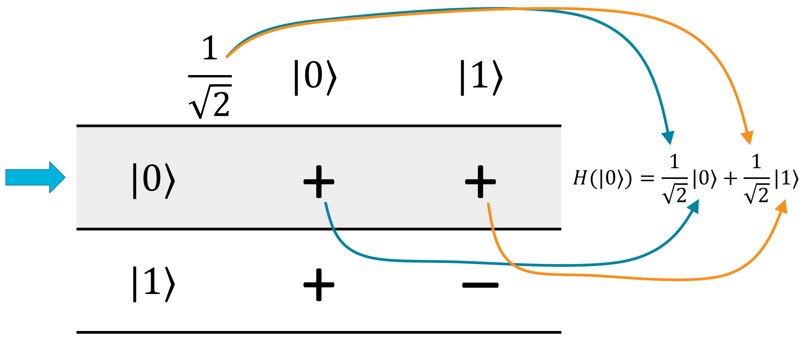{: .center loading=lazy }

Similarly, if you apply H to a single qubit in the $\ket{1}$ state, then the result will be $\frac{1}{\sqrt{2}} \ket{0} - \frac{1}{\sqrt{2}} \ket{1}$:

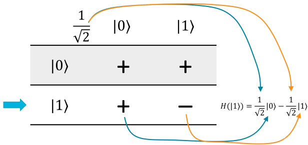{: .center loading=lazy }

Here's the Hadamatrix for two qubits:

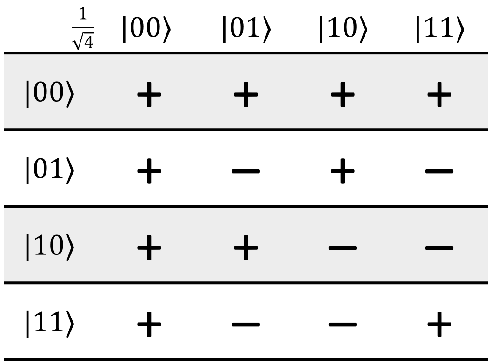{: .center loading=lazy }

You might be able to see a pattern forming - the matrix is basically divided into four quadrants.
The top-left is just the previous Hadamatrix from one size smaller, the top-right and bottom-left are copies of it, and the bottom-right is the inverted version.
The result amplitude is just $1 / \sqrt{2^n}$, where $n$ is the number of qubits in the register.

Here's the Hadamatrix for three qubits (and we'll stop here because it's getting very big):

{: .center .large loading=lazy }

Let's do a quick demo of the 3-qubit Hadamatrix.
Let's say that we have a register in the state $\ket{101}$.
According to the matrix, the result of applying H to the whole register will be:

$$
\begin{aligned}
H_{ALL} (\ket{101}) = \frac{1}{\sqrt{8}} ( &\, \ket{000} - \ket{001} + \ket{010} - \ket{011} - \\
&\, \ket{100} + \ket{101} - \ket{110} + \ket{111} )
\end{aligned}
$$

This is useful if you quickly want to know the result of H on everything, because the resulting phases and the amplitudes of each state may not be obvious.

## Using H on a Register Already in a Superposition

Let's say we gave you this state:

$$
\ket{\psi} = \frac{1}{\sqrt{2}} \ket{011} + \frac{1}{\sqrt{2}} \ket{101}
$$

And we asked you to figure out what the results of Hadamarding all of the qubits will be.
Assuming you don't have access to Quirk or some simulator to tell you the answer, you have 3 options:

1. Do the math. Figure out what the 3 8x8 Hadamard matrices are, and run the register's state vector through them all.
1. Apply the distribution rule.
   Figure out $H_0$ on the first two terms, then $H_1$ on the resulting four terms, then $H_2$ on the resulting eight terms to get a grand total of 16 terms.
   Apply constructive and destructive interference to reduce accordingly.
1. Use the Hadamatrix, which tells you everything after a little plug-and-chug.

In this case, we have two terms, both of which start with amplitude $1 / \sqrt{2}$.
I'll highlight them in the Hadamatrix and put their original amplitudes to the side:

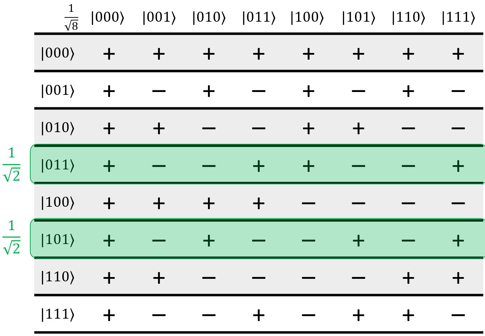{: .center .large loading=lazy }

Since the other rows weren't in the original register's state, we can get rid of them.
They won't be involved in this calculation:

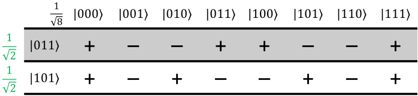{: .center .large loading=lazy }

Now, to figure out the results, we just process each column one by one. The process goes like this:

1. Start at the first column.
1. Go through each row in that column.
   Multiply the value by the original amplitude (the row's amplitude, highlighted in green here), by the Hadamard coefficient (the value in the top-left corner, in this case $1 / \sqrt{8}$), and finally by the phase (the value in the cell, either +1 or -1).
1. Do the same for the subsequent rows in the column.
1. Add all of these coefficients together.
   The total sum will be the final amplitude of that state in the register's resulting superposition.

For this example, we'll start with the first column:

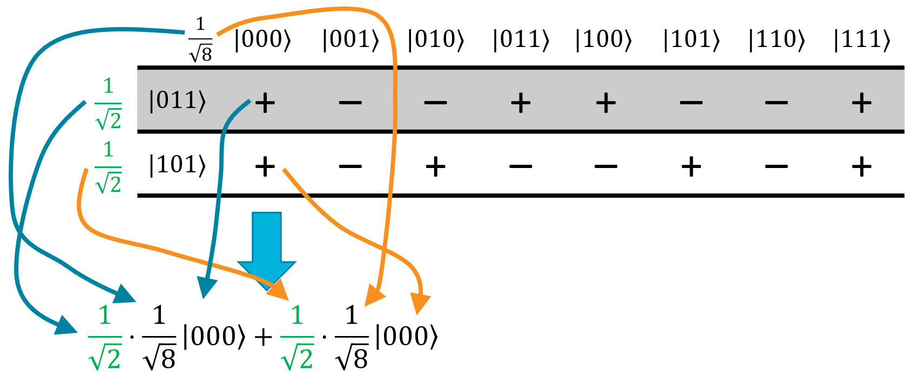{: .center .large loading=lazy }

In the final register superposition, the state $\ket{000}$ will have an amplitude of $\frac{1}{\sqrt{2}} \cdot \frac{1}{\sqrt{8}} + \frac{1}{\sqrt{2}} \cdot \frac{1}{\sqrt{8}} = \frac{2}{\sqrt{16}}$.

Similarly, doing this with the second column gives an amplitude of $\frac{1}{\sqrt{2}} \cdot \frac{1}{\sqrt{8}} \cdot -1 + \frac{1}{\sqrt{2}} \cdot \frac{1}{\sqrt{8}} \cdot -1 = -\frac{2}{\sqrt{16}}$.

In the third column, the two terms will destructively interfere so the state $\ket{010}$ doesn't appear in the final register superposition at all.
The same is true of the 4th, 5th, and 6th columns.
Following the steps for the 7th and 8th column, we get this result for the final register superposition:

$$
\displaylines{
\ket{\psi} = \frac{2}{\sqrt{16}} \ket{000} - \frac{2}{\sqrt{16}} \ket{001} - \frac{2}{\sqrt{16}} \ket{110} + \frac{2}{\sqrt{16}} \ket{111} 
\\~\\
= \frac{1}{2} \left( \ket{000} - \ket{001} - \ket{110} + \ket{111} \right)
}
$$

That was a fairly simple example. Let's try a harder one next.

## Using the Hadamatrix on Negative Terms

In this example, we're going to use the Hadamatrix to figure out what the result of applying $H_{ALL}$ to the following state will be:

$$
\ket{\psi} = \frac{1}{2} \left( \ket{000} - \ket{001} + \ket{011} - \ket{110} \right)
$$

Let's start like we did before, by selecting the rows that are in the original superposition and putting the amplitudes of each state next to those rows, and removing the rows that aren't in the original superposition:

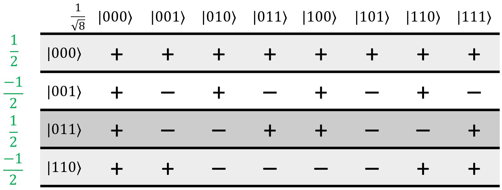{: .center .large loading=lazy }

This next step is optional, but we think it makes things easier.
I'm going to take the minus sign out of the amplitudes in the first two rows, and to balance things out, invert the signs of each cell in those rows:

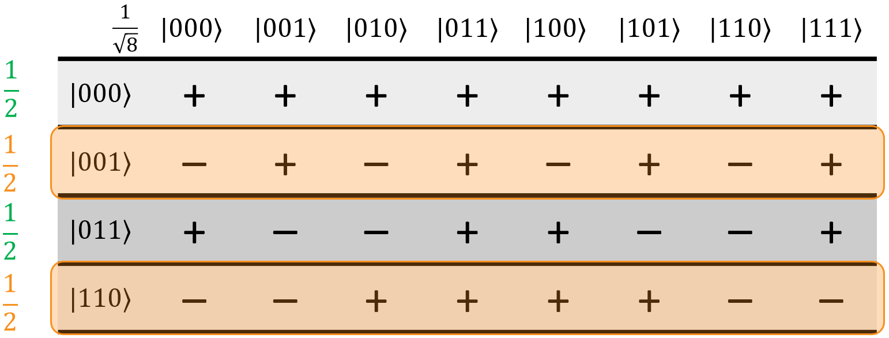{: .center .large loading=lazy }

In our opinion, this makes it more obvious how the terms will constructively and destructively interfere.
Either way, the next step in the process is to go through each column, multiply by the relevant coefficients, and add them all up:

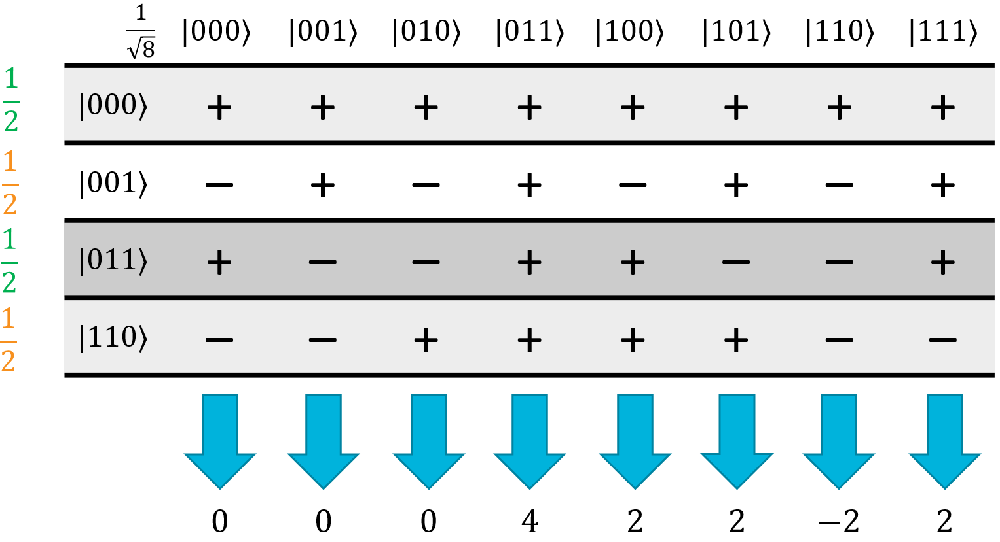{: .center .large loading=lazy }

Since all of the original amplitudes are the same, each term will have an amplitude of $1/(2 \sqrt{8})$ so we just add the phases up and multiply by the amplitude at the end to make things simpler.
This will result in a final superposition of:

$$
\ket{\psi} = \frac{4}{2 \sqrt{8}} \ket{011} + \frac{2}{2 \sqrt{8}} \ket{100} + \frac{2}{2 \sqrt{8}} \ket{101} - \frac{2}{2 \sqrt{8}} \ket{110} + \frac{2}{2 \sqrt{8}} \ket{111}
$$

Basically, the Hadamatrix tells you everything you need to know in order to calculate $H_{ALL}$ on any arbitrary superposition.
In some cases (such as when all of the original terms have the same amplitude), it makes it really easy to figure out what the result will be, thanks to shortcuts like the ones we took above.

## Interference-Based Algorithms

Quantum interference is extremely important in many quantum algorithms, and is one of the contributing factors that let them solve things faster than classical computers can.
In the next section, we're going to start looking at quantum algorithms that actually compute things faster than classical computers can.
This is where we start getting into the actual use cases for these algorithms.
The reason we made the Hadamatrix, and why we found it so useful to understand why those algorithms work, will become apparently very quickly when we walk through them.
Let's start with the most basic one first: the Deutsch-Jozsa algorithm.
