# Qubit Registers

## Qubit Registers and Ket Notation

At this point, you should feel pretty comfortable with qubits and single-qubit gates.
But, as you can imagine, quantum algorithms that perform useful calculations don't just manipulate single qubits.
In this section, we're going to talk about arrays of qubits - more formally called **qubit registers**.

Qubit registers aren't discrete physical blocks of qubits on a processor like classical registers in a CPU are.
The name "register" is just what we call abstract groups of arbitrary qubits.
Registers truly are just like arrays of qubits, defined in software.
Their physical mapping or layout on the actual hardware doesn't matter.

In quantum computing, qubit registers are written as kets with multiple terms inside of them.
You've already seen kets for single qubits, like so (shown with the Bloch Sphere for convenience):

$$
\textcolor{blue}{\ket{a} = \ket{0}}, \qquad
\textcolor{purple}{\ket{b} = \ket{1}}, \qquad
\textcolor{red}{\ket{c} = \frac{\sqrt{2}}{\sqrt{5}} \ket{0} + \frac{\sqrt{3}}{\sqrt{5}} \ket{1}}
$$

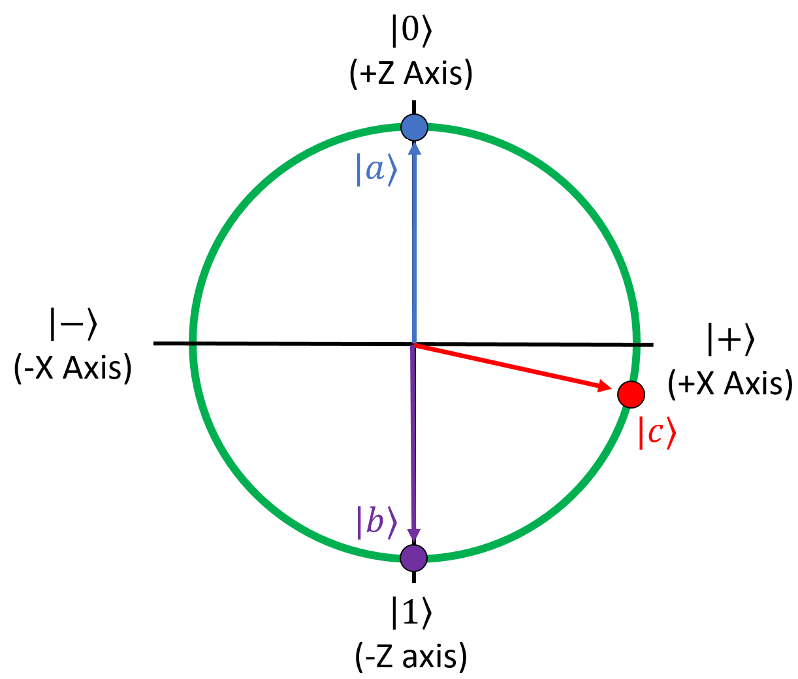{: .center loading=lazy }

The first qubit has a 100% chance of being measured in the $\ket{0}$ state, the second one has a 100% chance of being measured in the $\ket{1}$ state, and the third one has a 40% chance of being measured as $\ket{0}$ and a 60% chance of being measured as $\ket{1}$.

This is an example of a ket that represents a register with 2 qubits in it:

$$
\ket{\psi} = \ket{00}
$$

In this ket, there are two zeros.
The first zero represents the state of the first qubit, which we'll call $\psi_0$ since we're computer scientists and everything is zero-indexed in our world.
The second zero represents the state of the second qubit, which we'll call $\psi_1$.
In this example, both qubits are in the $\ket{0}$ state, so both have a 100% chance of being measured as $\ket{0}$.
Both qubits get their own independent Bloch Spheres:

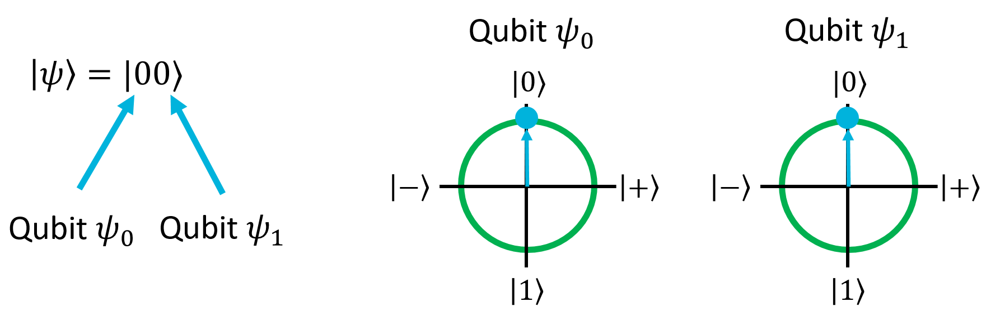{: .center loading=lazy }

Here's a larger example, this time for a register with 5 qubits:

$$
\ket{\psi} = \ket{00101}
$$

In this example, the qubits $\psi_0$, $\psi_1$,and $\psi_3$ are all in the $\ket{0}$ state while $\psi_2$ and $\psi_4$ are in the $\ket{1}$ state.
This is the binary number 00101, which is 5 in decimal.
Qubit registers can be used to represent decimal numbers in binary the same way that classical bit arrays can.
As a few more examples, here are the ways of writing the numbers 0 through 3 with qubits:

$$
\displaylines{
\ket{\psi} = \ket{00} = 0
\\~\\
\ket{\psi} = \ket{01} = 1
\\~\\
\ket{\psi} = \ket{10} = 2
\\~\\
\ket{\psi} = \ket{11} = 3
}
$$

If you're familiar with binary numbers from classical software engineering, you'll feel right at home with this.

## Applying Single-Qubit Gates to Registers

When we have multiple qubits in a register, applying a single-qubit gate to one of them acts independently on that qubit, as you would expect it to.
For example, say we started with this state:

$$
\ket{\psi} = \ket{00}
$$

Both qubits are in the $\ket{0}$ state.
If we apply the X gate to the second qubit, it will flip from $\ket{0}$ to $\ket{1}$:

$$
X(\psi_1), \qquad \ket{\psi} = \ket{01}
$$

The two Bloch Spheres for this register will now look like this:

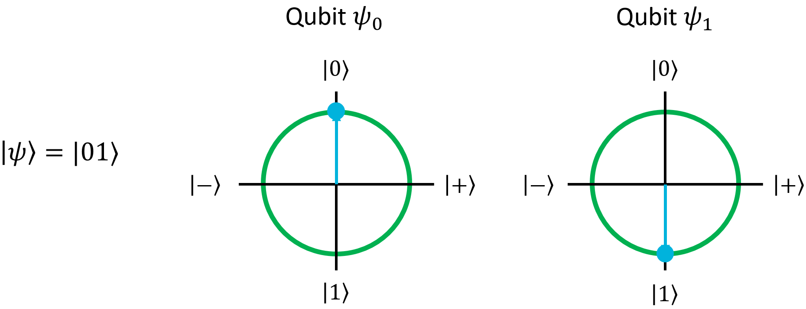{: .center loading=lazy }

Note how this gate flipped the second qubit but left the first qubit alone.

This behavior is true for any single-qubit gate, and as shown, we can selectively apply single-qubit gates to any qubit in a register, just like we'd be able to apply classical operations on any bit in an array.

## Registers in Superpositions

We've seen how to write registers out when the qubits are in either of the computational basis states.
What if one of the qubits is in a superposition? Let's explore that with an example.
We'll start by creating a new register, called $\ket{\psi}$, with one qubit that starts in the $\ket{0}$ state.
Next, let's put it into the $\ket{+}$ state with the H gate:

$$
\begin{aligned}
\ket{\psi} &= \ket{0}
\\~\\
H(\psi_0), \qquad \ket{\psi} &= \ket{+}
\\~\\
&= \frac{1}{\sqrt{2}} \ket{0} + \frac{1}{\sqrt{2}} \ket{1}
\end{aligned}
$$

As a reminder, the H gate mirrors the qubit around the X=Z axis:

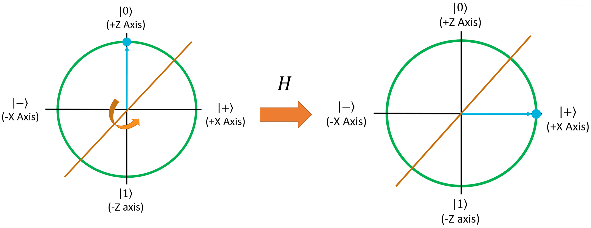{: .center loading=lazy }

Now, let's add a second qubit to this register (which will be in the $\ket{0}$ state):

$$
\displaylines{
\ket{\psi_0} = \frac{1}{\sqrt{2}} \ket{0} + \frac{1}{\sqrt{2}} \ket{1}
\\~\\
\ket{\psi_1} = \ket{0}
}
$$

By themselves, they're easy to represent. The Bloch Spheres for these 2 qubits will look like this:

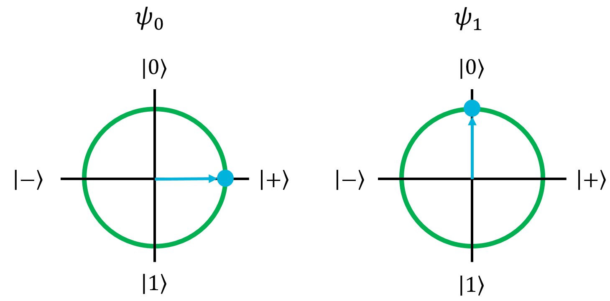{: .center loading=lazy }

But how do we represent the register as a single ket?
For that, let's do a little bit of math.
Recall from [the vector math section](/background-math/vectors) that ket notation has the tensor product built into it, so the ket $\ket{ab}$ is really the same thing as $\ket{a} \otimes \ket{b}$.
So to combine our two qubits here together into one ket, we can just take their tensor product:

$$
\begin{aligned}
\ket{\psi} &= \ket{\psi_0 \psi_1}
\\~\\
&= \ket{\psi_0} \otimes \ket{\psi_1}
\\~\\
&= \left( \frac{1}{\sqrt{2}} \ket{0} + \frac{1}{\sqrt{2}} \ket{1} \right) \otimes \ket{0}
\end{aligned}
$$

At this point, it's useful to remember that the tensor product is linear, so it can be distributed to each of the terms in the parentheses:

$$
= \frac{1}{\sqrt{2}} \ket{0} \otimes \ket{0} + \frac{1}{\sqrt{2}} \ket{1} \otimes \ket{0}
$$

Now, we can turn the two tensor products back into single kets:

$$
= \frac{1}{\sqrt{2}} \ket{00} + \frac{1}{\sqrt{2}} \ket{10}
$$

This is the state of our register. So what does it mean?

Well, like with a single qubit, this state shows that there are two possible measurement outcomes: $\ket{00}$ or $\ket{10}$.
In the first case, both qubits are measured as $\ket{0}$.
In the second case, the first qubit is measured as $\ket{1}$ and the second qubit is measured as $\ket{0}$.
Both cases have a 50% chance of being measured.

Notice, however, that the second qubit is $\ket{0}$ in either case.
No matter which overall state you end up measuring, that second qubit will always be measured in the $\ket{0}$ state.
The first qubit, however, has a 50% chance of being $\ket{0}$ and a 50% chance of being $\ket{1}$.
This is exactly what we would expect, knowing that the first qubit is in the $\ket{+}$ state and the second qubit is in the $\ket{0}$ state.

In a nutshell, when a qubit register is in a superposition, the terms of the superposition represent the possible measurement outcomes for every qubit.
The amplitudes of each term tell you the probability of measuring that state.
This is exactly the same as for single qubit kets, but now each ket represents the measurement outcome of multiple qubits.

Let's do another example, this time with an uneven superposition.
We'll start with $\ket{00}$ and rotate the second qubit 45° around the X-Z plane:

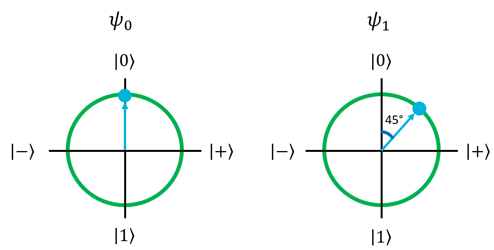{: .center loading=lazy }

Doing the math out for this second qubit, we get its rather ugly ket form:

$$
\begin{aligned}
\ket{\psi_1} &= \cos \left( \frac{45°}{2} \right) \ket{0} + \sin \left( \frac{45°}{2} \right) \ket{1} 
\\~\\
&= \frac{\sqrt{2 + \sqrt{2}}}{2} \ket{0} + \frac{\sqrt{2 - \sqrt{2}}}{2} \ket{1}
\\~\\
&\approx 0.924 \cdot \ket{0} + 0.383 \cdot \ket{1}
\end{aligned}
$$

This qubit will have an 85.4% chance of being measured as $\ket{0}$, and a 14.6% chance of being measured as $\ket{1}$.
Now, if we follow the same tensoring process as the previous example, we get the overall state for the two-qubit register:

$$
\begin{aligned}
\ket{\psi} &= \ket{0} \otimes \left( \frac{\sqrt{2 + \sqrt{2}}}{2} \ket{0} + \frac{\sqrt{2 - \sqrt{2}}}{2} \ket{1} \right)
\\~\\
&= \frac{\sqrt{2 + \sqrt{2}}}{2} \ket{00} + \frac{\sqrt{2 - \sqrt{2}}}{2} \ket{01}
\end{aligned}
$$

In this register, there are two possible measurement outcomes: $\ket{00}$ and $\ket{01}$.
The first has an 85.4% chance of occurring, and will have both qubits in the $\ket{0}$ state.
The second has a 14.6% chance of occurring, and will have the first qubit in the $\ket{0}$ state but the second qubit in the $\ket{0}$ state.
Just like you would expect from the individual qubit states, the first qubit will be $\ket{0}$ no matter what, and the second qubit could be $\ket{0}$ or $\ket{1}$.

## The Tyranny of the State Vector

So far, we've just looked at registers with 2 qubits.
We kind of ignored the overall state vector of the register because it's not that important.
To explain why, let's try looking at the state vector for a register with 3 qubits.
To keep it simple, let's just look at the $\ket{000}$ state:

$$
\begin{aligned}
\ket{000} &= \begin{bmatrix} 1 \\ 0 \end{bmatrix} \otimes \begin{bmatrix} 1 \\ 0 \end{bmatrix} \otimes \begin{bmatrix} 1 \\ 0 \end{bmatrix}
\\~\\
&= \begin{bmatrix} 1 \\ 0 \end{bmatrix} \otimes \begin{bmatrix} 1 \cdot \begin{bmatrix} 1 \\ 0 \end{bmatrix} \\ 0 \cdot \begin{bmatrix} 1 \\ 0 \end{bmatrix} \end{bmatrix}
\\~\\
&= \begin{bmatrix} 1 \\ 0 \end{bmatrix} \otimes \begin{bmatrix} 1 \\ 0 \\ 0 \\ 0 \end{bmatrix}
\\~\\
&= \begin{bmatrix} 1 \cdot \begin{bmatrix} 1 \\ 0 \\ 0 \\ 0 \end{bmatrix} \\ 0 \cdot \begin{bmatrix} 1 \\ 0 \\ 0 \\ 0 \end{bmatrix} \end{bmatrix}
\\~\\
&= \begin{bmatrix} 1 \\ 0 \\ 0 \\ 0 \\ 0 \\ 0 \\ 0 \\ 0 \end{bmatrix}
\end{aligned}
$$

As you can see, the register's state vector has 8 terms in it.
In fact, for $n$ qubits, the statevector will have $2^n$ terms.
If you use a conventional 64-bit double to represent the amplitude of a qubit, this means it would take $64 \cdot 2^n = 2^{n+6}$ bits of classical memory to represent $n$ qubits, or $2^{n+3}$ bytes.
If you include a double for the the imaginary component of each qubit's amplitude, this doubles to $2^{n+4}$ bytes.
To put that into perspective, capturing the state vector of a 32-qubit register would take 64 GB of conventional RAM.

This exponential growth is why we don't really look at state vectors in quantum computing, and just represent registers with ket notation.
This is also why quantum computers are hard to simulate with classical computers, and it hints as to why they're so powerful.
We'll explore that topic more later in the class.
For now, all you need to know is that each qubit you add to a register doubles the size of its state vector.
We could easily write a large register's state like this:

$$
\ket{11001100110011001100}
$$

This shows a 20-qubit register that happens to represent the number 838,860 in binary.
We know exactly what state each of the 20 qubits is in just by looking at the ket.
The state vector for this register is $2^{20} = 1,048,576$ terms long though, and it would just be silly to try and write that out. 

## 4-Qubit Register Example

So far, we've spent a lot of time looking at registers with just 2 qubits.
Let's do some examples with, say, 4 qubits to further demonstrate ket notation and how single-qubit gates affect registers.
In this first example, we want to build the state $\ket{1010}$.

As usual, let's start by putting everything into the $\ket{0}$ state:

$$
\ket{\psi} = \ket{0000}
$$

For each of these examples, I'll include the Bloch Sphere for all 4 qubits.
Here are the Bloch Spheres for this starting state:

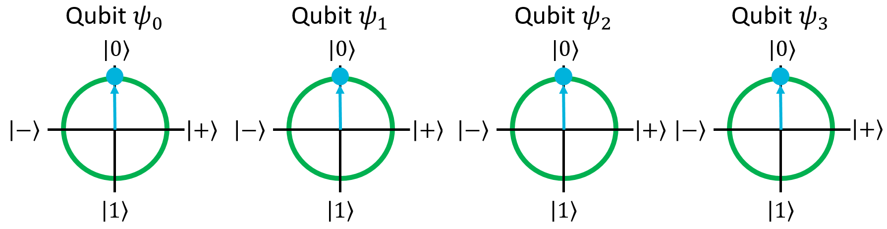{: .center loading=lazy }

To get to $\ket{1010}$, we can easily do it by applying the X gate to the first and third qubits:

$$
X(\psi_0), \qquad \ket{\psi} = \ket{1000}
$$

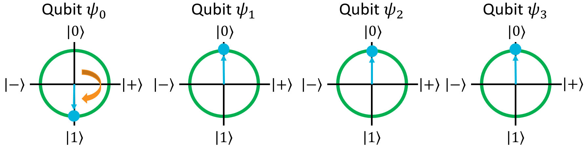{: .center loading=lazy }

$$
X(\psi_2), \qquad \ket{\psi} = \ket{1010}
$$

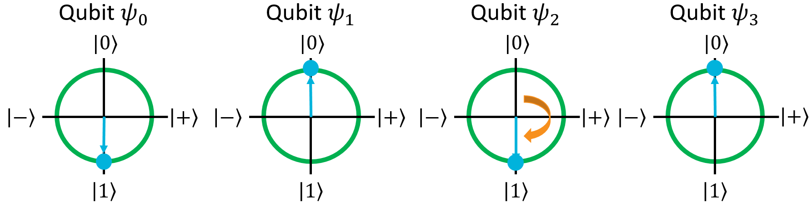{: .center loading=lazy }

And with that, we have our $\ket{1010}$ state.

## 4-Qubit Register Example: X, Z, and H Gates

In this example, we're going to have some fun with the X, Z, and H gates.

First things first - let's start with a blank slate again:

$$
\ket{\psi} = \ket{0000}
$$

{: .center loading=lazy }

Now, let's apply H to the second qubit to see what it does to the register's ket:

$$
H(\psi_2), \qquad \ket{\psi} = \frac{1}{\sqrt{2}} \ket{0000} + \frac{1}{\sqrt{2}} \ket{0010}
$$

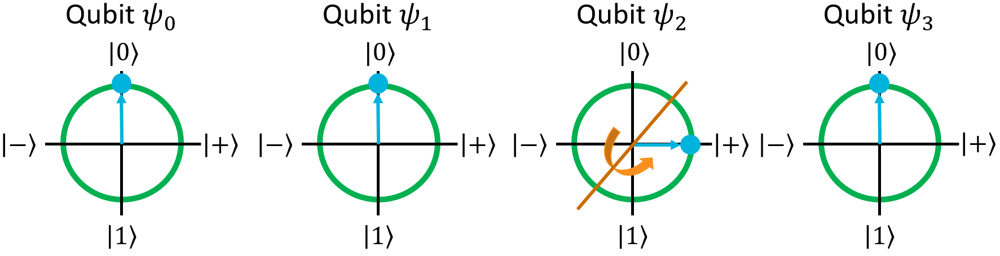{: .center loading=lazy }

Like we saw with 2-qubit registers, the H gate on one qubit put the register into a superposition.
Now there are two possible measurement outcomes: $\ket{0000}$ and $\ket{0010}$, both of which have a 50% chance of being measured.

Next, let's apply the X gate to the first qubit:

$$
X(\psi_0), \qquad \ket{\psi} = \frac{1}{\sqrt{2}} \ket{1000} + \frac{1}{\sqrt{2}} \ket{1010}
$$

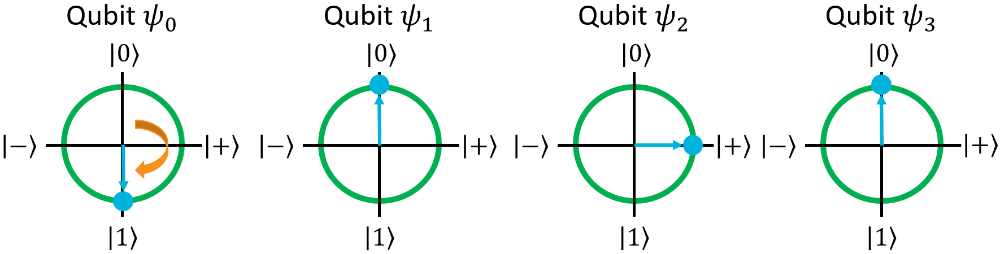{: .center loading=lazy }

Note what happened here, because this is important: applying the X gate to the first qubit flipped the first qubit in both terms of the register's state.
This is a general rule about how quantum gates work: **applying a quantum gate to a register will apply it to every term in the register's superposition, independently**.
With this in mind, an easy way to figure out what the X gate does to this register is by **distributing** the gate to each of the terms:

$$
\begin{aligned}
\ket{\psi} &= \frac{1}{\sqrt{2}} \ket{0000} + \frac{1}{\sqrt{2}} \ket{0010}
\\~\\
X(\psi_0), \qquad \ket{\psi} &= \frac{1}{\sqrt{2}} \left( X_0(\ket{0000}) \right) + \frac{1}{\sqrt{2}} \left( X_0(\ket{0010}) \right)
\\~\\
&= \frac{1}{\sqrt{2}} \ket{1000} + \frac{1}{\sqrt{2}} \ket{1010}
\end{aligned}
$$

This is an easy way to figure out what the result of applying a gate to a register will be: just apply it to every term in the superposition separately, and then couple all of the results together.

Let's see what happens if we apply the Z gate to the first qubit:

$$
Z(\psi_0), \qquad \ket{\psi} = -\frac{1}{\sqrt{2}} \ket{1000} - \frac{1}{\sqrt{2}} \ket{1010}
$$

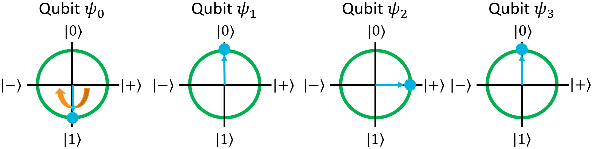{: .center loading=lazy }

This is another good lesson to pay attention to: since the Z gate will negate the $\ket{1}$ state, **any state in the register's superposition where that Z'd qubit is $\ket{1}$ will be negated**.
In this case, since we're applying Z to the first qubit and the first qubit is $\ket{1}$ in both states of the register's superposition, both get negated.

But wait a minute, the first qubit is in the $\ket{1}$ state which is on the Z axis, and the Z gate mirrors things around the Z axis.
Shouldn't this end up having no effect?
In fact, that is exactly what happens because of the fact that **global phase can be ignored**:

$$
\begin{aligned}
\ket{\psi} &= -\frac{1}{\sqrt{2}} \ket{1000} - \frac{1}{\sqrt{2}} \ket{1010}
\\~\\
&= -1 \cdot \left( \frac{1}{\sqrt{2}} \ket{1000} + \frac{1}{\sqrt{2}} \ket{1010} \right)
\\~\\
&= \frac{1}{\sqrt{2}} \ket{1000} + \frac{1}{\sqrt{2}} \ket{1010}
\end{aligned}
$$

Thus, the Bloch Sphere correctly shows that there is no difference between these two states because global phase is irrelevant.

Now, let's try applying Z to the third qubit.
As a reminder, this will negate any state in the register's superposition where the third qubit is $\ket{1}$, so in this case, only the second term ($\ket{1010}$):

$$
Z(\psi_2), \qquad \ket{\psi} = \frac{1}{\sqrt{2}} \ket{1000} - \frac{1}{\sqrt{2}} \ket{1010}
$$

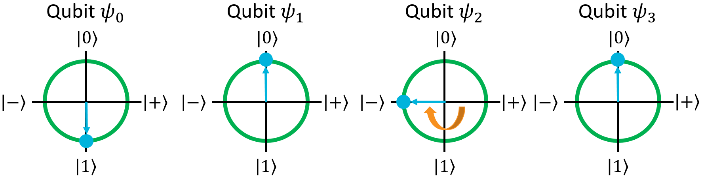{: .center loading=lazy }

As the Bloch Sphere shows, this is different from the previous state because the third qubit is in a different position than it used to be.
If we apply the Z gate to the third qubit again, it will flip back over to the right half of the Bloch Sphere, and the ket term will become positive again:

$$
Z(\psi_2), \qquad \ket{\psi} = \frac{1}{\sqrt{2}} \ket{1000} + \frac{1}{\sqrt{2}} \ket{1010}
$$

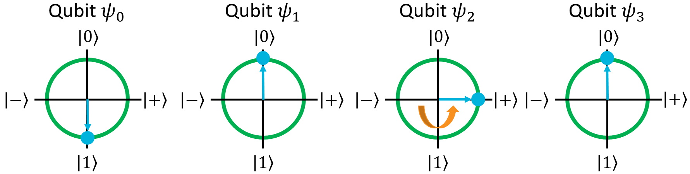{: .center loading=lazy }

Okay, that's easy enough for single-qubit gates.
In the next section, we're going to look at gates that take multiple qubits as parameters.