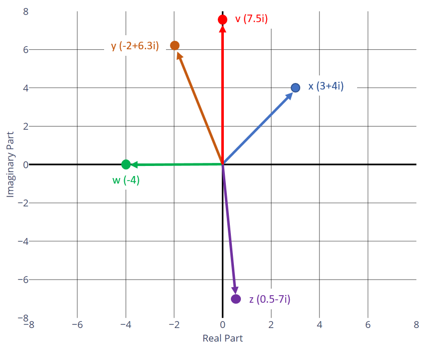
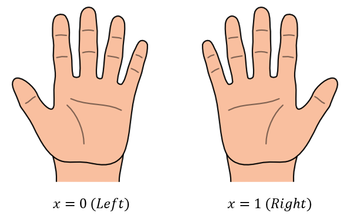
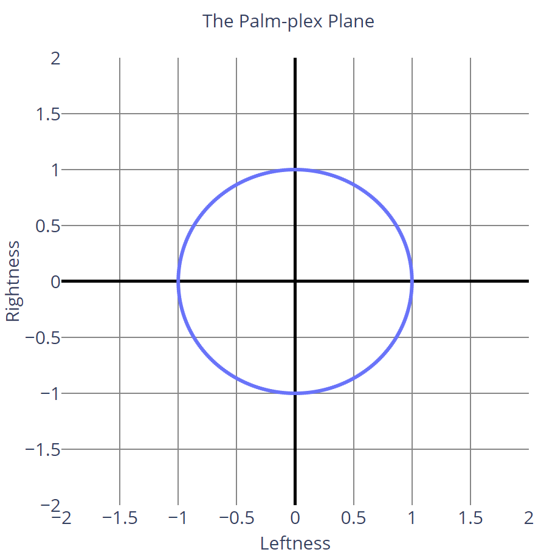

# Qubits

## Complex Number Reminder

In [the refresher section](../background-math/complex-numbers.md), we briefly went over complex numbers.
As a reminder, a complex number is a number with two separate parts: a **real** part, and an **imaginary** part:

$$
x = a + bi
$$

They look a little weird at first, but at the end of the day, they're just entities that have two independent properties.
You can think of a complex number like a tuple, or like an array with two elements, or even like a class with two fields.
The real part and the imaginary part have nothing to do with one another, so any of these data structures can represent a complex number.

As another reminder, it is usually very helpful to draw two-dimensional entities on a plane - especially when we have multiple points and want to compare them.
For complex numbers, this is done with the **complex plane** where the x-axis represents the real number line, and the y-axis represents the imaginary number line:

{: .center loading=lazy }

The two-dimensionalness of complex numbers and the complex plane actually provide a good foundation that will help explain how quantum bits work.
I'll get to that in a moment. But first, let's think about classical bits.

## The Classical Interpretation of Bits

A bit is simply a single digit of a binary number; it is the most basic unit of information in a classical system.
A bit can only have two values: 0 or 1.
From a mathematical viewpoint, this is useful because we can use bits to perform binary integer arithmetic.
In the most abstract sense, though, a bit simply represents a choice between two mutually exclusive things.

A good way to demonstrate this notion is with your hands.
A hand is a thing, and there are two distinct types of hands: left hands and right hands.
A hand can only be left or right.
It can't be half-left and half-right; it has to be one or the other.
There is no transformation in reality (not counting optical effects like mirrors) that will turn a left hand into a right hand.
You can rotate your hand however you want, you can move it around, but at the end of the day, you can always tell whether a hand is left or right when you look at it, no matter what you do to it. 

If we select one of our two hands, we can easily encode our choice with a single bit.
We could say that a value of 0 represents our left hand, and a value of 1 represents our right hand:

{: .center loading=lazy }

If we were to draw these two values on the number line, the left-hand point would sit at 0, and the right-hand point would sit at 1.
From a classical computing perspective, this makes perfect sense.
Quantum computing, however, requires a somewhat different interpretation of how a hand selection can be encoded in a bit.
This is going to seem weird, but if you can grasp this concept, you can grasp quantum mechanics.

## An Alternative Interpretation of Bits

Another way to think about hands, rather than a classical "left or right" choice, is to consider "leftness" and "rightness" to be two independent properties of a hand.
In this interpretation, we could encode a hand choice by saying that a bit with value 0 represents a hand that is 100% left and 0% right, and a bit with value 1 represents a hand that is 0% left and 100% right:

$$
\displaylines{
Bit_0 = 1 \cdot Left + 0 \cdot Right = Left
\\~\\
Bit_1 = 0 \cdot Left + 1 \cdot Right = Right
}
$$

Since both components are separate from one another in this interpretation, a hand is kind of like a complex number: it has a "left" component and a "right" component.
That means we can treat hands like arrays with two elements, where the first element represents the left component and the second represents the right component:

$$
\displaylines{
Bit_0 = \begin{bmatrix} 1 \\ 0 \end{bmatrix} = Left
\\~\\
Bit_1 = \begin{bmatrix} 0 \\ 1 \end{bmatrix} = Right
}
$$

Just like complex numbers, this two-dimensional representation of hands can easily be visualized on a graph.
Let's plot these two points on a graph where the "leftness" of a hand is represented by the x-axis, and the "rightness" of a hand is represented by the y-axis.
Because we have no shame, I'm going to call this graph the **palm-plex plane**:

{: .center loading=lazy }

As weird as this interpretation seems, it's still totally valid.
A classical bit can only have two values, and both of them correspond to the only two points on the graph.
That being said, in classical computation, this graph isn't very useful.
The axes of the palm-plex plane stretch out to infinity, but a hand can't really take advantage of that.
For example, a hand can't be 200% left or -50% right.
Furthermore, a hand can't be combinations of left and right (such as 25% left, 75% right).
Unfortunately, we are restricted by the fact that a hand can only either be left or right, and it can't be any arbitrary combination of the two.
Our bit is confined to these two points.

Quantum computers break this rule.

## The Qubit

In quantum computers, bits are called **qubits** (short for quantum bits).
Like classical bits, qubits represent two mutually exclusive things, such as our left or right hand choice.
Unlike classical bits, qubits are not confined to be in one state or the other during computation (an important distinction that I'll talk about later).
They actually follow the second interpretation of classical bits, where the two states are not mutually exclusive at all.
Instead, they are just two independent properties of the thing representing the qubit.

To keep things simple, let's continue our hand analogy.
A classical bit in this alternative interpretation was either 100% left and 0% right, or 100% right and 0% left.
This amount of "leftness" and "rightness" is called the **amplitude** of these different states.
To be pedantic, this is how we would describe a classical hand bit:

$$
Bit = a \cdot Left + b \cdot Right, \qquad a + b = 1, \qquad a \cdot b = 0
$$

The only solutions to this system of equations are (1, 0) and (0, 1).

A qubit representing a hand, however, is not restricted to these two states.
Instead, a qubit can be in any state where the sum of the squares of the amplitudes' magnitudes equals 1.
More formally, this is how we would describe a hand qubit:

$$
Qubit = a \cdot Left + b \cdot Right, \qquad {\lvert a \rvert}^2 + {\lvert b \rvert}^2 = 1
$$

It will certainly help to visualize this.
This is what the graph of all possible qubits looks like on the palm-plex plane:

{: .center loading=lazy }

Qubits can be in any state that lies on the unit circle of this plane.
This means that a qubit can be completely left, completely right, or have the properties of both left and right hands *at the same time*.
For example, the point $\left( \frac{1}{\sqrt{2}}, \frac{1}{\sqrt{2}} \right)$ is completely valid for a qubit.
It has equal amplitudes of leftness and rightness.

Try not to think of this as a single bit that has been put into a singular, bizarre hybrid state that somehow represents half of one state and half of the other.
Think of it more like two totally independent bits that have been paired together into one entity.
In fact, in quantum computing, this is usually how we think of (and write) qubits.
The point $\left( \frac{1}{\sqrt{2}}, \frac{1}{\sqrt{2}} \right)$ would actually be written like this:

$$
\ket{x} = \frac{1}{\sqrt{2}} \ket{0} + \frac{1}{\sqrt{2}} \ket{1}
$$

I'll explain the notation in a second, but the important thing to note is that we write qubits out as two separate terms, just like complex numbers.
The first term represents the amplitude of the **0-state** (the choice that we've assigned to a value of 0; in our hand analogy, the left hand) and the second term represents the amplitude of the **1-state** (in our analogy, the right hand).
We don't squish them together into a single term, we think of them as two independent parts of an overall whole.
When a qubit has non-zero amplitude in both terms, we say that it is in a **superposition** of the 0-state and the 1-state.
Superpositions are what we would consider the **first key principle of quantum computing**, because they are the most important aspect of it.

This is going to seem very strange for a while.
There's really no easy way to transition from the classical computing paradigm to the quantum one other than practice and experimentation, and we're going to do lots of those later in the class.
For now, let's talk about how to work with qubits.

## Writing Qubits with Ket Notation

Because the 0-state amplitude and 1-state amplitude are two separate properties, a qubit is usually thought of as an array of two real numbers, just like a complex number.
It's most convenient to write qubits as column vectors.
Recall from the refresher that **column vectors** can just be written as a **ket**.
This is how we'd write the ket for a single qubit:

$$
\ket{x} = \begin{bmatrix} a \\ b \end{bmatrix}
$$

Here $x$ is a qubit, where $a$ is its amplitude of the 0-state and $b$ is its amplitude of the 1-state.
The vector $\begin{bmatrix} a \\ b \end{bmatrix}$ is called the **state vector** of the qubit, because it's a vector that fully describes everything about the qubit's state.

If $x$ was completely in the 0 state, then it would have a 0 state amplitude of 1, and a 1 state amplitude of 0.
It would be equivalent to a classical bit with a value of 0, or a left hand, or a light switch in the OFF position.
We write that as the $\ket{0}$ ket, like this:

$$
\ket{0} = \begin{bmatrix} 1 \\ 0 \end{bmatrix}, \qquad \text{Classical OFF (0)}
$$

Similarly, for a qubit with all of its amplitude in the 1 state, we write it as the $\ket{1}$ ket like this:

$$
\ket{1} = \begin{bmatrix} 0 \\ 1 \end{bmatrix}, \qquad \text{Classical ON (1)}
$$

These two kets are going to be our **fundamental building blocks for all of quantum computing**, just like bit values of 0 and 1 are the fundamental building blocks of classical computing.
They even have a fancy name: $\ket{0}$ and $\ket{1}$ together form the computational basis.
Using the rules of vector addition and scalar multiplication shown in the recap section, we can actually rewrite the original qubit as a sum of its $\ket{0}$ and $\ket{1}$ components:

$$
\ket{x} = \begin{bmatrix} a \\ b \end{bmatrix} = a \cdot \begin{bmatrix} 1 \\ 0 \end{bmatrix} + b \begin{bmatrix} 0 \\ 1 \end{bmatrix} = a \ket{0} + b \ket{1}
$$

This is the general form of the notation we showed earlier; in that example, $a = b = \frac{1}{\sqrt{2}}$.
This notation is going to be extremely handy when representing complicated arrays of qubits later on, so it's important that you become familiar with it.

## Qubit Amplitudes

According to the laws of physics, qubits are always unit vectors.
As described in [the recap section](/background-math/vectors), that means the sum of the squares of $a$ and $b$'s magnitudes always add up to 1:

$$
\ket{x} = \begin{bmatrix} a \\ b \end{bmatrix} = a\ket{0} + b\ket{1}, \qquad {\lvert a \rvert}^2 + {\lvert b \rvert}^2 = 1 
$$

This means that amplitudes can be positive, negative, and even complex numbers.
Thus, a more complete definition of a qubit would look like this:

$$
\ket{x} = \begin{bmatrix} a + bi \\ c + di \end{bmatrix} = (a + bi) \ket{0} + (c + di) \ket{1}, \qquad (a^2 + b^2) + (c^2 + d^2) = 1
$$

For example, all of these states are valid for qubits:

$$
\begin{bmatrix} -1 \\ 0 \end{bmatrix}, \qquad
\begin{bmatrix} \frac{1}{\sqrt{2}} \\ \frac{1}{\sqrt{2}} \end{bmatrix}, \qquad
\begin{bmatrix} \frac{-1}{\sqrt{2}} \\ \frac{\sqrt{3}}{2} \end{bmatrix}, \qquad
\begin{bmatrix} \frac{\sqrt{2}}{\sqrt{3}} \\ \frac{1}{\sqrt{3}} \end{bmatrix}, \qquad
\begin{bmatrix} \frac{i}{\sqrt{2}} \\ \frac{1}{\sqrt{2}} \end{bmatrix}, \qquad
\begin{bmatrix} \frac{1}{\sqrt{2}} \\ \frac{1}{2} + \frac{i}{2} \end{bmatrix}, \qquad
...
$$

This actually means that qubits are technically 4-dimensional entities, so instead of drawing them as a circle in a 2D plane, we'd have to draw them as 4D sphere.

That's kind of hard to do.

Since this class is just an introduction, we're going to avoid complex numbers.
You can just stick to the easier form with only $a$ and $b$ for now, but in many real quantum computing problems, you're going to need to deal with them.

## Qubit Measurement

At first glance, it might seem like qubits can be used to store arbitrary amounts of information, since their amplitudes can be any real number.
If we wanted to encode, say, a 7-digit phone number into a single qubit, we could just set the amplitude of the 0-state to that number; as an example, consider the qubit below, which I'll call the [Jenny](https://www.youtube.com/watch?v=6WTdTwcmxyo) qubit:

$$
\ket{Jenny} = 0.8675309 \cdot \ket{0} + 0.4973833 \cdot \ket{1}
$$

The amplitude of the 1-state isn't important; it's just whatever's left over (in this case, $\sqrt{1 − {0.8675309}^2}$).
The point is, we can technically encode as much information into a qubit as our instrumentation allows, contingent upon its precision.
This would mean that a single qubit could represent an enormous number of classical bits, which would quickly drive hard drive and RAM manufacturers into a frenzy.
In fact, using photons as qubits, we could construct a simple quantum circuit that would put the photon into the desired superposition, then pass it through a fiber optic cable to the destination, where it could be "decoded" to recover the original information.
Bandwidth would increase by orders of magnitude, and ISP prices would probably skyrocket accordingly.

Unfortunately, there is a second weird property of qubits that prevents us from directly taking advantage of arbitrary qubit amplitudes.
While we can put a qubit into any superposition state that we want, we can't actually get the amplitude information out of it.
Whenever we observe a qubit (essentially, when we read its value), the qubit will always be measured as either $\ket{0}$ or $\ket{1}$, no matter what. 

If the qubit is $\ket{0}$ already, then when we measure it, it will be measured as $\ket{0}$ 100% of the time.
Similarly, if it's $\ket{1}$ already, then it will always be $\ket{1}$ when we measure it.
If the qubit is in any other superposition, we don't know what it will be when we measure it.
Measuring a qubit is a probablistic operation, which means that if the qubit is in a superposition, then there is some non-zero probability that it will be $\ket{0}$ and some other non-zero probability that it will be $\ket{1}$, but we don't know which it will be until we actually measure it.
Specifically, the probability that it will be $\ket{0}$ is the amplitude of the $\ket{0}$ state's magnitude squared, and the probability of $\ket{1}$ is the amplitude of the $\ket{1}$ state's magnitude squared:

$$
\ket{x} = a\ket{0} + b\ket{1}, \qquad \text{Prob}_{\ket{0}} = {\lvert a \rvert}^2, \qquad \text{Prob}_{\ket{1}} = {\lvert b \rvert}^2
$$

For the list of example amplitudes in the [Qubit Amplitudes](#qubit-amplitudes) section above, the probabilities of measuring $\ket{0}$ would be 100%, 50%, 25%, 66.666%, 50%, and 50%.
For any qubit state, the probability of measuring $\ket{1}$ is just 100% minus the probability of $\ket{0}$. 

Once a qubit has been measured as $\ket{0}$ or $\ket{1}$, it will stay in that state until you modify it (or it gets randomly modified by the environment - a phenomenon known as [decoherence](https://en.wikipedia.org/wiki/Quantum_decoherence) which is what has made quantum computers so hard to physically develop).
Because of this, you can't run a quantum computation on a qubit and measure it a bunch of times to determine roughly what its probabilities were.
You'd have to prepare a qubit in a known state, run the computation, measure the result, and repeat the entire process multiple times in order to generate independent measurements.

In other words, we can encode an arbitrary amount of information into a single qubit, but we can't get it back just by measuring that qubit.
Encoding information in a quantum system is a one-way trip unless you're very clever and work out a way to extract it while obeying the rules of qubits.
Most of the well-known and celebrated algorithms, including the ones we'll learn about in this class, do exactly this.

So how can a qubit's value depend on when you measure it, and how does it "decide" which value to be?
This is called the [Measurement Problem](https://en.wikipedia.org/wiki/Measurement_problem) in quantum mechanics, and it is one of the great unsolved mysteries of the universe.
We're not going to get into it during this class, because honestly it is such a complicated problem that it even touches on philosophy at some points.

## Qubit Phases

As you might have realized by now, the fact that the measurement probability of a state is determined by the square of its amplitude means that it gives the same probability whether it's positive or negative.
Thus, for measurement purposes, the sign of the amplitudes doesn't actually matter.
For quantum operations prior to measurement, however, the sign plays a very important role.
This sign is called the phase of the amplitude.
For completeness, the **phase** also includes any imaginary component of the amplitude, but we are going to ignore the imaginary component in this class.

There is a third strange property of qubits when it comes to phases: when performing quantum operations, we can't actually observe the individual phases of the $\ket{0}$ and $\ket{1}$ amplitudes.
All we can measure is the *difference* between those phases.
In other words, these two qubits are functionally identical:

$$
\displaylines{
\ket{x} = \ket{0} + \ket{1}
\\~\\
\ket{y} = -\ket{0} - \ket{1}
}
$$

Because the $\ket{0}$ and the $\ket{1}$ amplitudes have the same phase, any quantum operation we do on either one (including measurement) will end up having the same result.
Note that the $\ket{y}$ qubit can be rewritten like this:

$$
\ket{y} = -1 \cdot (\ket{0} + \ket{1})
$$

In this case, we say that $\ket{y}$ has a **global phase** of -1.
In quantum computing, global phases don't matter.
They can be ignored.

Now consider these two qubits:

$$
\displaylines{
\ket{z} = \ket{0} - \ket{1}
\\~\\
\ket{w} = -\ket{0} + \ket{1} = -1 \cdot (\ket{0} - \ket{1})
}
$$

Both of these qubits are identical to each other ($\ket{w}$ is just $\ket{z}$ with a global phase of -1), but they are not the same as $\ket{x}$ and $\ket{y}$ because the $\ket{0}$ and $\ket{1}$ states have different phases. 

The standard convention when describing a qubit's state is to keep the phase off of the $\ket{0}$ state, so it's always positive (and never has an imaginary component).
The $\ket{1}$ state is allowed to have a different phase.
If a quantum operation ever applies a phase to the $\ket{0}$ state, it's usually just transferred to the $\ket{1}$ state by multiplying both the $\ket{0}$ and $\ket{1}$ amplitudes by the inverse phase.
In this class, because we aren't going to deal with imaginary numbers, that just means multiplying both by -1.

## Qubit Rules Recap

If you've made it this far, then you have essentially learned the basics of how a single qubit works.
Here's a quick summary of the rules that qubits play by, for reference:

- In quantum computing, the classical 0 value is represented by the column vector $\ket{0} = \begin{bmatrix} 1 \\ 0 \end{bmatrix}$ and the classical 1 value is represented by the column vector $\ket{1} = \begin{bmatrix} 0 \\ 1 \end{bmatrix}$.

- Unlike classical bits, qubits can be in a **superposition** of the $\ket{0}$ and $\ket{1}$ states (they can represent both states at the same time).
    - $\ket{x} = \begin{bmatrix} a \\ b \end{bmatrix} = a \ket{0} + b \ket{1}, \qquad {\lvert a \rvert}^2 + {\lvert b \rvert}^2 = 1$
    - $a$ is the **amplitude** of the $\ket{0}$ state.
    - $b$ is the amplitude of the $\ket{1}$ state.
    - The amplitudes can be any arbitrary complex numbers, as long as their magnitudes squared sum up to 1.

- Qubit measurements (reads) are **probabilistic**.
    - When a qubit is measured, it will always be either $\ket{0}$ or $\ket{1}$.
    - A qubit in the $\ket{0}$ state will always be measured as $\ket{0}$.
    - A qubit in the $\ket{1}$ state will always be measured as $\ket{1}$.
    - A qubit in an arbitrary superposition $a \ket{0} + b \ket{1}$ will have probability ${\lvert a \rvert}^2$ of being measured as $\ket{0}$, and probability ${\lvert b \rvert}^2$ of being measured as $\ket{1}$.
    - Once you measure a qubit, it will stay in the measured state until you (or the environment) modify it.
    - Measuring a qubit multiple times will have no effect on it and will always produce the same result, unless it's modified between measurements.

- The sign of the amplitude (and its imaginary part, if using complex numbers) is called the **phase** of the amplitude.
    - **Global phases** don't matter.
        -  $\ket{0} + \ket{1}$ is the same as $-\ket{0} - \ket{1}$.
        -  $\ket{0} - \ket{1}$ is the same as $-\ket{0} + \ket{1}$.
    - **Relative phases** (differences between $\ket{0}$'s phase and $\ket{1}$'s phase) do matter.
        -  $\ket{0} + \ket{1}$ is not the same as  $\ket{0} - \ket{1}$.
    - Neither global nor relative phases matter during measurement, but relative phases matter during quantum operations. Global phases never matter.
    - By convention, the $\ket{0}$ state doesn't have a phase (it's always positive and non-imaginary). The $\ket{1}$ state always holds the phase information.

In the next section we'll look at the standard way of visualizing qubits - the Bloch Sphere.