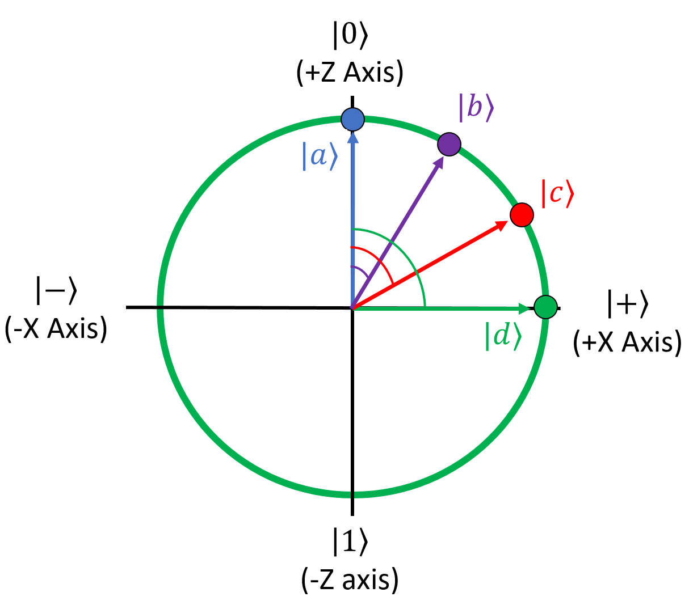
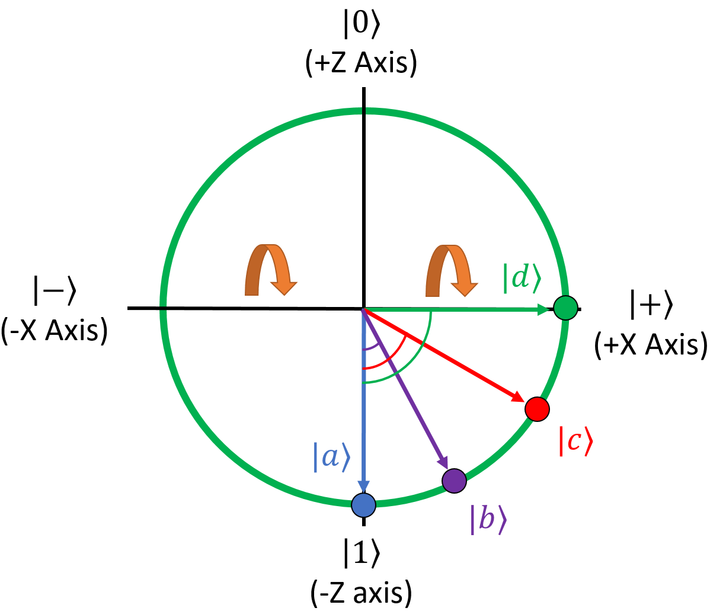
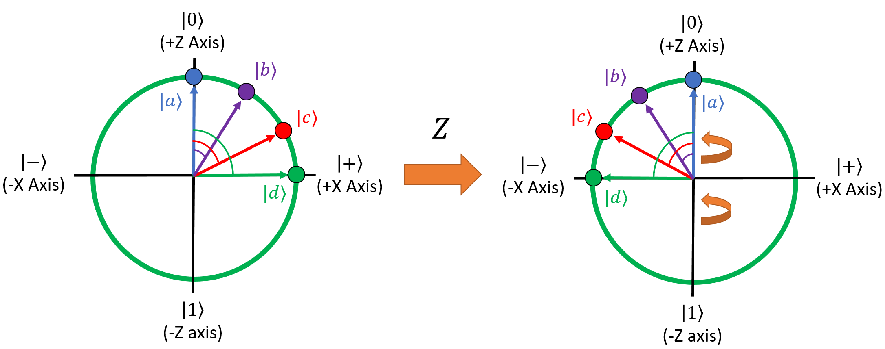
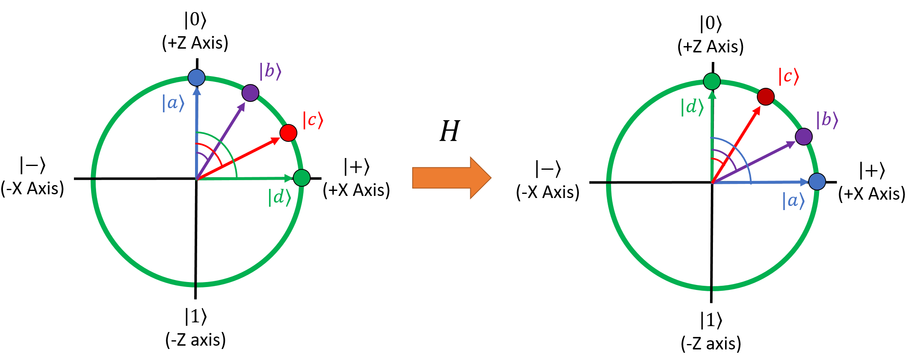
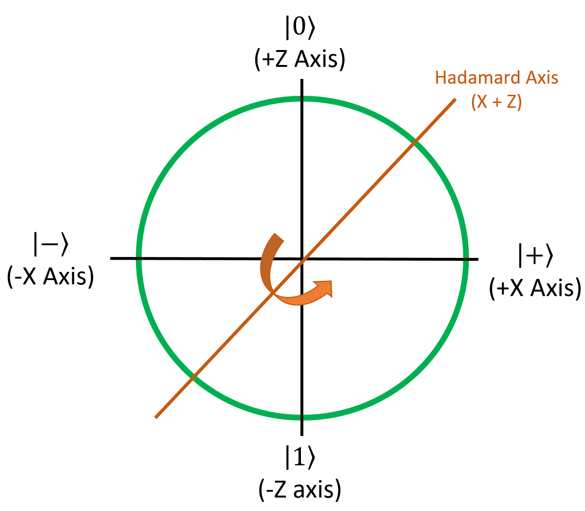

# Single-Qubit Gates

## Classical Unary Logic Gates

Alright! At this point, we've talked about what a qubit is, and we've talked about the Bloch Sphere which is the standard way to visualize qubits.
Let's talk a bit about quantum computers, how they calculate things with qubits.

In classical computers, we use **logic gates** as the fundamental structures that interact with input bits to produce output bits.
Most of the time, we think of these input and output bits as different physical bits.
We had four unary gates (gates that only take one bit as input): 

- **Clear**, which always sets the output to 0
- **Mark**, which always sets the output to 1
- **Identity**, which sets the output to whatever the input was
- **Negate (NOT)**, which sets the output to the opposite of the input

As a reminder, here are the truth tables for each of them:

**Clear**
{: .center }

| Input | Output |
| - | - |
| 0 | 0 |
| 1 | 0 | 

**Mark**
{: .center }

| Input | Output |
| - | - |
| 0 | 1 |
| 1 | 1 | 

**Identity**
{: .center }

| Input | Output |
| - | - |
| 0 | 0 |
| 1 | 1 | 

**Negate**
{: .center }

| Input | Output |
| - | - |
| 0 | 1 |
| 1 | 0 | 

## Quantum Unary Logic Gates

Quantum computers use an analog of classical logic gates as their primitive qubit manipulation structures, which conveniently enough, are called **quantum logic gates**.
In function, they are different from classical logic gates in two main ways:

1. The input qubit of a quantum gate and the output qubit **are the same qubit**.
   Unlike classical logic gates, a quantum logic gate modifies the input qubit directly.
   A more computer-sciencish way of saying this is that **qubits are mutable**.
   When expressed as functions in code, quantum gates don't return anything - they modify their qubit parameters directly.
2. Quantum logic gates aren't represented by truth tables.
   Instead, they're represented as **matrices**. 
    1. More specifically, quantum gates are represented as **unitary matrices**.
       This means that the matrix multiplied by its adjoint is equal to the identity matrix.
    1. This also means that quantum gates are, by definition, **reversible** - if you put something in, then you run that output on the adjoint of the gate, you always get the original input back.
    1. For unary gates (ones that only act on one qubit), a logic gate is a **2x2 matrix**.
1. When a quantum computer applies a logic gate to a qubit, it takes the dot product of the gate's matrix and the qubit's state vector.
   The qubit's resulting state will be the result of that multiplication.

There are a lot more than four quantum unary gates.
Technically, because qubit amplitudes can be any real or complex number, there are infinitely many possible qubits and thus there could be infinitely many possible quantum gates to transform arbitrary inputs into arbitrary outputs.
In practice, though, we tend to stick to a "standard set" of well-defined gates.
In a moment, we'll go over this standard set to see how they work and what they do to qubits.
Before that though, I'm going to offer a bit of explanation about how to interpret quantum gates.

### Applying Qubit Gates

Because qubits are represented with vectors, and because qubit gates are represented with matrices, it's fair to say that quantum computers are effectively just very fast at calculating matrix math.
We can certainly do that too - in fact, if we wanted to simulate a quantum computer, we would just end up doing a lot of scalar addition, multiplication, and tensor products to a bunch of vectors and matrices.
This is what most quantum simulators that run on traditional hardware (like your laptops or desktops) end up doing.

Doing the math is certainly a correct way to think about quantum operations, and for some people, it is actually the preferred route.
That's totally fine!
For us, however, we find the math to get a little tedious for anything but the simplest problems, so we have an alternative way of thinking about qubits - one which calls back to the classical truth tables.

Because each qubit has two independent amplitudes for the $\ket{0}$ and $\ket{1}$ states, we just think of a quantum logic gate in terms of what it does to the $\ket{0}$ and $\ket{1}$ states.
In other words, we just build a truth table for each gate.
It turns out this is really all you need in order to understand quantum mechanics - you can ignore all of the vector and matrix math if you don't want to use it.
It's always there for you to fall back on if you need it, but in our opinion, it's easier to conceptualize quantum logic gates in terms of a truth table.

In the rest of the section, I'll go over the standard single-qubit gates we use most often in quantum computing.

## The I (Identity) Gate

For our first example of a quantum gate, I'll pick the simplest one.
The **I gate**, also called the Identity gate, is the same as the classic identity gate: it puts the output into the same state as the input.
Since the input and output qubits are the same qubit in quantum gates, this means that the gate effectively doesn't do anything to the input qubit at all.

To start, as a demonstration, I'm going to show how this gate works from the math perspective.
We'll get to the truth-table interpretation after that.
As stated, quantum unary gates are represented by 2x2 unitary matrices. Here's the matrix for the I gate:

$$
I = \begin{bmatrix} 1 & 0 \\ 0 & 1 \end{bmatrix}
$$

Unsurprisingly, it's the identity matrix.
Let's apply this gate to a few qubits to show what would happen when a quantum computer runs this gate.
As a reminder, this is how the dot product works for a 2x2 matrix $M$ and a 2x1 vector $v$:

$$
M = \begin{bmatrix} M_{00} & M_{01} \\ M_{10} & M_{11} \end{bmatrix}, \qquad v = \begin{bmatrix} v_0 \\ v_1 \end{bmatrix}, \qquad M \cdot v = \begin{bmatrix} M_{00} \cdot v_0 + M_{01} \cdot v_1 \\ M_{10} \cdot v_0 + M_{11} \cdot v_1 \end{bmatrix}
$$

Let's do the math and see what it does to a qubit in an arbitrary state:

$$
\displaylines{
\ket{\psi} = a \ket{0} + b \ket{1} = \begin{bmatrix} a \\ b \end{bmatrix}
\\~\\
\begin{aligned}
I(\ket{\psi}), \qquad \ket{\psi} &= \begin{bmatrix} 1 & 0 \\ 0 & 1 \end{bmatrix} \cdot \begin{bmatrix} a \\ b \end{bmatrix}
\\~\\
&= \begin{bmatrix} 1 \cdot a & 0 \cdot b \\ 0 \cdot a & 1 \cdot b \end{bmatrix}
\\~\\
&= \begin{bmatrix} a \\ b \end{bmatrix}
\end{aligned}
}
$$

As a reminder, the I gate (as with all quantum gates) doesn't actually "return" anything, in the computer science context.
It directly modifies the qubit that it was given.
Think of this like a **pass-by-reference** style of function.

Anyway, no matter what the input is, the output is always the same.
That's why this is called the identity matrix, and by extension, the identity gate.
As you might expect, this has the same truth table as the classical Identity gate, though it uses kets instead of individual bits:

| Input | Output |
| - | - |
| $\ket{0}$ | $\ket{0}$ |
| $\ket{1}$ | $\ket{1}$ |

## The X (NOT) Gate

The next gate is another familiar face, and it's used *all the time* in quantum computing: this one is called the Pauli X gate (**X gate** for short), but it's also called the **NOT gate**.
As you may have guessed, this is the quantum analog of the classical negation gate, which is also called NOT.
Here's its matrix:

$$
X = \begin{bmatrix} 0 & 1 \\ 1 & 0 \end{bmatrix}
$$

Here's the truth table for it:

| Input | Output |
| - | - |
| $\ket{0}$ | $\ket{1}$ |
| $\ket{1}$ | $\ket{0}$ |

This essentially turns the $\ket{0}$ state into the $\ket{1}$ state, and the $\ket{1}$ state into the $\ket{0}$ state.
This is why it's known as the NOT gate, also occasionally called the bit-flip gate for this reason.
More generally, it will swap the amplitudes of the $\ket{0}$ and $\ket{1}$ states for a qubit:

$$
\displaylines{
\ket{\psi} = a \ket{0} + b \ket{1} = \begin{bmatrix} a \\ b \end{bmatrix}
\\~\\
X(\ket{\psi}), \qquad \ket{\psi} = \begin{bmatrix} b \\ a \end{bmatrix} = b \ket{0} + a \ket{1}
}
$$

That's interesting and is probably useful for all sorts of things.
But there's one question that remains in our head: why is it also called the X gate?
It's obvious why it's called NOT, but where does the name X come from? For that explanation, we're going to go back to the Bloch sphere.

### The X Gate and the Bloch Sphere

To demonstrate what's going on, I'm going to pick four example qubits.
We want them to be evenly spaced between the positive Z axis (the $\ket{0}$ state) and the positive X axis (the $\ket{+}$ state).
An easy way to figure out what their amplitudes should be is with the spherical coordinate representation shown in the previous section.
Since we don't care about the imaginary part and we're sticking to the X-Z plane in this class, we can ignore the angle $\phi$ entirely and just leave it at zero.
If we do that, the equation for a qubit is:

$$
\ket{\psi} = \cos \left( \frac{\theta}{2} \right) \cdot \ket{0} + \sin \left( \frac{\theta}{2} \right) \cdot \ket{1}, \qquad 0 \le \theta \le \pi
$$

To evenly space the four qubits out, we want angles of $\theta$ = 0°, 30°, 60°, and 90° from the +Z axis to the +X axis (0, $\pi∕6$, $\pi∕3$, and $\pi∕2$ in radians).
Doing the math, we get these states for the four qubits:

$$
\textcolor{blue}{\ket{a} = \begin{bmatrix} 1 \\ 0 \end{bmatrix}}, \qquad
\textcolor{purple}{\ket{b} = \begin{bmatrix} \frac{\sqrt{3} + 1}{2 \sqrt{2}} \\ \frac{\sqrt{3} - 1}{2 \sqrt{2}} \end{bmatrix}}, \qquad
\textcolor{red}{\ket{c} = \begin{bmatrix} \frac{\sqrt{3}}{2} \\ \frac{1}{2} \end{bmatrix}}, \qquad
\textcolor{green}{\ket{d} = \begin{bmatrix} \frac{1}{\sqrt{2}} \\ \frac{1}{\sqrt{2}} \end{bmatrix}}
$$

Here's what these qubits look like when we graph them on the Bloch Sphere:

{: .center loading=lazy }

Note that this isn’t the entire 3D sphere - we've removed the Y axis since we aren't going to deal with imaginary phases in this class.

Anyway, applying the X gate to these qubits is easy, since the X gate just flips the top and bottom elements of the state vector.
This is what each qubit becomes after the X gate runs on it:

$$
\textcolor{blue}{\ket{a} = \begin{bmatrix} 0 \\ 1 \end{bmatrix}}, \qquad
\textcolor{purple}{\ket{b} = \begin{bmatrix} \frac{\sqrt{3} - 1}{2 \sqrt{2}} \\ \frac{\sqrt{3} + 1}{2 \sqrt{2}} \end{bmatrix}}, \qquad
\textcolor{red}{\ket{c} = \begin{bmatrix} \frac{1}{2} \\ \frac{\sqrt{3}}{2} \end{bmatrix}}, \qquad
\textcolor{green}{\ket{d} = \begin{bmatrix} \frac{1}{\sqrt{2}} \\ \frac{1}{\sqrt{2}} \end{bmatrix}}
$$

Now for the fun part.
Here's what these qubits look like on the Bloch Sphere:

{: .center loading=lazy }

See what happened here?
**The X gate mirrors qubits around the X axis of the Bloch Sphere.**
This is why it's called the X gate.

This is a good demonstration of why the Bloch Sphere is such a useful visualization tool.
You can always just "do the math" and calculate the state vector of a qubit based on the matrix of the gate being applied to it, but that doesn't always offer some intuitive sense of what the gate is doing.
For visual learners, which many of us are, the Bloch Sphere makes gates easier to understand.

Alright, with that knowledge in hand, let's look at some more gates.

## The Z (Phase-Flip) Gate

The next gate is the **Z gate**, which is another one that you'll see used all over the place.
This gate doesn't actually have a classical analog; this is a gate that only makes sense in quantum computing.
It also goes by the name "phase-flip gate" for obvious reasons when you look at its matrix:

$$
Z = \begin{bmatrix} 1 & 0 \\ 0 & -1 \end{bmatrix}
$$

Here's its truth table:

| Input | Output |
| - | - |
| $\ket{0}$ | $\ket{0}$ |
| $\ket{1}$ | $-\ket{1}$ |

This is the first gate that doesn't have a classical counterpart.
It leaves the $\ket{0}$ state alone, but it negates the amplitude of the $\ket{1}$ state:

$$
\displaylines{
\ket{\psi} = \begin{bmatrix} a \\ b \end{bmatrix}
\\~\\
Z(\ket{\psi}), \qquad \ket{\psi} = \begin{bmatrix} a \\ -b \end{bmatrix}
}
$$

Just as the X gate mirrors qubits around the X axis of the Bloch sphere, **the Z gate mirrors them around the Z axis**.
To show this, let's apply it to the four original qubits from the previous example:

$$
\textcolor{blue}{\ket{a} = \begin{bmatrix} 1 \\ 0 \end{bmatrix}}, \qquad
\textcolor{purple}{\ket{b} = \begin{bmatrix} \frac{\sqrt{3} + 1}{2 \sqrt{2}} \\ \frac{\sqrt{3} - 1}{2 \sqrt{2}} \end{bmatrix}}, \qquad
\textcolor{red}{\ket{c} = \begin{bmatrix} \frac{\sqrt{3}}{2} \\ \frac{1}{2} \end{bmatrix}}, \qquad
\textcolor{green}{\ket{d} = \begin{bmatrix} \frac{1}{\sqrt{2}} \\ \frac{1}{\sqrt{2}} \end{bmatrix}}
$$

After Z, they become:

$$
\textcolor{blue}{\ket{a} = \begin{bmatrix} 1 \\ 0 \end{bmatrix}}, \qquad
\textcolor{purple}{\ket{b} = \begin{bmatrix} \frac{\sqrt{3} + 1}{2 \sqrt{2}} \\ \frac{1 - \sqrt{3}}{2 \sqrt{2}} \end{bmatrix}}, \qquad
\textcolor{red}{\ket{c} = \begin{bmatrix} \frac{\sqrt{3}}{2} \\ \frac{-1}{2} \end{bmatrix}}, \qquad
\textcolor{green}{\ket{d} = \begin{bmatrix} \frac{1}{\sqrt{2}} \\ \frac{-1}{\sqrt{2}} \end{bmatrix}}
$$

{: .center loading=lazy }

It probably won't make sense why this is inherently useful right now; we'll get to that later on in the course when we talk about quantum interference.
For now, all that's important is that you understand what the Z gate does and how to apply it.

## The Hadamard (H) Gate

The third gate we'll look at is called the Hadamard gate, or the H gate for short.
It's certainly one of the most important, if not *the* most important single-qubit gate in the quantum logic gate arsenal.
This gate is going to look very unusual compared to everything you've seen so far:

$$
H = \begin{bmatrix} \frac{1}{\sqrt{2}} & \frac{1}{\sqrt{2}} \\ \frac{1}{\sqrt{2}} & \frac{-1}{\sqrt{2}} \end{bmatrix}
$$

The easiest way to explain why this gate is so important is by showing the truth table for it, so you can see what it does to the $\ket{0}$ and $\ket{1}$ states:

| Input | Output |
| - | - |
| $\ket{0}$ | $\frac{1}{\sqrt{2}} \ket{0} + \frac{1}{\sqrt{2}} \ket{1}$ |
| $\ket{1}$ | $\frac{1}{\sqrt{2}} \ket{0} - \frac{1}{\sqrt{2}} \ket{1}$ |

The H gate turns $\ket{0}$ into $\ket{+}$ and $\ket{1}$ into $\ket{-}$.
This gate is generally how we unlock the power of quantum superpositions.
Let's try looking at what it does to our four example qubits on the Bloch Sphere:

$$
\textcolor{blue}{\ket{a} = \begin{bmatrix} 1 \\ 0 \end{bmatrix}}, \qquad
\textcolor{purple}{\ket{b} = \begin{bmatrix} \frac{\sqrt{3} + 1}{2 \sqrt{2}} \\ \frac{\sqrt{3} - 1}{2 \sqrt{2}} \end{bmatrix}}, \qquad
\textcolor{red}{\ket{c} = \begin{bmatrix} \frac{\sqrt{3}}{2} \\ \frac{1}{2} \end{bmatrix}}, \qquad
\textcolor{green}{\ket{d} = \begin{bmatrix} \frac{1}{\sqrt{2}} \\ \frac{1}{\sqrt{2}} \end{bmatrix}}
$$

After H, the qubits are in these states:

$$
\textcolor{blue}{\ket{a} = \begin{bmatrix} \frac{1}{\sqrt{2}} \\ \frac{1}{\sqrt{2}} \end{bmatrix}}, \qquad
\textcolor{purple}{\ket{b} = \begin{bmatrix} \frac{\sqrt{3}}{2} \\ \frac{1}{2} \end{bmatrix}}, \qquad
\textcolor{red}{\ket{c} = \begin{bmatrix} \frac{\sqrt{3} + 1}{2 \sqrt{2}} \\ \frac{\sqrt{3} - 1}{2 \sqrt{2}} \end{bmatrix}}, \qquad
\textcolor{green}{\ket{d} = \begin{bmatrix} 1 \\ 0 \end{bmatrix}}
$$

{: .center loading=lazy }

It looks like it made our four qubits switch places with one another.
$\ket{a}$ became $\ket{d}$, $\ket{b}$ became $\ket{c}$, and vice versa.
How did it do this?
Essentially, H is a special gate that mirrors qubits around the axis defined by X = Z:

{: .center loading=lazy }

This is very helpful for converting qubit phase information into classical measurement information and bringing things in and out of superpositions, which we'll play around with later on in the course when we get to the hands-on problems.

## Other Standard Gates

The three nontrivial gates presented so far (X, Z, and H) are probably the most common of the "primitive" gates that you'll see in quantum algorithms (where primitive means they are fundamental atomic operations that most quantum computers will probably support).
That being said, there are a few more primitive gates in the standard set.
We won't use these in this class, but they're still good to know about.

### The Y Gate

The **Y gate**, as you can guess, mirrors qubits around the Y axis of the Bloch Sphere.
The matrix for it is a little weird:

$$
Y = \begin{bmatrix} 0 & -i \\ i & 0 \end{bmatrix}
$$

Basically, this swaps the $\ket{0}$ and $\ket{1}$ amplitudes (like the X gate), negates the new $\ket{0}$ state's amplitude, and multiplies both amplitudes by the imaginary unit.
That may not seem like it would have the same affect as rotating around the Y axis, but once you take global phases into account, it effectively does the same thing.

### The S Gate

The **S gate** is the square root of the Z gate.
Instead of rotating a qubit by 180° around the Z axis, it only rotates qubits by 90° counterclockwise (towards the positive Y axis).
For example, this will turn the $\ket{+}$ state into the $\ket{i+}$ state.
The matrix for it is this:

$$
S = \sqrt{Z} = \begin{bmatrix} \sqrt{1} & \sqrt{0} \\ \sqrt{0} & \sqrt{-1} \end{bmatrix} = \begin{bmatrix} 1 & 0 \\ 0 & i \end{bmatrix}
$$

### The T Gate

The **T gate** is the square root of the S gate (so the fourth root of the Z gate).
It rotates qubits by 45° around the Z axis.
It has this matrix:

$$
T = \sqrt{S} = \begin{bmatrix} \sqrt{1} & \sqrt{0} \\ \sqrt{0} & \sqrt{i} \end{bmatrix} = \begin{bmatrix} 1 & 0 \\ 0 & \frac{1+i}{\sqrt{2}} \end{bmatrix}
$$

## Arbitrary Rotation Gates

The set of unary gates I, X, Y, Z, H, S, and T are essentially all of the primitive single-qubit gates that you'll encounter in quantum computing.
However, as we mentioned before, there are an infinite number of possible qubit states and these gates alone can't turn any arbitrary qubit into any other arbitrary qubit.
For that, most quantum software frameworks give us three extra gates for this purpose, usually called the **arbitrary rotation gates**.

These gates aren't primitive; they're composed of a sequence of the other primitive gates (including one we haven't introduced yet, called CNOT).
Using them, they can get arbitrarily close to approximating any rotation around the Bloch Sphere, and can thus transform any given qubit into any desired state.
The fact that they aren't primitive won't matter for us, that's a hardware implementation detail.

### The Rx Gate

The **Rx gate** can perform any rotation around the X axis of the Bloch Sphere, which means it can move qubits around the Y-Z plane.
The matrix for it depends on which software framework you're using, but it's usually something like this:

$$
R_x = \begin{bmatrix} \cos \left( \frac{\theta}{2} \right) & -i \cdot \sin \left( \frac{\theta}{2} \right) \\ -i \cdot \sin \left( \frac{\theta}{2} \right) & \cos \left( \frac{\theta}{2} \right) \end{bmatrix}
$$

The most important thing to note about this matrix is that it's **parameterized** - it takes an angle $\theta$, which means the matrix itself depends on the angle you're rotating by.

### The Ry Gate

The **Ry gate** is used for arbitrary rotations around the Y axis of the Bloch Sphere.
When you want to move qubits around on the X-Z plane by weird, uneven amounts, this is the gate you want to use.
Here's the typical matrix for it:

$$
R_y = \begin{bmatrix} \cos \left( \frac{\theta}{2} \right) & -\sin \left( \frac{\theta}{2} \right) \\ \sin \left( \frac{\theta}{2} \right) & \cos \left( \frac{\theta}{2} \right) \end{bmatrix}
$$

We're going to use this gate for some of the exercises in this class where we want to move things around the X-Z plane, since that plane is the only place we care about (the only place that doesn't involve imaginary numbers).

### The Rz Gate and the Phase-Shift Gate

The **Rz gate** is used for rotations around the Z axis of the Bloch Sphere, so it can move qubits around the X-Y plane.
There are actually 2 different ways to represent this one.
The first way rotates the qubit and applies a global phase to it:

$$
R_z = \begin{bmatrix} e^{-i \theta / 2} & 0 \\ 0 & e^{i \theta / 2} \end{bmatrix}
$$

This isn't really used that much, because it applies a phase to the $\ket{0}$ state which we usually don't want.
The second version is called the **phase-shift gate** and is definitely used more often than Rz; it also rotates the qubit around the Z axis, but it doesn't apply a global phase, so the $\ket{0}$ state is left without a phase after the rotation:

$$
R_\phi = \begin{bmatrix} 1 & 0 \\ 0 & e^{i \phi} \end{bmatrix}
$$

Note that this is the same thing as the first version, just multiplied by a global phase of $e^{i \theta ∕ 2}$.
Also note that it uses $\phi$ instead of $\theta$ for the angle parameter, because $\phi$ is the symbol used to indicate the phase angle of a qubit when it's written in spherical coordinates (it's the angle from the X axis on the X-Y plane, which is basically what we're creating with this rotation).

## The Measurement Gate

The last single-qubit gate to talk about is the **measurement gate**.
This isn't really a gate in the strict sense, because it doesn't have a matrix associated with it; it's more of a quantum operation instead.
But, since all of the other gates can be considered quantum operations too, measurement is typically included in this category.

Measurement is a very special operation, because it's the only one that isn't reversible.
With all of the other gates, you can "undo" them by applying the adjoint version of them to get the original input back.
Once you measure a qubit, however, there's no way to revert it to its original state; you can't "un-measure" a qubit.
The superposition will collapse to either the $\ket{0}$ or $\ket{1}$ state, and all of the superposition information will be lost.

## Gate Recap

Before we go on, let's recap the gates and what they do.

Primitive gates:

- The **I (Identity)** gate does nothing. It's a no-op.
- The **X (NOT) gate** mirrors qubits around the X axis of the Bloch Sphere.
  It swaps the amplitudes of the $\ket{0}$ and $\ket{1}$ states, essentially turning $\ket{0}$ into $\ket{1}$ and vice-versa.
  This is the quantum version of the classical NOT gate.
- The **Z (Phase-Flip) gate** mirrors qubits around the Z axis.
  It leaves the $\ket{0}$ state alone, and flips the phase of the $\ket{1}$ state from positive to negative and vice-versa.
- The **H (Hadamard) gate** mirrors qubits around the X+Z axis.
  It turns $\ket{0}$ into $\ket{+}$ and $\ket{1}$ into $\ket{-}$.
  It's used to bring qubits in and out of superpositions, and cause quantum interference (discussed later on).
- The **Y gate** mirrors qubits around the Y axis.
  It's basically a combination of the X and Z gates.
- The **S gate** rotates qubits 90° around the Z axis, counterclockwise.
- The **T gate** rotates qubits 45° around the Z axis, counterclockwise.

Arbitrary rotation gates:

- The **Rx gate** can rotate qubits any angle you want around the X axis.
- The **Ry gate** can rotate qubits any angle you want around the Y axis.
- The **Rz gate** can rotate qubits any angle you want around the Z axis, but it applies a phase to the $\ket{0}$ state.
- The **$R_\phi$ (Phase-Shift) gate** rotates qubits any angle you want around the Z axis too, but it doesn't apply a phase to the $\ket{0}$ state so it's usually preferred over Rz.

Measurement:

- The **Measurement gate** collapses the qubit into either the $\ket{0}$ or $\ket{1}$ state, destroying its superposition information.
  The probability of measuring either state depends on the amplitudes, as described in [the Qubits section](/quantum-concepts/qubits).
- Measurement is the only gate that isn't reversible.

Alright! With the primitive gates covered, we can now start looking at writing quantum programs.