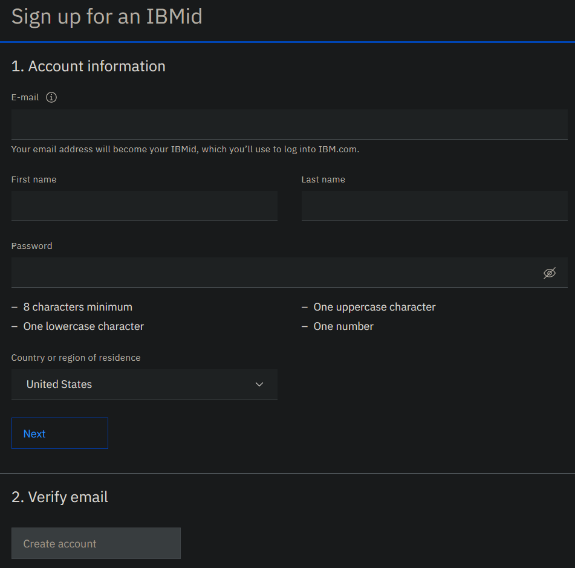
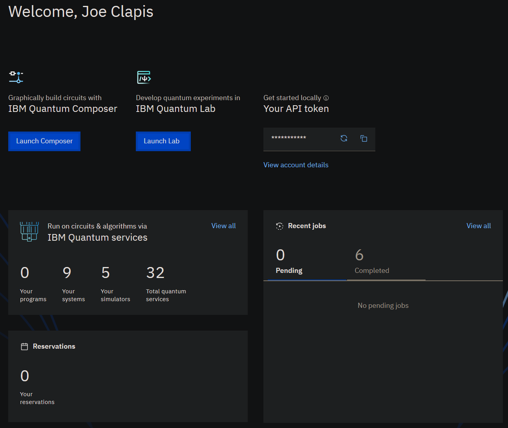
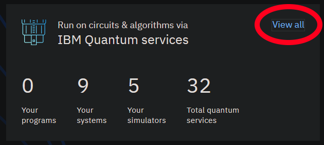
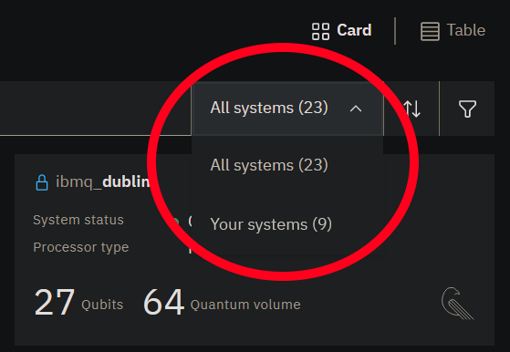
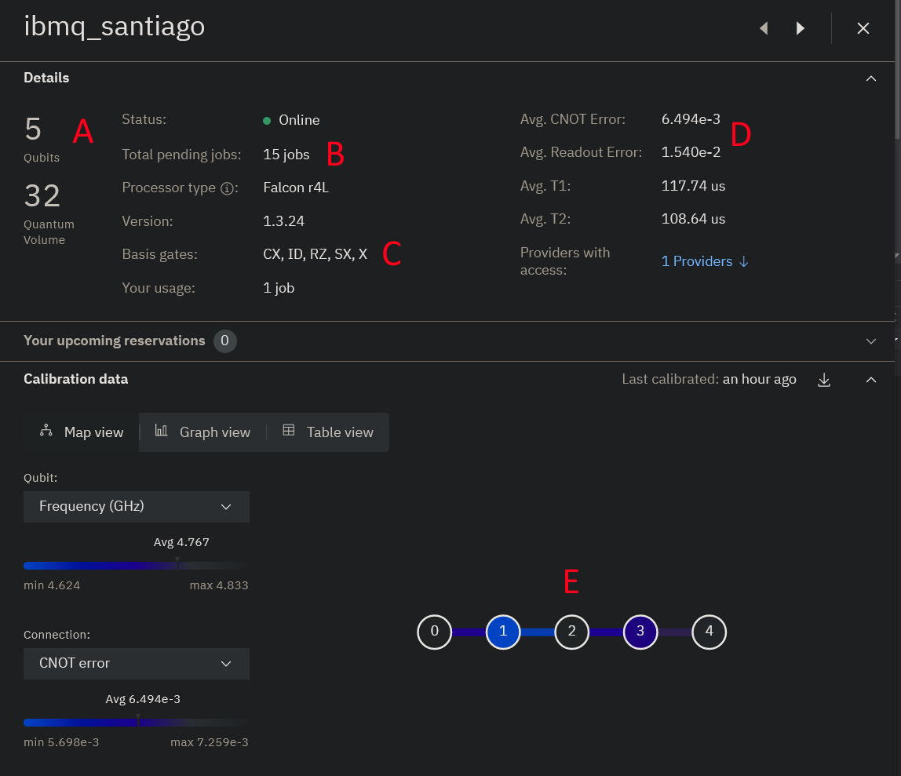
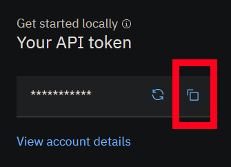
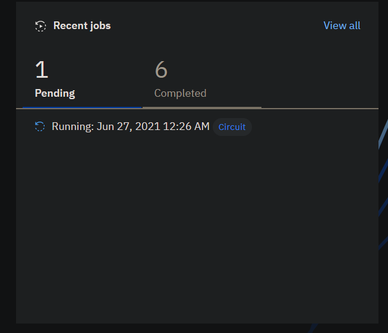
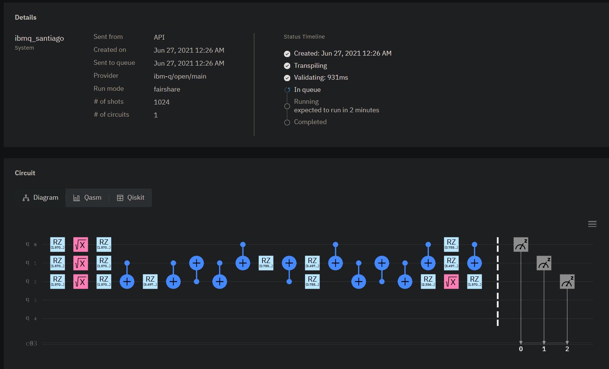
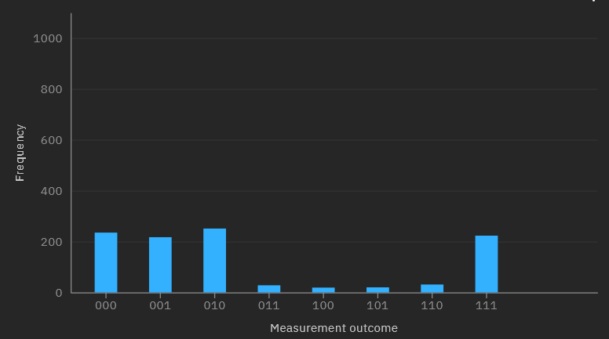

# Cloud-Based Machines

Throughout this entire class, everything you've experimented with so far has been run on a local simulator - a classical program that runs on your machine, and "pretends" to be a quantum computer.
It can run a circuit just fine as you've seen (though the RAM requirement doubles with each qubit you add to the total circuit).
However, the simulator is still a classical system: it doesn't run any faster than a regular computer does, so it can't simulate a quantum algorithm faster than running its classical equivalent.

To *actually* take advantage of the speedups that quantum algorithms provide, we need a *real* quantum computer that works on *real* qubits.

Luckily, such devices actually exist today.
Even luckier, we can easily get access to them to try them out!

Many companies working on quantum computers make them **available for use on the cloud**.
Some of them are publically available, but many of them are restricted to researchers and scientists.

Here is a list of some of the quantum computing platforms available today:

- [IBM Quantum](https://quantum-computing.ibm.com/)
- [Microsoft Azure Quantum](https://azure.microsoft.com/en-us/services/quantum/)
- [Amazon Braket](https://aws.amazon.com/braket/)
- [Google Quantum Computing Service](https://quantumai.google/cirq/tutorials/google/start)
- [Rigetti QCS](https://www.rigetti.com/qcs)

For this portion of the class, we're going to use **IBM Quantum** as the platform of choice.


## IBM Quantum

IBM Quantum is a very mature platform of cloud-accessible quantum computers maintained by IBM.
As you might have guessed, since they maintain Qiskit, they have made it extremely easy to run Qiskit circuits on their quantum computers.
In this section, we're going to run the examples from `qiskit_reference.py` on then to see how the execution differs from the simulator.

!!! note
    According to IBM Quantum's End User License Agreement, **if you are under 14 years old, you are not allowed to use their system.**
    You'll have to follow along with a classmate.
    If you're **between 14 and 17**, you can use it but **you need a parent or guardian** to read through the EULA and accept it for you.


### Creating an Account

You'll want to start by visitng [https://quantum-computing.ibm.com](https://quantum-computing.ibm.com) to create a new account with IBM Quantum.
This is a fairly simple process; all you need to give it is your email address, your name, a password, and your country of origin:

{: .center .large loading=lazy }

Once you've done that, you'll receive an email from them with a verification code.
Enter that, and you'll be prompted with the EULA.
**This is where you need a parent or guardian if you're between 14 and 17.**

After you've accepted the EULA, you'll see your dashboard:

{: .center .large loading=lazy }

This is where you can view the quantum computers you have access to, the circuits you've submitted to the job queue, the results of circuits that have completed, and any circuits you've saved so you can run them again later.


### Exploring an IBM Quantum Computer

Let's start by looking at the computers that you have access to.

Take a look at the "IBM Quantum services" pane, and click on the **View all** button in the top-left corner:

{: .center .large loading=lazy }

This will take you to the Services page.
Once here, click on the **Systems** tab towards the top of the screen.
This is a list of all of the quantum computers that IBM Quantum offers.
Many of them are relatively large; the `ibmq_manhattan` and `ibmq_brooklyn` systems, for example, offer a whopping 65 qubits!
Unfortunately, we don't have access to those.

To see what we *do* have access to, click the **All systems (23)** dropdown to the top-right and select **Your systems (9)**:

{: .center .large loading=lazy }

This reduces the list of the machines to ones that you'll be able to use.

Let's take a look at one of these systems; for example, `ibmq_santiago`.
Click on that, and a pane will pop up on the right with the machine's details.
It will look like this:

{: .center .large loading=lazy }

Here are the important parts that you should look at for now, denoted by the red letters in the image:

- A. This machine has 5 total qubits, with a [Quantum Volume](https://en.wikipedia.org/wiki/Quantum_volume) of 32. Quantum Volume is simply a relative metric of "how powerful" a quantum computers is; we'll get into the particular details of this later.
- B. At the time of this screenshot, it had 15 jobs in its queue. You may want to compare the queues for each machine when picking one to run on if you don't want to wait too long between submitting a job and getting the results.
- C. This machine natively supports the CNOT (CX), Identity (ID), Phase-shift / Arbitrary Z rotation (RZ), $\sqrt{X}$ (SX), and X gates.
    - The SX gate rotates a qubit 90° around the X-axis of the Bloch Sphere.
    - Some of the ones you're used to (notably H) are missing from this list. Luckily, the Qiskit compiler will automatically translate any gates in your circuits into this native gate set, so you don't need to worry about doing that translation manually. Each machine supports a universal gate set, so any quantum gate can be represented as a sequence of these native gates.
- D. These are the **error** statistics for this machine. We'll talk about errors later.
- E. This is the **topology map** of the machine. It shows which qubits have connectivity with which other qubits. Note that **some qubits can't directly interact with others**! For example, if you wanted to do a CNOT with qubit 0 as the control and qubit 4 as the target, those qubit's can't directly interact. You'll have to `SWAP(0, 1)`, `SWAP(1, 2)`, `SWAP(2, 3)` then do `CX(3, 4)` to achieve this (followed by a bunch of `SWAP` gates again to put everything back into the original order). 
    - Again, Qiskit's compiler will do this for you automatically, but it *is* something to be aware of when you're building your circuit.

Alright, now that you're a little more familiar with this machine, let's run one of the example circuits on it from our `qiskit_reference.py` file!


### Running a Circuit on an IBM Machine

Before running the circuit, you'll want to save your IBM account's credentials so that Qiskit can use them.

Head back to [your home page](https://quantum-computing.ibm.com/).
There you will see a small panel titled **Your API token**.
Click the copy button there to copy your account's access key:

{: .center .large loading=lazy }

Now, in your terminal with `qiskit-env` loaded, run the interactive `python` interpreter.
Enter the following two lines:

```python
from qiskit import IBMQ
IBMQ.save_account("<your access key>")
```

but replace `<your access key>` with the copied value.
This will save your key so that you can run on IBM's computers without needing to paste it in for every request.

Finally, exit out of the interpreter with `quit()`.

With that done, open `qiskit_reference.py` in Visual Studio.
Head to the bottom of the code here, comment out the `run_example_on_simulator` line, and uncomment the `run_example_on_hardware` line:

```python
if __name__ == '__main__':
    # Comment this line and uncomment the below line to run a circuit locally on a simulator
    #run_example_on_simulator(example_1)

    # Uncomment this line and comment the above to run a circuit on a real quantum machine
    run_example_on_hardware(example_1)
```

If you want, you can also change which computer you're running on.
The code is set up to use `ibmq_santiago` and run 1024 iterations in the `provider.get_backend()` method within the `run_example_on_hardware` method:

```python
provider = IBMQ.load_account()
backend = provider.get_backend('ibmq_santiago')
run = execute(circuit, backend, shots=1024)
result = run.result()
```

Feel free to update these settings to use a different backend if it has a shorter queue or to run more iterations for a larger sample size.

Save your changes, then run `python qiskit_reference.py` to execute the program.
This will connect to the IBM Quantum service and add your circuit to the machine's queue.

Go to [your home page](https://quantum-computing.ibm.com/) and look in the **Recent jobs** panel.
You should see a new job pop up, like this:

{: .center .large loading=lazy }

Once you click on it, you'll see the details pane:

{: .center .large loading=lazy }

This is where you can monitor the status of the job, the estimated time until it runs, what the circuit for it looks like, and the final measurement results once it's finished running.

Notice that this circuit is considerably more complex than the original source code, which was just 

```python
circuit.h(qubits[0])
circuit.h(qubits[1])
circuit.ccx(qubits[0], qubits[1], qubits[2])
```

This is because Qiskit's compiler has to both decompose each gate into something supported by the machine's native gate set (`CX`, `ID`, `RZ`, `SX`, and `X`) *and* it has to account for the topology limitations of the machine (e.g. qubit 2 can't directly interact with qubit 0).
That being said, while this circuit is hardly recognizable compared to its source code, it **should** have the same end result.
In the previous section, we measured the following output from the simulator:

```
Measured 000 284 times.
Measured 111 230 times.
Measured 010 247 times.
Measured 100 239 times.
```

This is expected, because qubits 0 and 1 are in uniform superposition and have an independent 50% chance of being in either state, but qubit 2 is entangled with them so that it's only a $\ket{1}$ if both other qubits are also $\ket{1}$.

Once your job finishes, you'll be able to view the results on the job's page or in the python console. 
Let's see what the output from the real quantum computer looks like:

```
Measured 000 235 times.
Measured 100 217 times.
Measured 010 251 times.
Measured 110 28 times.
Measured 001 19 times.
Measured 101 20 times.
Measured 011 31 times.
Measured 111 223 times.
```

{: .center .large loading=lazy }

!!! note
    The histogram on the website will show the results in little-endian order, so you'll have to mentally flip them if you want them in big-endian order.

Well this is interesting.
The four states that we **should see** have a high (and roughly equal) number of outputs, which is expected, but the four states that we **should never see** seem to have appeared a few times as well.
What happened?


## NISQ Machines and Quantum Errors

The above results are a demonstration of what is known as a **quantum error**.
These errors occur because of several conditions, but some of the more common ones are as follows:

- When a gate doesn't do what it's supposed to do, or it does it *mostly* correct (such as the X gate rotating a qubit 179° about the X axis instead of the full 180°)
- When the environment itself interferes with a physical qubit (such as a stray photon hitting it, messing up its state) - this is known as [quantum decoherence](https://en.wikipedia.org/wiki/Quantum_decoherence)
- When the measurement gate doesn't measure a qubit correctly and returns the wrong result

Unfortunately, the hardware systems being developed today are all susceptible to quantum errors.
For the `santiago` machine, you can see its expected error rate in its details page (which we labelled as **D** in the screenshot in the [Exploring an IBM Quantum Computer](#exploring-an-ibm-quantum-computer) section).

Because of this, machines being developed today are typically referred to as **Noisy Intermediate Scale Quantum (NISQ)** computers.
This means that they're highly susceptible to quantum "noise" (or errors like this) that prevent the final measurements from perfectly replicating the theoretical results.

For small circuits like this, the error can be dealt with relatively easily; since the frequency of the "correct" results is so much higher than the "incorrect" ones, it's straightforward to filter the incorrect ones out.
However, this is only effective because **we already know what to look for**.

In more complicated circuits, such as Grover's or Shor's algorithm, where we **don't** know the answer ahead of time, quantum error quickly dominates the entire statevector and turns the whole computation into useless mush in the middle of the program.
This makes the whole thing unusable as the output will be so random and noisy, it will not do any better at finding the true correct answer than a random number generator would.

In general, the development of quantum computers today focuses on two major areas:

1. Finding ways to add more qubits, or increase the connectivity between qubits
2. Finding ways to make qubits or gates more resilient, so they experience fewer errors

We can actually do some clever manipulation in software to help reduce quantum errors (such as the error correction codes you explored in Labs 10 and 11).
However, those require more qubits than all of the systems you have access to can provide - with the notable exception of the `melbourne` machine that offers 15 qubits.
You are welcome to implement some of the examples on that and implement the bit-flip code as a form of error correction to see how the results change, but note that the `melbourne` machine usually has a queue of hundreds of jobs so it may take some time before you're able to experiment with it.

Currently, error correction codes introduce more errors than they fix.
One of the major milestones in quantum computing development is a system with a low-enough error rate that the repairs performed by error correction codes can actually overcome the errors themselves, thus providing a resilient execution platform that can run indefinitely.

We're not there yet, but we get closer and closer to this goal with each passing achievement.
