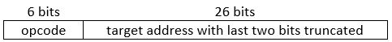

# Low-level Programming

## Objective

Get exposed to the basics of how classical computers work under the hood.

???+ note
    The contents of this module do not apply to quantum computers, but understanding the details of how today's computers work is helpful because it reveals much that we take for granted in software development. That is, many of the most basic capabilities of classical computers are not yet available on quantum computers, such as the ALU or RAM.

## Machine Instructions

In the previous section, we talked a bit about how classical computers are purpose-built to solve equations that are represented as a sequence of binary logic gates.
If we have a set of gates that are functionally complete, we can represent any function with them.

To demonstrate, let's say we wanted to add two numbers, A and B, together.
For simplicity, let's say that A and B are both two-bit big endian integers:

$$
\displaylines{
A = A_1 A_0
\\~\\
B = B_1 B_0
}
$$

We want to find their sum S, which could potentially be a three-bit big endian integer:

$$
S = S_2 S_1 S_0
$$

For example, if $A=10$ and $B=11$, then $S=101$.
By hand, we'd start by adding the last two bits of each number ($A_0 + B_0$).
If they're both zero, the result is zero.
If either is one and the other is zero, the sum is one.
If both are one, the sum is zero and we need to "carry" a one to the next digit.

Here's a truth table for these values based on the input:

| $A_0$ | $B_0$ | $S_0$ | Carry Out |
| - | - | - | - |
| 0 | 0 | 0 | 0 |
| 0 | 1 | 1 | 0 |
| 1 | 0 | 1 | 0 |
| 1 | 1 | 0 | 1 |

Conveniently enough, these two outputs (the sum and the carry), have the same truth tables as an XOR and an AND gate, respectively:

$$
\displaylines{
S_0 = A_0 \oplus B_0
\\
Carry \: Out = A_0 \: \text{AND} \: B_0
}
$$

This is known as a **half-adder** circuit.
Now, for the next pair of bits, we'd have to add them together and add the carry bit as well.
This is a three-bit operation, and we don't have any three-bit gates!
We're going to have to do it as a sequence of two-bit gates.
We know we're going to take in three bits and produce two (a sum and a carry bit), so we can build a truth table for this sequence which is the same as the half-adder but with an additional carry input:

| Carry In | $A_1$ | $B_1$ | $S_1$ | Carry Out |
| - | - | - | - | - |
| 0 | 0 | 0 | 0 | 0 |
| 0 | 0 | 1 | 1 | 0 |
| 0 | 1 | 0 | 1 | 0 |
| 0 | 1 | 1 | 0 | 1 |
| 1 | 0 | 0 | 1 | 0 |
| 1 | 0 | 1 | 0 | 1 |
| 1 | 1 | 0 | 0 | 1 |
| 1 | 1 | 1 | 1 | 1 |

There are a few ways to implement this, but here is one particular way: the sum bit looks like $A \oplus B$ if the carry-in is 0, and $\text{NOT}(A \oplus B)$ if the carry-in is 1.
This is the same as $(A \oplus B) \oplus Carry \: In$, so that's one viable sequence for the sum bit.

The carry-out bit looks like it's $A \: \text{AND} \: B$ if the carry-in is 0, but $A \: \text{OR} \: B$ if the carry-in is one.
That doesn't give an immediate circuit, so we'll have to look further.
Note that when $A \: \text{AND} \: B = 1$, the carry-out bit is 1 no matter what the carry-in bit is.
If the carry-in is 1 and either A or B is 1, but not both, the carry-out is also 1.
We can write these rules out like this:

$$
\displaylines{
Sum = (A \oplus B) \oplus Carry \: In
\\~\\
Carry \: Out = (A \: \text{AND} \: B) \: \text{OR} \: (Carry \: In \: \text{AND} \: (A \oplus B) )
}
$$

This is one representation of a **full-adder** circuit.
If we wanted to program a list of instructions that would implement this two-bit addition function, we could do it like this (written as some generic pseudocode):

```csharp linenums="1"
// Add the last two bits
s[2] = a[1] XOR b[1]
carry_2 = a[1] AND b[1]

// Add the first two bits, including the previous carry
axb = a[0] XOR b[0]
s[1] = axb XOR carry_2

// Figure out the new carry
first_half = a[0] AND b[0]
second_half = carry_2 AND axb
carry_1 = first_half OR second_half

// Set the first sum bit to the carry value
s[0] = carry_1
```

While functional, this is incredibly tedious.
To make matters worse, we'd have to extend this function out to even more instructions if we wanted to tackle larger numbers, such as adding two 32-bit integers together.
This kind of hand-written instruction code is completely impractical, and hardware engineers recognize that.
To help software engineers work efficiently, processor developers provide **assembly languages** for their processors that make things less cumbersome.


## Assembly Language

Assembly languages represent what most would consider the lowest-level of programming language.
These languages are very tightly coupled to the instruction sets of the specific hardware that they're designed to work on.
They give the user direct access to the CPU registers and the system's memory, and come with a whole host of instructions that implement simple binary arithmetic operations.

To continue the example from above, let's write some actual x86 assembly for adding the numbers 2 and 3 together:

```assembly linenums="1"
mov eax, 2      ; eax = 2 in decimal, 10 in binary
mov ebx, 3      ; ebx = 3 in decimal, 11 in binary
add eax, ebx    ; eax = eax + ebx, result will be 5 in decimal, 101 in binary
```

*Feel free to try it for yourself with [this online x86 emulator](https://carlosrafaelgn.com.br/asm86/).
As a point of reference, Wikipedia has [a brief rundown of all of the instructions that x86 supports](https://en.wikipedia.org/wiki/X86_instruction_listings).
Notice how many of them there are.*

This is much easier than writing out the raw logic by hand.
Addition of two 32-bit integers is a single instruction in x86!
Furthermore, we now have a way to store and keep track of a huge set of numbers using **memory addressing**:

```assembly linenums="1"
mov ecx, 0x400800   ; ecx = 0x400800 (4,196,352 in decimal)
mov edx, 0xC        ; edx = 0xC (12 in decimal)
mov [ecx], edx      ; set the value at memory address 0x400800 to 12
```

As a third benefit, assembly gives us the ability to jump to other instruction addresses based on the value of a register.
This lets us write **conditional statements** and **branching logic**:

```assembly linenums="1"
cmp [ebp-4], 10
jge short loc_401600  ; jump to 0x401600 if the value in ebp-4 >= 10
```

Finally, this ability to jump to arbitrary addresses and execute them as instructions lets us write **functions**, which can be called from other functions:

```assembly linenums="1"
push eax            ; push eax onto the stack as the 2nd argument
push ecx            ; push ecx onto the stack as the 1st argument
call sub_401870     ; run the instruction at 0x401870 as a subfunction, with
                    ; ecx and eax as 2 arguments for it
mov [ebp-4], eax    ; put the return value into the address 4 bytes above ebp
```

That is immediately helpful because it means we only need to write the code for a particular function once.
If we want to call it multiple times, then we can just use this syntax instead of having to repeat the function's code over and over.

These are just some of the features that assembly provides.
Still, many would consider them to be the bare minimum with respect to a useful programming language's functionality.
It's still difficult to program large functions in assembly and do things that we would consider trivial operations today.
Here are a few examples:

- We have to explicitly allocate memory on the heap and partition it properly.
- We have to keep track of things like array indices manually, as offsets to specific memory addresses.
- We can't easily define "ownership" of variables, in the same way that object-oriented languages allow objects to have instance variables.
- There's no sense of types, so we can't enforce type safety.
- There's no sense of "memory bounds", so we can write code that will read and write memory past the point we expect, causing things like [segmentation faults](https://en.wikipedia.org/wiki/Segmentation_fault) and [buffer overflows](https://en.wikipedia.org/wiki/Buffer_overflow), which can crash the machine or serve as an entry point for malicious code.

Essentially, while assembly gives us the freedom to do whatever we want at the hardware level, it also means we're responsible for what happens at the hardware level.
The lack of abstraction makes it easy for software engineers to make mistakes when writing assembly code, and it's notoriously difficult to debug.
It also has the disadvantage of being platform-specific: if we write code for one instruction set like x86, we'll have to completely rewrite it if we want to port it over to a different platform like ARM.

There are still some valid use cases where engineers have to craft assembly by hand (especially when working with certain embedded systems), but it has largely been superseded by the use of **high-level programming languages**.

## Additional Materials

- [Khan Academy lesson on computer components](https://www.khanacademy.org/computing/computers-and-internet/xcae6f4a7ff015e7d:computers/xcae6f4a7ff015e7d:computer-components/a/computer-components-introduction)

- [CrashCourse video on the ALU](https://youtu.be/1I5ZMmrOfnA)

- [CrashCourse video on registers and RAM](https://youtu.be/fpnE6UAfbtU)

- [CrashCourse video on the CPU](https://youtu.be/FZGugFqdr60)

- [CrashCourse video on instructions & programs](https://youtu.be/zltgXvg6r3k)

- [CrashCourse video on early programming languages](https://youtu.be/RU1u-js7db8)

- [MIPS Green Sheet](https://inst.eecs.berkeley.edu/~cs61c/resources/MIPS_Green_Sheet.pdf)

    - This is not intended to be understood in any level of detail, but to provide an example of a fully functional instruction set architecture.

## Knowledge Check

### Q1

(Hard) In the MIPS instruction set architecture, a `j` instruction is used to jump to a particular memory address before continuing program execution. It is translated into machine code as follows:

{: .center loading=lazy }

Note that the last two bits of the address are left off because instructions are 4 bytes; therefore, the address of any instruction in the program will be a multiple of 4.

If the opcode for `j` is `000010`, what is the machine code to jump to address `0x0003E8`? Give your answer as a 32-bit hexadecimal.

??? check "Answer"
    `0x080000FA`

### Q2

(Hard) When running the MIPS assembly program below, what is the decimal value of the word (4-byte data) at the address labeled `var` after the `sw` instruction? (Note comments after `#` sign.)

```assembly linenums="1"
    .globl main     # Declare entrypoint to program
    .text           # Begin program code
main:               # Label address of main function
    lw $t2, var     # Load register $t2 with word at address var
    addi $t2, 23    # Add immediate data 23 to register $t2
    sw $t2, var     # Store word in register $t2 to address var
# ...
    .data           # Begin data structures
var:                # Label address of var
    .word 100       # Reserve 4-byte word with initial value of 100
```

??? check "Answer"
    $123$

## Exercises

### E1

Draw a step-by-step diagram of how a conventional computer adds two numbers and stores the result to memory.
