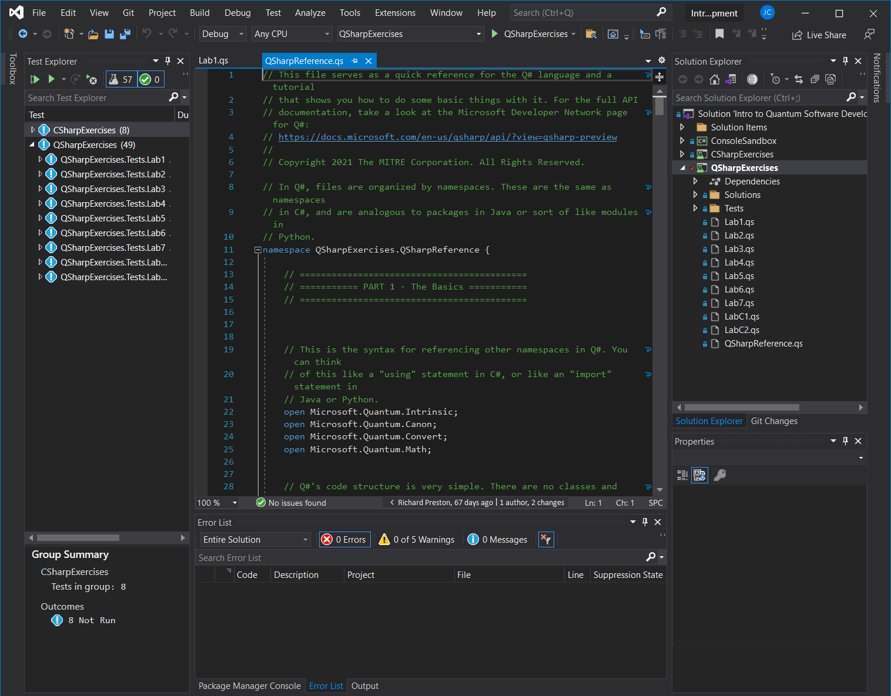
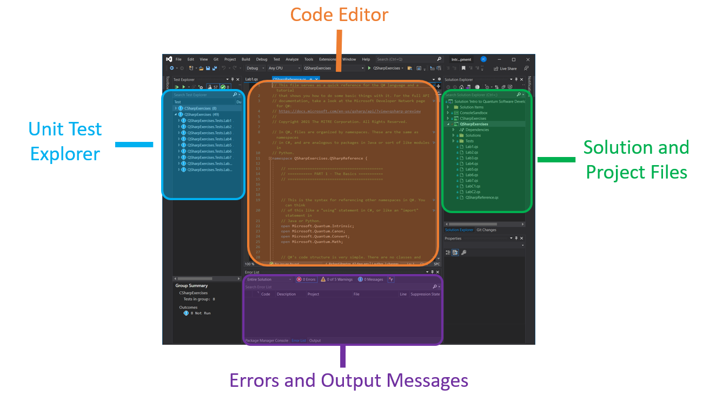
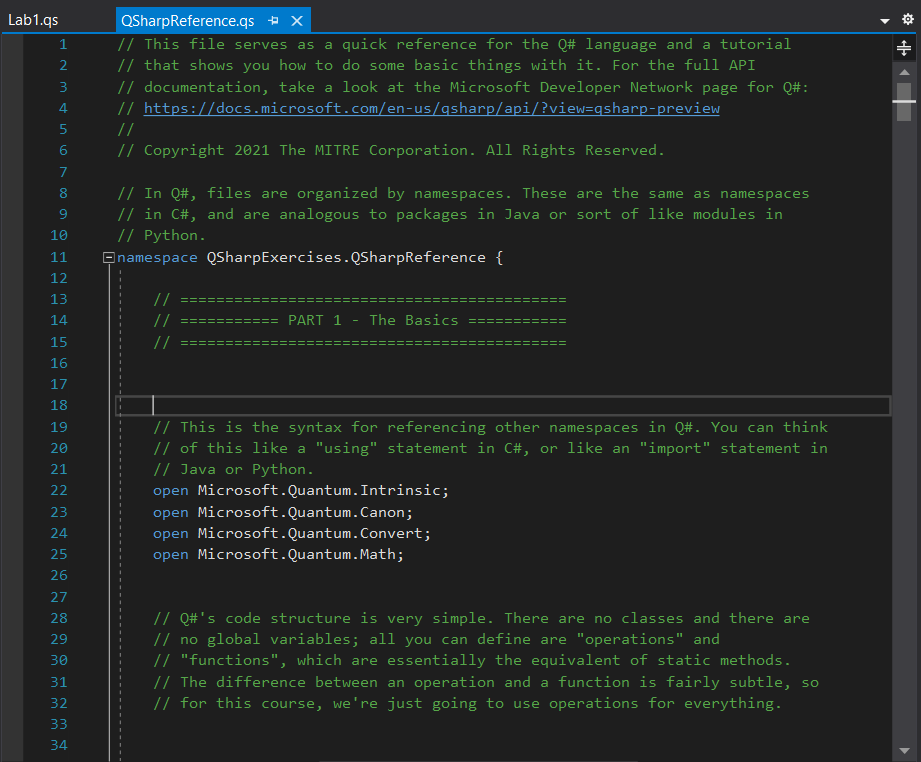
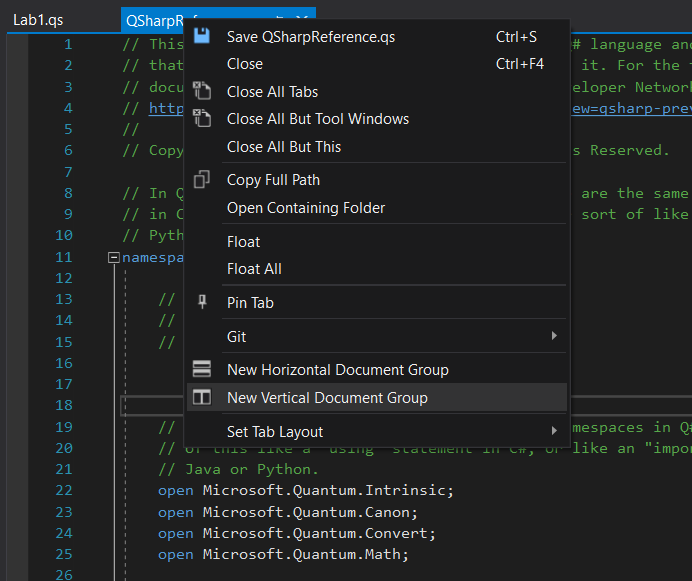
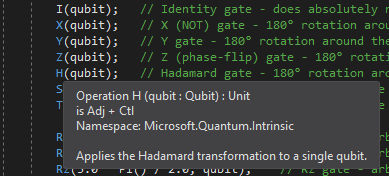
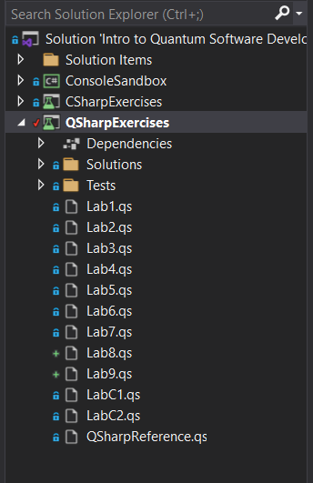
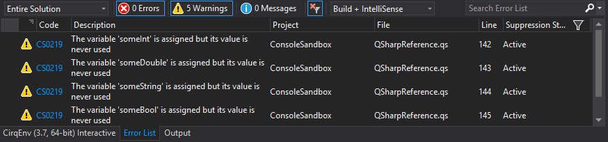
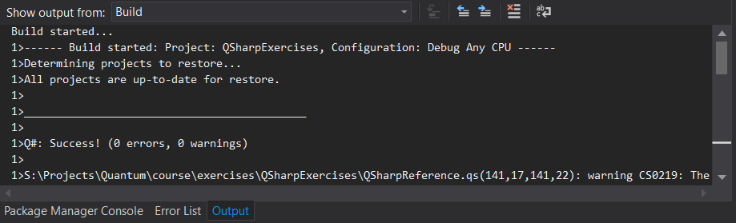
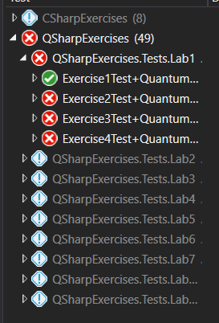
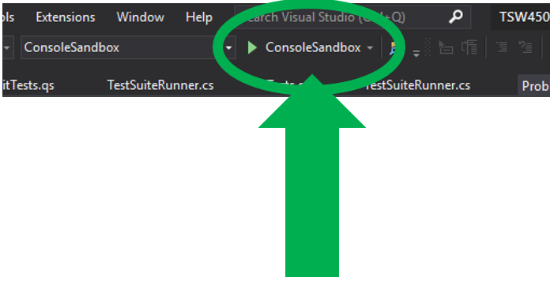

# Visual Studio

## Objective

Set up and practice working in the development environment.

???+ note
    If you haven't ever worked with Visual Studio and .NET before, we recommend working through the [Additional Materials](#additional-materials) section first to learn how to create a C# project. Then come back to the top of the page.

## The Visual Studio IDE

In this class, we're going to write lots of quantum code in a special language called Q#.
As with all programming languages, this is easiest when we have an IDE to work with.
Our tool of choice here is going to be Visual Studio, a powerful general-purpose IDE.
If you're already familiar with Visual Studio, you can skip this section.
If you've never used it before, this will show you some of the basics of how to use it when developing programs.

Visual Studio organizes your code into **projects**.
Each project represents a single binary, such as a library, an executable, or a collection of unit tests.
Projects that are related to each other are grouped into an overall **solution**.
Our class has a solution, which contains multiple projects.
We'll get into those later, but for now, we'll use the solution to give a quick tutorial of Visual Studio.

**Go to the [Getting Started](../getting-started.md#lab-exercises) page and follow the instructions for installing the course exercises.**

When you first open the class solution in Visual Studio, you will see a window that looks something like this:

{: .center loading=lazy }

This is the main IDE window, and we're going to spend most of our development time in here during the class.
Obviously it's been pretty condensed so it can fit in this document - your actual window is going to have more real-estate than this.

Here's a breakdown of the different areas in the IDE and what they do:

{: .center loading=lazy }


### The Code Editor

The code editor is the area where you can view and edit source code files.
Here's a zoomed-in look:

{: .center loading=lazy }

As you can see, it comes with syntax highlighting, line numbers, and a preview of the entire active file's contents in place of a vertical scroll bar.

You can open multiple files in the code editor.
Each file will have its own **editor tab**, as shown in the top of this picture.
Clicking on a tab will open the editor for that file.

If you want to have two editors open simultaneously, you can create a **new tab group**:

- Right-click on the tab of the file you want to see
- Select **New Vertical Tab Group** as shown in this picture:

{: .center loading=lazy }

Now, you'll see two editors appear side-by-side.
This can be helpful if you want to refer to one document while editing another.

Hovering over a variable in the code editor will bring up a tool tip that shows its documentation.
For example, hovering over the H function shows this:

{: .center loading=lazy }

This can be handy for a quick reference lookup.


### The Solution Explorer

The solution explorer shows all of the projects (and all of their files) contained in the solution, in a tree structure.
It looks like this:

{: .center loading=lazy }

There are three projects shown here: `ConsoleSandbox`, `E1_Basic_Single_Qubit_Gates`, and `E2_Multi_Qubit_Gates`.
Each one has been expanded to show the files that comprise it.

**Double-clicking on a file** in the explorer will open it up in the code editor.

If you want to add a new code file (or other resource file) to a project, simply right-click it, select **Add**, then select **New Item**.
A wizard will pop up, letting you select the type of file to add from a set of predefined templates.


### The Error List and Output

The bottom of the screen contains two tabs: one is called **Error List**, and the other is called **Output**.
The Error List pane shows syntax or compilation warnings and errors that your program has.
Some errors will appear as you type, others won't show up until you try compiling your code. It looks like this:

{: .center loading=lazy }

The Output pane shows debug messages from the compiler (and some other sources, but that's all we'll really use it for in this class).
It can help you figure out what went wrong if something breaks during compilation but the error messages aren't explicit enough.
It looks like this:

{: .center loading=lazy }


### The Test Explorer

The last important part of the IDE's main window is the Test Explorer.
This pane shows you all of the unit tests across all of the projects in the solution.
Each of the labs in this class is implemented as an incomplete unit test that you need to finish, so you'll be using the Test Explorer a lot.

To run a test, right-click on it and select **Run Selected Tests**.
Tests that pass will have a green checkmark next to them.
Tests that fail will have a red X:

{: .center loading=lazy }


## Compiling Your Code

Once you've finished writing your code and want to compile it, select the **Build** menu option and select **Build Solution**.
The shortcut key will either be F6 or Ctrl+Shift+B depending on your setup.
This will build all of the projects in the solution, but Visual Studio is smart enough to know which files you've changed since the last build - it will only build the files / projects that have been updated.

Once your code is compiled, you can execute the unit tests.
If a test fails, you can just change the code, compile it, and then run the test again to see if your changes fixed it.


## Running the ConsoleSandbox Program

The class solution contains a console / terminal program called `ConsoleSandbox`, which is essentially a playground you can use when learning Q# to experiment and play with things.
To run it, simply click the button with the green play icon in the top toolbar:

{: .center loading=lazy }

This will launch a new command prompt and automatically start the program.

## Additional Materials

### Project Setup

- [Visual Studio download page](https://visualstudio.microsoft.com/vs/)

- [dotNET video introducing Visual Studio](https://youtu.be/5AOp8zFu4Vg)

- [dotNET tutorial on setting up a C# project](https://youtu.be/R5CHKcXuRtY)

- [Microsoft doc page on installing Visual Studio](https://docs.microsoft.com/en-us/visualstudio/install/install-visual-studio?view=vs-2019)

- [Visual Studio "about" page](https://docs.microsoft.com/en-us/visualstudio/get-started/visual-studio-ide?view=vs-2019)

- [dotNET video on unit testing](https://youtu.be/QBiBZ8bsfcU)

- [Microsoft doc page on unit test basics](https://docs.microsoft.com/en-us/visualstudio/test/unit-test-basics?view=vs-2019)

- [Walkthrough to create and run unit tests](https://docs.microsoft.com/en-us/visualstudio/test/walkthrough-creating-and-running-unit-tests-for-managed-code?view=vs-2019)

### C# Basics

- [Microsoft programming guide on arrays](https://docs.microsoft.com/en-us/dotnet/csharp/programming-guide/arrays/)

- [Microsoft programming guide on passing value-type parameters](https://docs.microsoft.com/en-us/dotnet/csharp/programming-guide/classes-and-structs/passing-value-type-parameters)

- [Microsoft programming guide on passing reference-type parameters](https://docs.microsoft.com/en-us/dotnet/csharp/programming-guide/classes-and-structs/passing-reference-type-parameters)

## Knowledge Check

### Q1

What does IDE stand for?

??? check "Answer"
    Integrated Development Environment

### Q2

Which of the following is an advantage of using an IDE? (Check all that apply.)

A: All the tools needed to develop software are integrated into one application

B: An IDE typically sports a powerful graphical user interface that can make for a more friendly development experience

C: There is always a one-to-one relationship between the project files as they are displayed in the IDE and the files in the project folder in the underlying filesystem, with nothing hidden from the user

D: Many IDEs check your code as you type, similar to spell check in a word processor, to help prevent common mistakes

E: All IDEs work with any language or framework; it’s a matter of developer preference on which one to use for a particular application

??? check "Answer"
    A, B, D

### Q3

Which of the following is an advantage of writing unit tests? (Check all that apply.)

A: If a component has unit tests, it is guaranteed to be bug-free

B: Test driven development can help to ensure software requirements are being met

C: A comprehensive library of unit tests can help identify problems when they occur and debug them quickly

D: Even in complex software projects, unit tests can check for the correct behavior in every possible state of the system

E: Writing unit tests encourages a modular approach to software development where the outputs and/or behavior of each component are clearly defined

??? check "Answer"
    B, C, E

### Q4

Fill in the `Exponent` function below so that it passes the `ExponentTest` unit test. Assume the appropriate scaffolding is put in place. Use the least number of characters possible.

```c# linenums="1"
public int Exponent(int a, int b)
{
    // ???
}

...

[TestMethod]
public void ExponentTest()
{
    Assert.AreEqual(Exponent(3, 2), 9);
}
```

??? check "Answer"
    `return 9;`

## Exercises

Open the course exercises in Visual Studio. Select the `CSharpExercises` project and build it. Open the Test Explorer and run all the unit tests in the project. (The project should build, but the tests should fail. If the build fails, it is likely related to missing packages; try right-clicking on the solution in the Solution Explorer and click "Restore NuGet Packages".) In the Solution Explorer, open `CSharpExercises\Exercises.cs`. There are eight functions that need to be implemented to pass the unit tests. Only modify the code inside each function, and do not modify `Tests.cs`.

The solutions to the exercises are available on GitLab.
