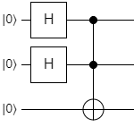
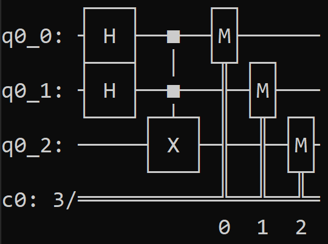
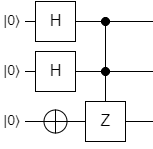
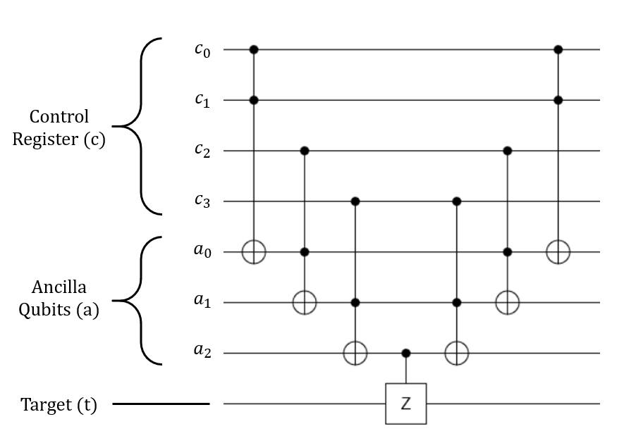

# Intro to Qiskit

As you might expect, Q# isn't the only language or framework for developing quantum algorithms.
There are quite a few available today, each with its own set of quirks and features.

In this section, we're going to introduce you to a very popular one used in this field: IBM's Quantum Information Science Kit, or [Qiskit](https://qiskit.org/).


## Comparison to Q\#

Unlike the QDK, which comes with its own quantum-specific language in Q#, Qiskit is a toolkit written entirely for **Python** development.
Creating algorithms, running tests, and debugging are all done in Python with Qiskit.

At a high level, Qiskit operates in a fairly similar way to Q#.
Most of the code is spent creating registers, running quantum instructions on qubits, and measuring things at the end.
However, there are a few fundamental differences between the two:

- Q#:
    - In Q#, quantum programs are a sequence of static operations with no global state. They're executed statement-by-statement so it's easy to set a breakpoint, inspect the state of everything, and move on when you're done.
    - Q# has the `adjoint` and `controlled` keywords that let you run inverse and arbitrarily-controlled versions of your quantum operations trivially.
    - Q# lets you measure a qubit in the middle of computation (before the quantum work is finished) and use that measurement in arbitrary classical code. 
    - In Q#, you run an entire circuit once. If you want to get multiple measurement outputs, you have to simulate the whole thing once per output.
    - Q# has "memory management", so you can arbitrarily allocate and deallocate qubits as you see fit in the middle of your program.
    - The stock Q# installation only runs on a local quantum simulator. 
- Qiskit:
    - In Qiskit, quantum programs are actually **objects** called **circuits**. Most of the program is spent **building the circuit object** - actually *running it* is done as a separate step.
    - Because it's Python, your circuit building code has **complete access** to your program's global state, and any other Python libraries you want to use for classical data processing.
    - Qiskit doesn't have a built-in way to run an arbitrarily controlled version of a quantum gate or subroutine. You'll have to build them manually.
    - Measuring-in-the-middle is somewhat supported, but Qiskit only lets you run other quantum operations in controlled mode (using the measurement as the control). It doesn't let you measure and then run arbitrary classical code based on the result in the middle of the program.
    - In Qiskit, you have to do all of the "memory management" of qubits yourself. Once you allocate a qubit, you can't "unallocate" it, so you have to handle reusing ancilla qubits manually to minimize the number of qubits used by your program. (On the plus side, this means you don't **have to** return them to the $\ket{0}$ state when you're done with them if you know what you're doing.)
    - Qiskit has a full **backend** system that lets you specify how to run a circuit object: you can run it on your local simulator, on a more powerful cloud-based simulator, or **even on a cloud-based real quantum computer**! This makes Qiskit a great tool for studying the differences between the *theoretical* implementation of an algorithm, and the *practical* usage of it on a real machine. However, it makes it a bit harder to debug programs since you can't breakpoint in the middle of execution (on a simulator) and inspect everything.
    - Qiskit's simulator lets you build and simulate a circuit once, then sample measurements from it **many times** without needing to re-simulate it the whole thing. This is a much faster way to get lots of measurement results to build a statistical distribution of the final state.

Ultimately, once you become familiar with Qiskit's semantics, it's quite easy to translate back and forth between it and Q# (and any other quantum frameworks that subscribe to the circuit-gate-register model).
Everything you've learned in this class is still perfectly applicable when using Qiskit.
In fact, we tend to use both of these frameworks together during our own quantum software work.


## The Basics of Qiskit

The Qiskit developers have written a lot of documentation that introduces people to both quantum computing and Qiskit simultaneously.
In fact, [they have an entire online textbook](https://qiskit.org/textbook/preface.html) dedicated to this.
However, we already covered many of these concepts.
Rather than do a recap of them, we're just going to show you how to use Qiskit to build and run quantum circuits using what you already know.


### Prerequisites

This tutorial assumes that you already have Python and Qiskit installed.
The virtual machine accompanying the class bundle already has them set up.
If you're running on your own machine, please follow the [installation instructions](https://qiskit.org/documentation/getting_started.html) before proceeding.


### Preparing a Quantum Circuit

Before anything, you'll want to start by importing the appropriate modules and classes:

```python
from qiskit import QuantumCircuit, ClassicalRegister, QuantumRegister
from qiskit import execute
from qiskit import Aer
```

- The `QuantumCircuit` class represents an entire quantum circuit object, including the qubits involved and the gates applied on those qubits.
- The `QuantumRegister` class represents a single quantum register, which is a collection of qubits.
- The `ClassicalRegister` class represents a "classical register", which essentially means a collection of classical bits that can store the results of measuring qubits.
- `execute` is a function that lets you run a quantum circuit once you've built it.
- `Aer` is used to create a local simulator that can run circuits.

Next, you'll want to do is define a `QuantumRegister` object with the number of qubits it needs to have.
For all intents and purposes, you can treat it like a list of qubits with a fixed size.
If you plan to measure those qubits, you'll also want to create a `ClassicalRegister` with the same size.
In this example, let's use a size of 3 qubits:

```python
qubits = QuantumRegister(3)
measurement = ClassicalRegister(3)
```

Now create a new `QuantumCircuit` object to contain those registers, and any operations on the qubits:

```python
circuit = QuantumCircuit(qubits, measurement)
```

Let's recreate the first example from the [Complex Superpositions](../quantum-concepts/complex-superpositions.md) section.
As a reminder, this circuit had the following implementation:

{: .center .large loading=lazy }

Here's how we would implement this circuit in Qiskit:

```python
circuit.h(qubits[0])
circuit.h(qubits[1])
circuit.ccx(qubits[0], qubits[1], qubits[2])
```

There are a few things to break down here:

1. Quantum gates are **methods** of the `QuantumCircuit` class, unlike the free-floating static methods in Q#.
2. The syntax for them is largely the same; `h()` is the Hadamard gate, `ccx()` is the CCNOT gate, and so on.
3. The order of quantum operations is the same in Q# as it is in Qiskit, so the actual circuit itself should translate relatively easily.

!!! note
    You can also apply these gates to an entire register instead of a single qubit; for example, `circuit.h(qubits)` would apply the H gate to all of the qubits in the `qubits` register.

For a complete list of the gates that Qiskit supports, take a look at their [Circuit Library documentation](https://qiskit.org/documentation/apidoc/circuit_library.html).

If we want to measure the qubits, we can do that with the `measure()` method:

```python
circuit.measure(qubits, measurement)
```

This will measure each qubit in the `qubits` register, and put the result in the corresponding classical bit of the `measurement` register.

We can also print an ASCII version of the circuit diagram, which can be useful for debugging:

```python
print(circuit)
```

This will produce the following output when the program is run:

{: .center .large loading=lazy }

With this picture you can quickly tell if your implementation is what it's *supposed to be*, or if you made a mistake somewhere.
Notice the measurement gates at the end - these weren't in the original circuit diagram.


### Executing a Quantum Circuit

Once you've finished building a circuit object, you're ready to execute it.
This means you send it to one of Qiskit's backend systems, where it will either be simulated, executed on a real quantum computer, or processed in some other way that provides useful analysis.
Right now, we're just going to show how to **simulate the circuit locally**.
Don't worry, we'll get to execution on real machines later.

Simulating a circuit is quite simple to perform with the following lines:

```python
simulator = Aer.get_backend('aer_simulator')
simulation = execute(circuit, simulator, shots=1000)
result = simulation.result()
```

The `shots` parameter here (when using a simulator) describes how many random samples to take from the final statevector.
In this example, it's set to 1000 samples.
Since the simulator can keep track of the statevector without collapsing the superposition (because everything is stored classically), Qiskit will simulate the entire circuit once and then randomly measure each of the qubits as many times as you want without any performance penalty.
This is much different than the way Q# works, where you can only measure once per execution.

The `result` object contains all of the simulation results.
There is a lot of data captured in this object, but most of the time we only need to look at which states were measured, and how many occurrences each state had.

Here's a quick description of how to do this:

```python
counts = result.get_counts(circuit)
for(measured_state, count) in counts.items():

    # Qiskit will give you the state in little-endian form by default, so if you want to
    # turn it into big-endian, just reverse the state
    big_endian_state = measured_state[::-1]
    print(f"Measured {big_endian_state} {count} times.")
```

The `get_counts()` method provides a dictionary where the keys are the measured states, and the values are how many times the corresponding state was measured.
As you can see from the comments above, Qiskit will return the states in little-endian mode by default but they can be easily reversed and transformed into big-endian if you prefer.

Running the whole program will produce the following output:

```
Measured 000 284 times.
Measured 111 230 times.
Measured 010 247 times.
Measured 100 239 times.
```

This is exactly what we'd expect - the first and second qubits each have a 50% chance of being measured as 0 or 1 independently, but when they're both a 1, the third qubit is a 1 as well.


### Arbitrarily-Controlled Gates and Ancilla Qubits

Now that you've seen the process for building and running a circuit, let's do another example.
For this one, we'll use the third circuit from the [Complex Superpositions](../quantum-concepts/complex-superpositions.md) section:

{: .center .large loading=lazy }

This one starts easily enough:

```python
circuit.h(qubits[0])
circuit.h(qubits[1])
circuit.x(qubits[2])
```

However, there's a problem with the CCZ gate.
Qiskit doesn't have a CCZ operation, and it doesn't provide a way to run a gate in controlled mode with an arbitrary number of control qubits.
To achieve this, we're going to have to build our own implementation.

Luckily, we can start with the CZ gate that Qiskit provides.
Conceptually, the *easiest* way to do this is to create an ancilla qubit which will be flipped when all of the controls in the original CCZ gate are flipped, then use the ancilla as the control on a CZ gate.

We can accomplish this quickly by creating an ancilla, then using the CCX gate on it, and finally using that as the control of a CZ:

```python
ancilla = QuantumRegister(1, "ancilla")
circuit.add_register(ancilla)
circuit.ccx(qubits[0], qubits[1], ancilla)

circuit.cz(ancilla, qubits[2])
```

If we had *more* control qubits, say a Z with 4 controls, we'd have to extend this technique with what's called a  **Toffoli Cascade** as shown here:

{: .center .large loading=lazy }

Essentially, we'd just create a ladder of CCX gates to create a single qubit which can act as an aggregated control qubit for an arbitrary gate.
Of course, after we run that gate, we have to *undo* the cascade.
This is an expensive operation, but it reveals one of the interesting things about the framework: Qiskit tends to make you think about the **low-level implementation details** of your code, whereas Q# is more designed to stay **high-level** and abstract.


## Running the Qiskit Examples

To help familiarize you with Qiskit, we've provided some examples with the lab exercises.
You can see them if you open the **QiskitExercises** project in the solution explorer.
At the top level is a file named `qiskit_reference.py` which contains a few examples of Qiskit code that implements all three circuits in the [Complex Superpositions](../quantum-concepts/complex-superpositions.md) section.

To run it, open a command prompt that has access to Python and Qiskit.
If you're using the Virtual Machine that came with this class, you can find this in the start menu labeled `Miniconda Prompt`.
This will launch the Anaconda environment that is included with Visual Studio.
We've created a Conda environment with Qiskit installed (as described in Qiskit's installation instructions above) which you can activate with the following command:

```shell
conda activate qiskit-env
```

Once you've done this, navigate to the class bundle folder and into the `exercises/QiskitExercises` directory.

You can then run the reference file with this command:

```shell
python qiskit_reference.py
```

It will produce the output you saw above - the circuit diagram for Example 1 in the Complex Superpositions section, followed by the measurement results for 1000 iterations.

To change which example is run, scroll to the bottom of the `qiskit_reference.py` file in Visual Studio and modify the following code:

```python
# Code runner - change the method below to run a different example
if __name__ == '__main__':
    # Comment this line and uncomment the below line to run a circuit locally on a simulator
    run_example_on_simulator(example_1)

    # Uncomment this line and comment the above to run a circuit on a real quantum machine
    #run_example_on_hardware(example_1)
```

Change `example_1` to whichever example you want, or add your own code here and run it as a way to experiment.


## Labs 12 and 13

The next two labs run through some of the algorithms you've already built, so you can get some practice translating between Q# and Qiskit:

- Lab 12 is the Deutsch-Jozsa algorithm
- Lab 13 is Grover's algorithm

You will find the code for these in the `exercises\QiskitExercises` folder, right alongside the `qiskit_reference.py` file.

To run each exercise in these labs, head to the `QiskitExercises\Tests` folder with your Qiskit terminal.

For Lab 12, run the following command:

```shell
python lab12tests.py Lab12Tests.test_exercise_1
```

Replace `test_exercise_1` with the number of each exercise you want to test.

For Lab 13, the following command will let you run each exercise's test:

```shell
python lab13tests.py Lab13Tests.test_exercise_1
```

Likewise, replace `test_exercise_1` with the name of the exercise you want to test as you progress.

Take a look at both of these labs before moving on.
You can refer to your implementations for those in the Q# labs; these labs are just meant to give you a feel for Qiskit's semantics and not teach you how those algorithms work.
