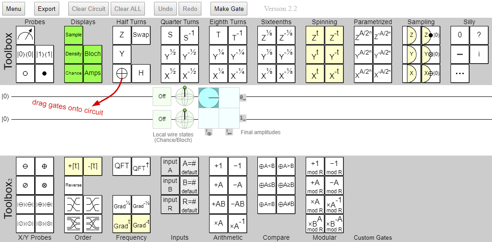
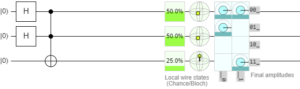
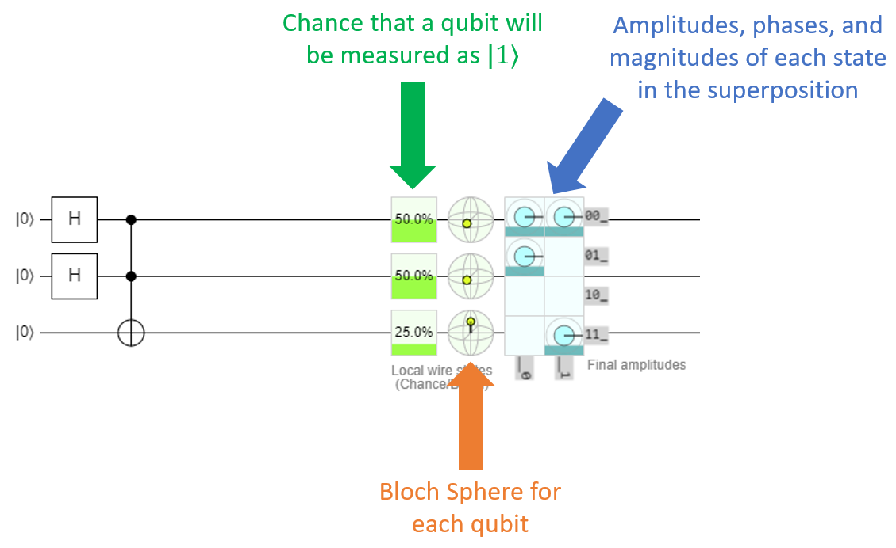
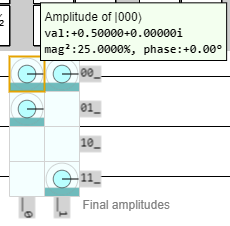
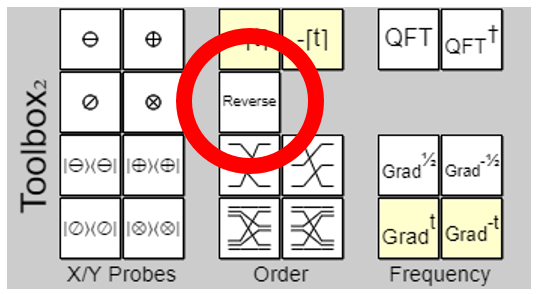
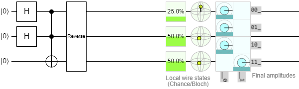
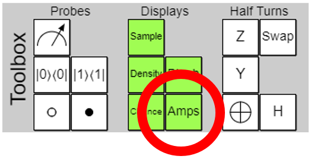
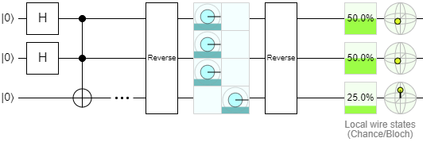

# The Quirk Tool

## Quirk

Quirk is a webapp that can be used to graphically construct quantum circuits in a drag-and-drop fashion, and automatically simulates the circuit as you build it.
It supports circuits with up to 16 qubits.
Quirk is one of our favorite tools, because it's a very easy and quick way to construct, visualize, and explore new quantum circuits and ideas.
If you're going to do any quantum software work, you'll want to have it bookmarked.

You can access Quirk here: [https://algassert.com/quirk](https://algassert.com/quirk)

Once you pass the splash screen, you'll see the main circuit editor which looks like this:

{: .center loading=lazy }

The UI has three parts:

- The **top toolbox** contains the most common gates, and some that are less-common.
  It also contains some utilities that show the Bloch Sphere for a qubit, the qubit's amplitudes, and its probability of being measured in the $\ket{0}$ or $\ket{1}$ state.
- The middle part is the **circuit diagram**.
  You can drag gates from the toolboxes onto this part of the app to construct your circuit.
- The **bottom toolbox** contains some more advanced tools and quantum functions that are used occasionally in quantum computing.

Quirk is pretty self-explanatory: hover over one of the gates on a toolbox, drag it from the toolbar to the circuit diagram, and drop it into the position that you want it.

Here's what the diagram section looks like after we construct the first example circuit from the previous page, for the state $\ket{\psi} = \frac{1}{2} \left( \ket{000} + \ket{010} + \ket{100} + \ket{111} \right)$:

{: .center loading=lazy }

Note that after every gate you drop onto the diagram, it re-simulates the entire circuit for you and provides you with some information about it on the right:

{: .center loading=lazy }

Hovering over any of those elements will give you a tooltip that provides more information.
For example, hovering over the Bloch Sphere will give you the qubit's position in both spherical coordinates, and cartesian coordinates.

*As a quick note, this is the first time you're seeing the Bloch Sphere for entangled qubits.
It turns out, the Bloch Sphere can't really help visualize entanglement very well.
When a qubit gets entangled, its radius actually shrinks so it's less than 1.0, and it seems like the point representing it is actually inside the sphere.
The explanation for this behavior is beyond the scope of this class; just keep in mind that when you're dealing with entangled qubits, the Bloch Sphere isn't going to show you all of the details very well.*

## Quirk's Amplitude Readout

The amplitudes section shows that this register is in a superposition with 4 equally states of equal amplitude.
Hovering over them will reveal them to be $\ket{000}$, $\ket{001}$, $\ket{010}$, and $\ket{111}$.
The tooltip will show the amplitude, phase, and magnitude (chance of being measured) for each state, which we find extremely helpful when working with superpositions:

{: .center loading=lazy }

But wait a minute, the original state was supposed to be $\frac{1}{2} \left( \ket{000} + \ket{010} + \ket{100} + \ket{111} \right)$.
The state $\ket{100}$ is supposed to be in there, but Quirk is showing $\ket{001}$ instead!
What happened here?

It turns out, Quirk's amplitude readout is in **little-endian** format.
That means its qubit order is reversed from what we normally expect.
There are two ways to deal with this:

1. Just remember that this is a thing, and read all of the amplitude states backwards.
1. Apply the **Reverse** operation to the register.

We personally prefer the second option.
The Reverse operation is in the bottom toolbox:

{: .center loading=lazy }

Drag that onto the diagram at the end of the circuit, and resize it so that it spans across all of the qubits. The result will now become this:

{: .center loading=lazy }

Now the amplitudes are showing the correct states!
Awesome!
Of course, the chance and Bloch Sphere readouts are backwards now, so you basically have to pick which one you want to see and reverse or un-reverse the circuit accordingly.
We guess you could say it's just a… quirk… of the application.

Another alternative, which requires a little more management but ends up letting you see all of the details properly, is to make a second amplitudes display by dragging the amplitudes control down from the top toolbox:

{: .center loading=lazy }

With this control, you can actually resize the amplitudes readout so it only shows you the amplitudes of the qubits you care about.
This is useful for ignoring ancilla qubits.
If you shrink it too far and only include some of the qubits in an entangled state but not all of them, it will warn you that the amplitudes are incoherent and can't be displayed.
Anyway, here's our typical way to look at a circuit:

{: .center loading=lazy }

We put a **spacer** (the … icon, found on the top right of the top toolbox) after the end of the circuit, then put an amplitude display wrapped in reverses.
This will show the amplitudes in big-endian form, and the second reverse will fix the chance and Bloch Sphere displays.
We just ignore the second amplitude display at the very end of the diagram.

You're free to do this too if you want, or pick whatever method is most convenient for you.
If you prefer reading the amplitudes in little-endian form, you're more than welcome to do that instead.

## Lab 3

Quirk is very useful for visualizing circuits, and understanding what they actually do to their constituent qubits.
It's easy to just take one gate off and see how that changes the amplitudes of everything, for example.
You might find it useful to experiment with when you start working on Lab 3, which will ask you to construct some fairly complicated superpositions.
At this point, you're ready to go ahead and work on those exercises. 
Once you've finished them, congratulations! 
You've learned the fundamentals of quantum computing, and are ready to start building quantum algorithms.