# Configuration Management and Source Control

In this supplement, we're going to explore the aspects of **configuration management** and **source control** that you should use when working on the group project.

**Note:** This assumes you already have an account on Github.
If you don't please [make one first](https://github.com/signup).
It's completely free; all you need is an email address.

## Creating a New Github Project

To start, click the `+` icon in the top right corner.
When the dropdown appears, select **New repository**.

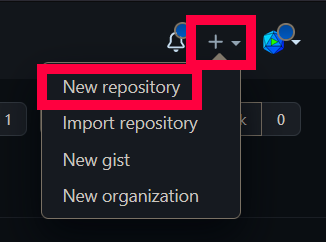

This will open up the repostiory creation dialog.
Here you can pick options such as:

- The repository name
- A descripton for it
- Whether it's public (so everyone on the Internet can see and pull it) or private (so you can control who gets to see it)
- Whether to include a README file (usually a [Markdown](https://www.markdownguide.org/) file that describes your project in more detail, what it does, how to build it, how to test it, etc.) - this is what gets displayed on your project's home page
- An option for adding a `.gitignore` file from a template - this will be used by git to ignore certain files and folder so it won't commit them
- An option to specify a software license that your code is built with

For our example, we'll go with these settings:


- Set the **repository name** to something like "hello-world" or "test-repo" or anything else you want.
- Set the **visibility** to **private** so you get to control who can see and play with it safely.
- Add a **README** if you want to learn how to play with it using Markdown syntax. Worst case is you just ignore it.
- Add a `.gitignore` file and choose `VisualStudio` from the list of templates. This will ignore all of your personal preference files and all of your build artifacts so they don't get added to the repository for other people to download.
- Add a **license**. I typically use **Apache 2.0**. We encourage you to read up on software licenses with the **Learn more** link when you start to publish your own real code.


## Adding Users to the Project

Once the project is created, you'll want to add users to it.
You don't have to do this now, but when it's time to work with your group on your project, you will want to add them so everyone has access to the project.
For reference, here's how you do it:

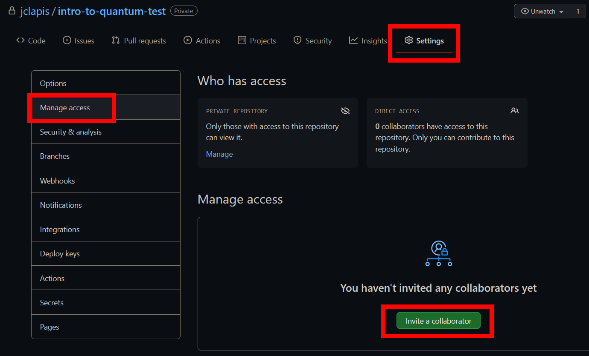

1. Click on the **Settings** section, then go to **Manage access**.
2. Click the **Invite a collaborator** button.
3. Type the usernames of your teammates in this box, then click the green button to add them to the repository.


## Cloning the Project Repository

Now that you have your project set up, you can **clone** the repository.
This means you'll pull down a copy of the latest code onto your local machine.
It will be managed with **git** for source control, and automatically linked back to your repository on Github.
This way, when you have changes you want to share with everyone else, you can send them back up to the project so other people can get them too.

To clone the repository, decide where on your local filesystem you want to store it.
We'll use `C:\Quantum\` for now - don't worry, the cloned repository will be put into its own subfolder.

First, get the link to the repository using the green **Code** button on Github:

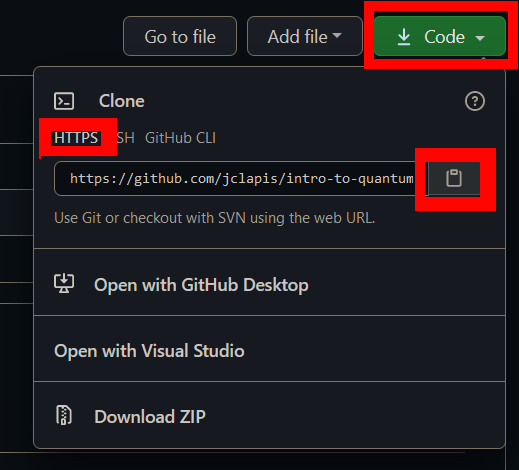

Make sure the **HTTPS** tab is selected, then click on the little clipboard button at the end of the URL box.
This will copy the URL to your clipboard.

Now, open a new instance of Visual Studio and select the **Clone a repository** button to the right, under the **Get started** header:

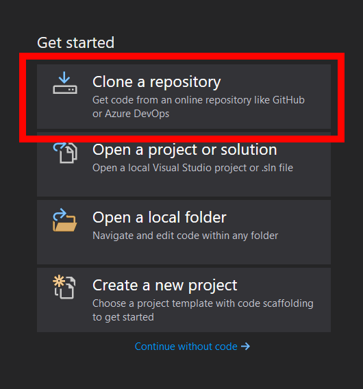

In the **Repository location** box, paste the URL that you copied from Github.

In the **Path** box, type `C:\Quantum\<name of repository>`.

It should look like this:

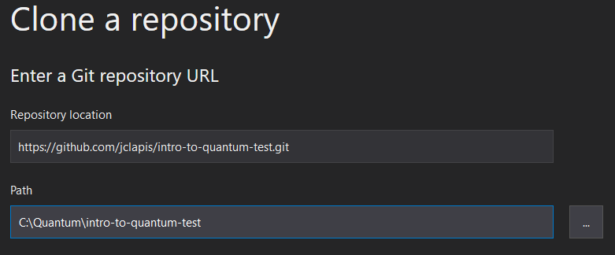

Click the **Clone** button to pull everything down to your local machine.


## Creating a new Q# Project

The first thing we want to do is make a new Q# project file that will hold our code.

In Visual Studio, click the **File** menu, select **New**, then select **Project**:

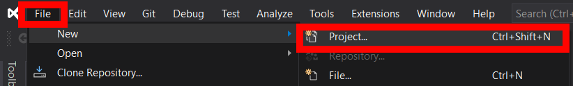

When the new project dialog comes up, in the search bar type `q#` to filter things to Q# projects, then select **Q# Test Project** and click **Next**:

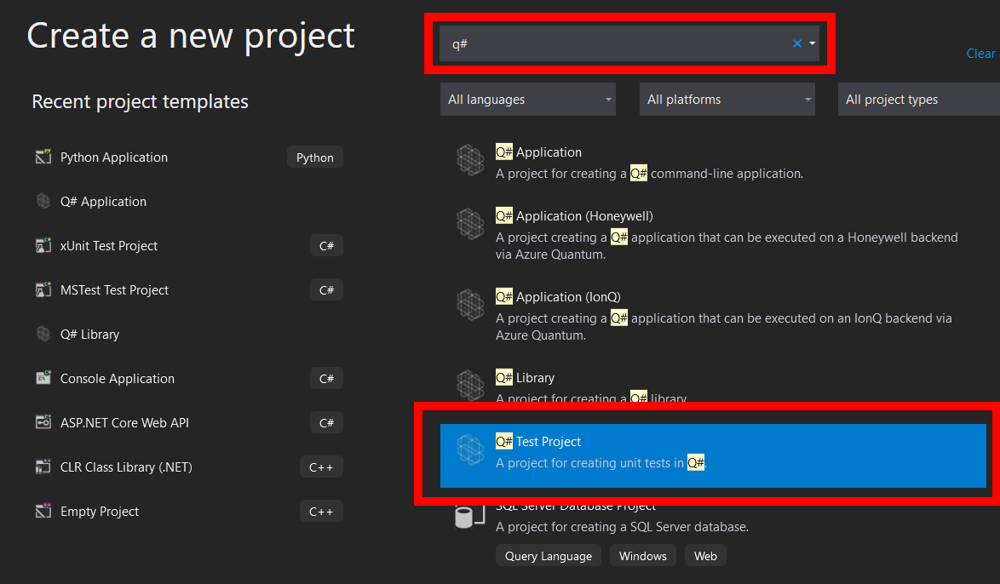

For the **Project name**, say something like `QSharpTestProject`.

In the **Location** box, browse to (or type) the folder where you cloned your repository; in this example, `C:\Quantum\<name of repository>`.

Leave the other settings alone and click the **Create** button.

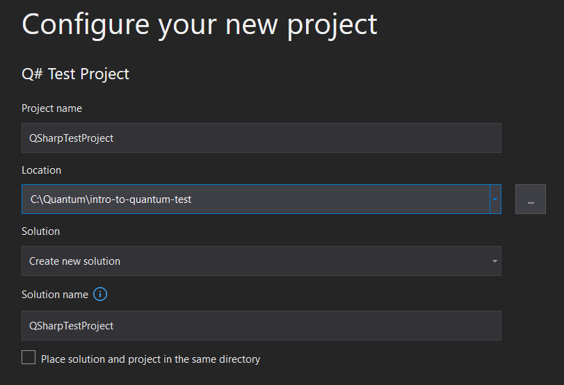

It will take a while, but once it's done you should see something like this:

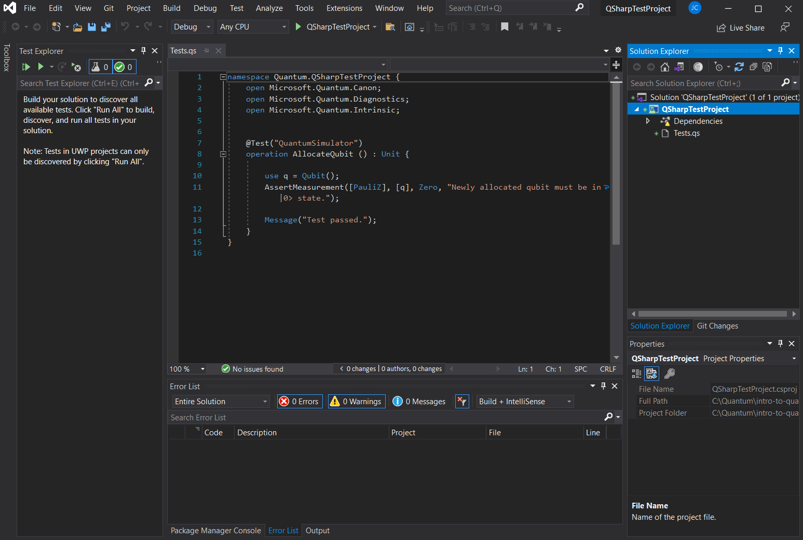

This will show you the Solution Explorer, where you can see your new project and its files (namely the **Tests.qs** file which is provided to you as an example with a unit test already in it).

The file itself will already be open in the code editor, showing you some example code for a basic unit test called **AllocateQubit**.
All this test does is allocate a new qubit, then check to see if it's `|0>` or not, and throws an exception if it isn't.
Since qubits are always provided in the `|0>` state, this will always pass.


## Committing and Pushing Changes Back to Github

Now that you have your project files set up, you should make a **git commit**.
This will essentially create a snapshot of your current code, compare it to what's changed since the last snapshot, and **save the new changes**.
This last part is important because git is able to **automatically merge someone else's changes in with yours** if you both modified the code at the same time.
This is called a **merge**.

As long as you don't step on each other's toes and change the same line of the same file, git can handle merging for you.
If you do both change the same thing, you'll get a **merge conflict** when you try to add their changes to your local filesystem and vice versa; this means you'll need to go in manually and decide which of the changes to save.
More on this later.

For now, commit your code so you have the new project structure saved.
Open the **Git Changes** tab in Visual Studio and you'll see all of your changes so far (i.e. the new project structure):

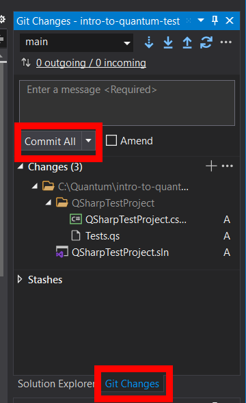

Type a message like "Baseline commit" into the message box so you know what changes you made, then click the **Commit All** button.
This will create a commit for you.

Now, you want to push the commit up to Github so it's stored on the server.
This way, everyone that has cloned your project can grab your changes.

You can do this with the **Push** button, which looks like an arrow pointing upward:

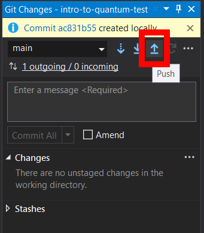

If it works, you'll get a nice little success message.
You can also now see your changes on Github at your project's home page:

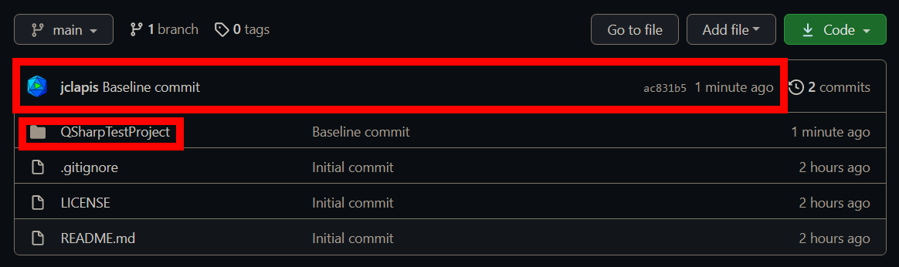


## Pulling Changes

Now, let's look at how to merge in changes that get pushed to Github.

I'll make a simple change by editing the `README.md` file using Github's built in editor (accessible via the little pencil button in the top right of the README display on the home page):

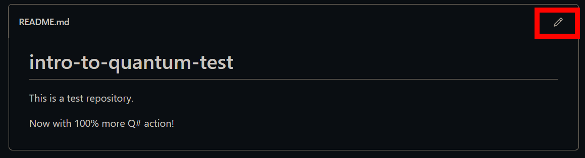

Once I'm done, I can save the changes directly in the browser.
They'll show up as a new commit in the repository.

Now, if I try to push new changes from Visual Studio back to Github, I'll get an error message:

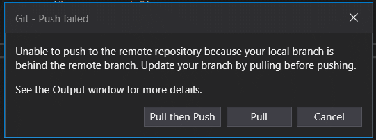

This is because my local copy of the repository is out of date; it doesn't contain the changes that have been stored on Github.
If I want to push new changes back to it, I have to **pull** the latest code from it first and **merge** it with my local code.

I can do this easily by clicking on the **Pull** button in that error dialog above.

If there weren't any merge conflicts, then the merge will complete automatically and I'll see a nice success message in the Git Changes view:

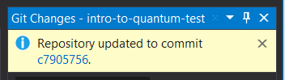

Now I can push my changes back up to Github, and they'll be merged together with the existing changes that are already up there.


## Handling Merge Conflicts

Sometimes, you're going to modify a file that was also modified by someone else and they pushed their changes to Github first.
In some cases, such as when you modify different **parts** of the file, this is fine; the merge algorithm can handle both of your changes automatically.
However, if you both modify the **same part** of the file, then git's auto-merge algorithm will fail when you pull and you'll have a **merge conflict**.
You'll have to manually fix this before you can do anything else.

Let's cause a merge conflict now by modifying the `Tests.qs` file on Github using the web editor, and at the same time on our local copy of the repository using Visual Studio.

I'll start by modifying the file directly on Github, adding `Hello from Github!` to the end of the `Message` line so it becomes this:

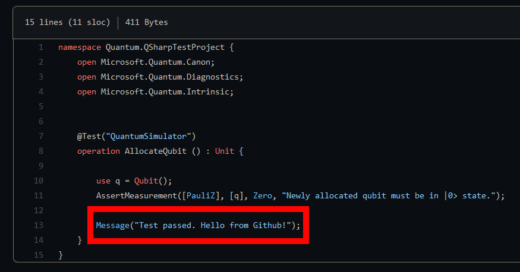

You can do this by navigating to the file (`QSharpTestProject/QSharpTestProject/Tests.qs`) in the browser and clicking the Pencil icon.

I'm also going to change my local copy in Visual Studio, adding `Greetings from Visual Studio!` to the end of the `Message` line like this:

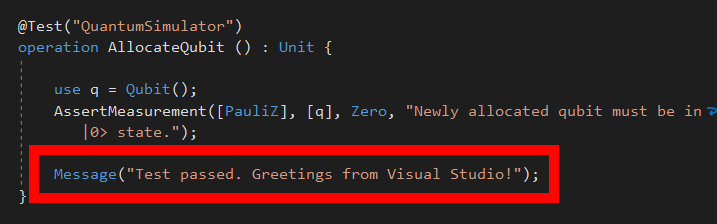

Now, I'm going to author a new commit in Visual Studio to save my changes to the file, with a message like "Updated the AllocateQubit message." or something.

After I commit it, I can try to do a **pull** using the Pull button:

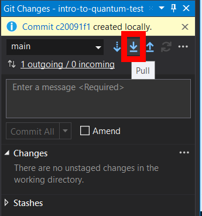

However, *this time*, it is going to fail.
The outcome will look like this:

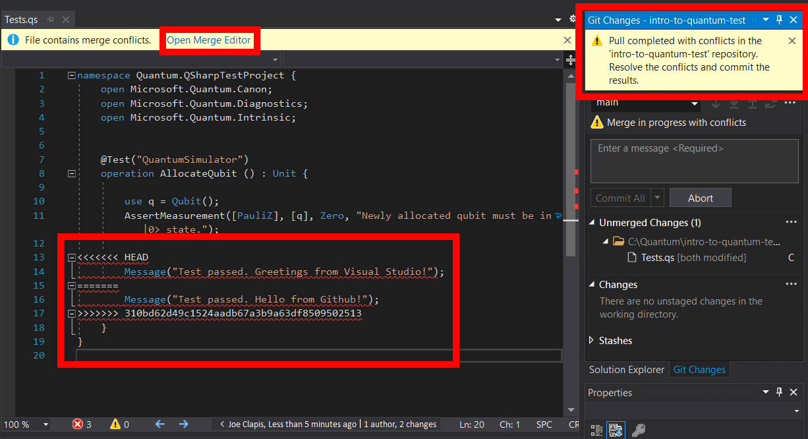

You can clearly see an error message in the top right letting you know that you ran into a merge conflict, so you have to resolve it manually before continuing.

The files that need to be fixed are shown in the **Unmerged Changes** section of the Git Changes tab.
As you can see, the only one is `Tests.qs` as expected.

If you look at the file in the Code Explorer, you can see the part of the code that's in conflict: the `Message` line.

This part:

```
<<<<<<< HEAD
        Message("Test passed. Greetings from Visual Studio!");
=======
```

Shows your *local* code changes.

The part below it:

```
=======
        Message("Test passed. Hello from Github!");
>>>>>>> 310bd62d49c1524aadb67a3b9a63df8509502513
```

Shows the *remote* code changes from Github.
Your job now is to fix this so the changes no longer conflict with each other.
There are three options:

1. Discard your changes and use the existing ones from Github
1. Discard the changes on Github and use your local ones
1. Roll the changes together into a new thing by hand

Whatever the case, it's easiest to use the **Merge Editor** to help you fix the file.
Click on the **Open Merge Editor** link at the top of the file, which is highlighted in the screenshot.
It will look like this:

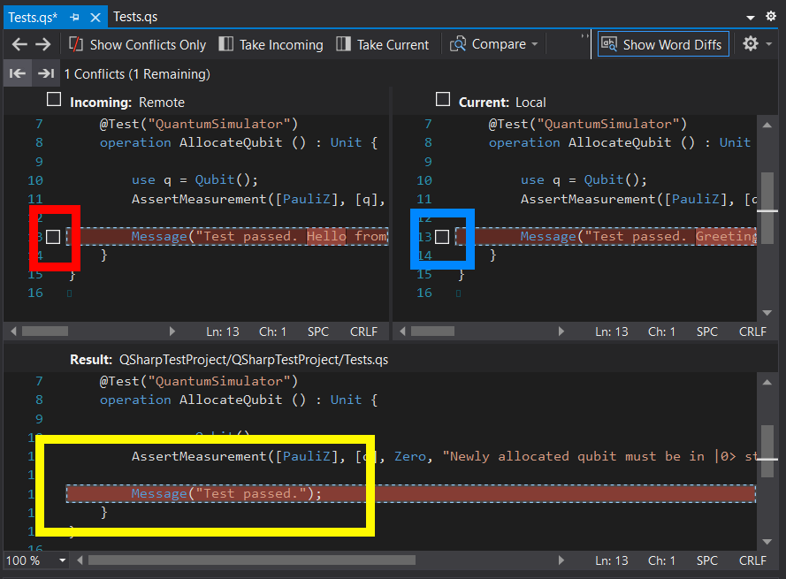

If you check the **Red box** on the left, you will use the remote changes from Github on the conflicting line (option 1).

If you check the **Blue box** on the right, you will use the local changes and discard the ones on Github (option 2).

If you check both, they'll both be placed in the file - one on top of the other.

We're going with option 3; we'll modify the text in the **Result** box (highlighted in yellow here) directly and change it to `Test passed. Greetings from Github and Visual Studio!`.

Once that's done, save the file.
The conflict counter up top will read `1 Conflicts (0 Remaining)`.
This means you've fixed all of the merge conflicts and are ready to commit them.

Click the **Accept Merge** button on top:


This will prepare a new commit with your fixes in place.
You'll see `Tests.qs` get moved under a new segment of the Git Changes tab, called **Staged Changes**:


Enter a message like "Resolved merge conflicts", then click **Commit Staged** to create a new commit with the changes in place.

Finally push this back up to Github with the Push button.

And there you go!
Now your local folder and Github are both up to date, and all of the code has been merged together:

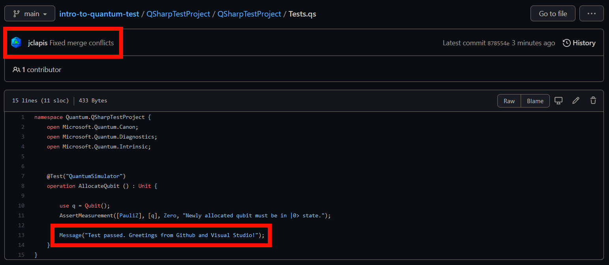

There are *many* more features of both git and Github, and you are welcome to explore both of them as you work on this project.
For the most part though, this will be enough to get you started and working with your group successfully.