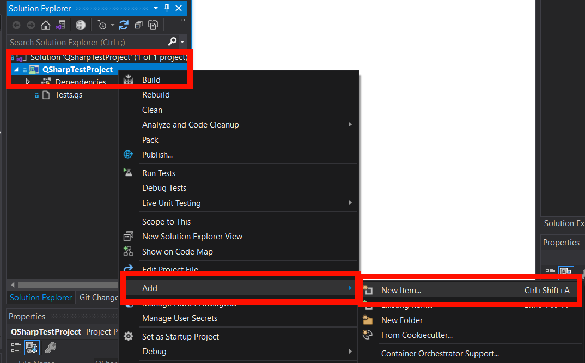
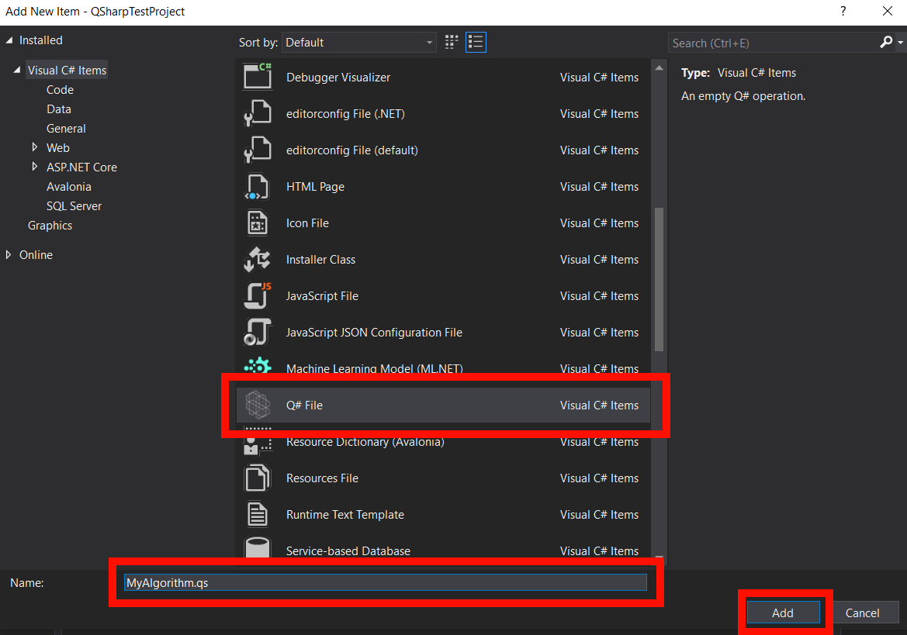
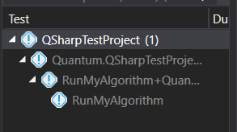

# Debugging and Testing with Q#

This tutorial will describe how to build out the sample Q# unit test and debug your algorithm as you build it.
It assumes you've already followed the [Configuration Management](./CM.md) tutorial; if you haven't, go through that first.


## Creating the Algorithm File

Let's start by making a new `.qs` file that will hold the algorithm code.

Right click the **QSharpTestProject** project in the Solution Explorer, then go to **Add** and **New Item**:



Scroll down the Type box until you get to **Q# File**, and select it.

In the **Name** box, type `MyAlgorithm.qs`, then click **Add**:



The file will open up in the Code Editor with some template text, including an empty operation called `MyAlgorithm`.
Let's fill it in by giving it a `Qubit[]` parameter named `register`, and adding the first example from the Complex Superpositions module:

```
    operation MyAlgorithm (register : Qubit[]) : Unit {
        H(register[0]);
        H(register[1]);
        CCNOT(register[0], register[1], register[2]);
    }
```

We know that this should only result in four states with equal probability: `|000>`, `|010>`, `|100>`, or `|111>`.


## Creating a Unit Test

Let's modify the `Tests.qs` file so it has a new operation that tests the `MyAlgorithm` function:

```
namespace Quantum.QSharpTestProject {
    open Microsoft.Quantum.Arithmetic;
    open Microsoft.Quantum.Canon;
    open Microsoft.Quantum.Diagnostics;
    open Microsoft.Quantum.Intrinsic;
    open QSharpTestProject;

    
    @Test("QuantumSimulator")
    operation RunMyAlgorithm() : Unit {
        use register = Qubit[3];
        for i in 0..999 {
            MyAlgorithm(register);
        
            let measurement = MeasureInteger(LittleEndian(register));
            if  measurement == 0b000 or
                measurement == 0b001 or
                measurement == 0b010 or
                measurement == 0b111 {
                Message($"Measured {measurement}. Test passed!");
            }
            else {
                fail $"Measured {measurement} which is an invalid state!";
            }
            ResetAll(register);
        }
    }
}
```

This will run it, then measure the result as a little-endian integer.
It then checks to see if the measured result is one of the four expected states (reversed because `MeasureInteger()` interprets the qubits as little-endian) and if so, it passes.
If it measures one of the four *unexpected* states, it fails immediately.
It runs the whole thing 1000 times, which lets us be reasonably certain that the algorithm works as expected.

Build the solution (click the **Build** menu, then click **Build Solution**).
When it's done, you should see your new test show up in the test explorer:



Now you can run it like you usually do with the regular lab exercises, and it should succeed with that familiar green check mark.
You can even look at the output to see all of the states that were measured.

The `RunMyAlgorithm()` operation shows up as a unit test in the test explorer because it is flagged with the `@Test` attribute above it:

```
@Test("QuantumSimulator")
```

Any operation with this attribute will be flagged as a unit test and will show up in the Test Explorer.


## Debugging with `DumpRegister()`

One of the things you might find useful during your algorithm development is Q#'s ability to give you a printout of a register's entire statevector anywhere in the program.

This is done with the [`DumpRegister()`](https://docs.microsoft.com/en-us/qsharp/api/qsharp/microsoft.quantum.diagnostics.dumpregister) function in the `Microsoft.Quantum.Diagnostics` namespace.

Let's change the `RunMyAlgorithm()` function so it only runs once:

```
for i in 0..0 {
    ...
}
```

Next, let's change `MyAlgorithm()` to this:

```
    open Microsoft.Quantum.Diagnostics;


    operation MyAlgorithm (register : Qubit[]) : Unit {
        H(register[0]);
        DumpRegister((), register);
        Message("");

        H(register[1]);
        DumpRegister((), register);
        Message("");

        CCNOT(register[0], register[1], register[2]);
        DumpRegister((), register);
        Message("");
    }
```

Now, when we build the solution and run the unit test, we see this in the output:

```
 Quantum.QSharpTestProject.RunMyAlgorithm+QuantumSimulator.RunMyAlgorithm
   Source: Tests.qs line 10
   Duration: 57 ms

  Standard Output: 
    # wave function for qubits with ids (least to most significant): 0;1;2
    ∣0❭:	 0.707107 +  0.000000 i	 == 	***********          [ 0.500000 ]     --- [  0.00000 rad ]
    ∣1❭:	 0.707107 +  0.000000 i	 == 	***********          [ 0.500000 ]     --- [  0.00000 rad ]
    ∣2❭:	 0.000000 +  0.000000 i	 == 	                     [ 0.000000 ]                   
    ∣3❭:	 0.000000 +  0.000000 i	 == 	                     [ 0.000000 ]                   
    ∣4❭:	 0.000000 +  0.000000 i	 == 	                     [ 0.000000 ]                   
    ∣5❭:	 0.000000 +  0.000000 i	 == 	                     [ 0.000000 ]                   
    ∣6❭:	 0.000000 +  0.000000 i	 == 	                     [ 0.000000 ]                   
    ∣7❭:	 0.000000 +  0.000000 i	 == 	                     [ 0.000000 ]                   
    
    # wave function for qubits with ids (least to most significant): 0;1;2
    ∣0❭:	 0.500000 +  0.000000 i	 == 	*****                [ 0.250000 ]     --- [  0.00000 rad ]
    ∣1❭:	 0.500000 +  0.000000 i	 == 	*****                [ 0.250000 ]     --- [  0.00000 rad ]
    ∣2❭:	 0.500000 +  0.000000 i	 == 	*****                [ 0.250000 ]     --- [  0.00000 rad ]
    ∣3❭:	 0.500000 +  0.000000 i	 == 	*****                [ 0.250000 ]     --- [  0.00000 rad ]
    ∣4❭:	 0.000000 +  0.000000 i	 == 	                     [ 0.000000 ]                   
    ∣5❭:	 0.000000 +  0.000000 i	 == 	                     [ 0.000000 ]                   
    ∣6❭:	 0.000000 +  0.000000 i	 == 	                     [ 0.000000 ]                   
    ∣7❭:	 0.000000 +  0.000000 i	 == 	                     [ 0.000000 ]                   
    
    # wave function for qubits with ids (least to most significant): 0;1;2
    ∣0❭:	 0.500000 +  0.000000 i	 == 	*****                [ 0.250000 ]     --- [  0.00000 rad ]
    ∣1❭:	 0.500000 +  0.000000 i	 == 	*****                [ 0.250000 ]     --- [  0.00000 rad ]
    ∣2❭:	 0.500000 +  0.000000 i	 == 	*****                [ 0.250000 ]     --- [  0.00000 rad ]
    ∣3❭:	 0.000000 +  0.000000 i	 == 	                     [ 0.000000 ]                   
    ∣4❭:	 0.000000 +  0.000000 i	 == 	                     [ 0.000000 ]                   
    ∣5❭:	 0.000000 +  0.000000 i	 == 	                     [ 0.000000 ]                   
    ∣6❭:	 0.000000 +  0.000000 i	 == 	                     [ 0.000000 ]                   
    ∣7❭:	 0.500000 +  0.000000 i	 == 	*****                [ 0.250000 ]     --- [  0.00000 rad ]
    
    Measured 1. Test passed!
```

This shows the statevector of `register` after each step: it shows the raw amplitudes of each state, the measurement probabilities, and the phase (in radians).
Note that each of the states is in little endian form, so you'll have to translate to binary appropriately if you want to think about the states that way.

You can pass any number of qubits into `DumpRegister()`, even one single qubit.
However, it doesn't work if you try to print a register that's been entangled with another register; if qubits are entangled, you have to include all of them in the `DumpRegister()` argument.
Otherwise, you'll get a message like this:

```
# wave function for qubits with ids (least to most significant): 0
## Qubits were entangled with an external qubit. Cannot dump corresponding wave function. ##
```

In either case, this might be useful to you when you're trying to build up your implementation for the group project but it isn't doing what you think it should be doing.


## Running with the Toffoli Simulator

One final tip we have is that Q# comes with a special simulator called the [Toffoli Simulator](https://docs.microsoft.com/en-us/azure/quantum/user-guide/machines/toffoli-simulator).
This simulator is extremely fast and capable of running algorithms with millions of qubits.
However, it comes with one major constraint: **it doesn't support superpositions.**

The Toffoli simulator only works with the `X`, `CNOT`, and multi-controlled `X` gates.
In other words, it basically only works if your quantum algorithm is really just a classical computing algorithm.

This is actually quite useful in situations such as testing quantum oracles, quantum arithmetic functions, or certain classical data encoding systems (like the NEQR image encoding algorithm listed in the example algorithms for the group project) which tend to be made exclusively out of `Controlled X` operations.
The Toffoli simulator can be used to run lots of tests on these operations against lots of inputs even if they use an absurd number of qubits.

To use the simulator, change the `@Test` attribute above your unit test operation to this:

```
@Test("ToffoliSimulator")
```
